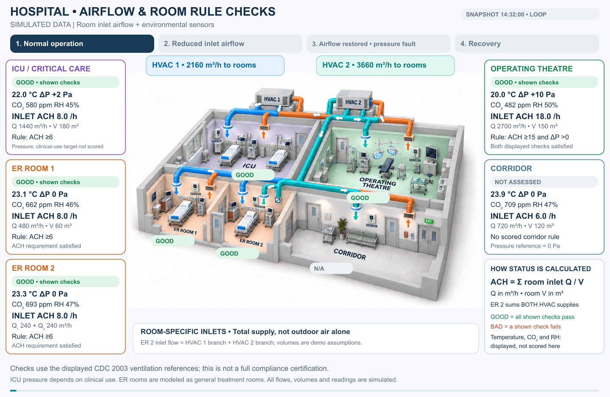
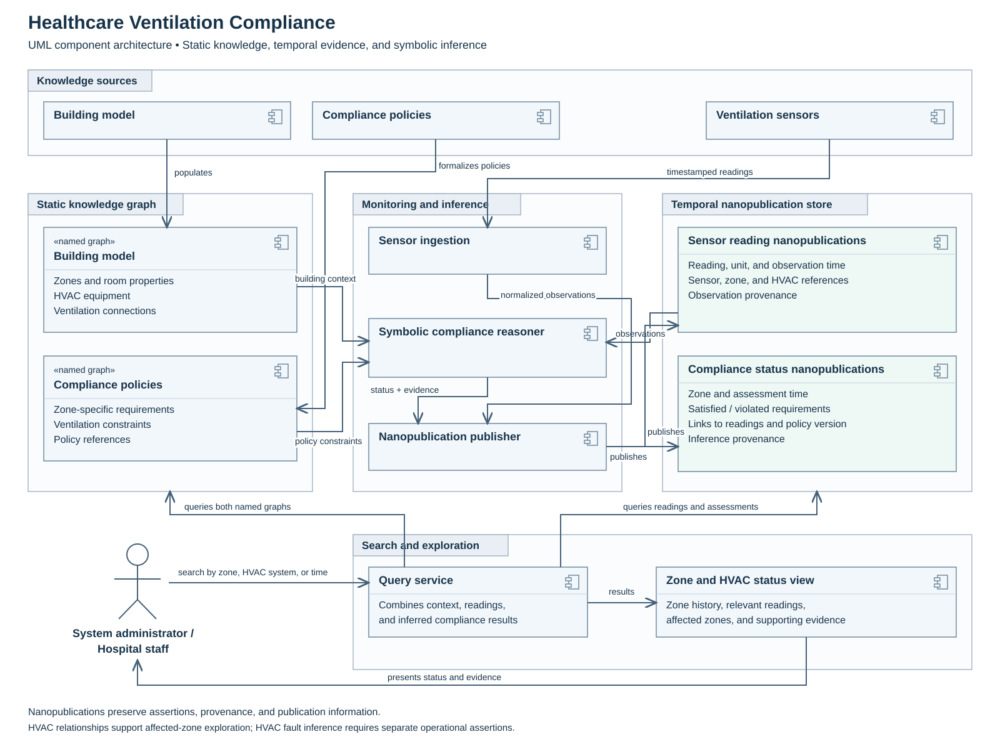
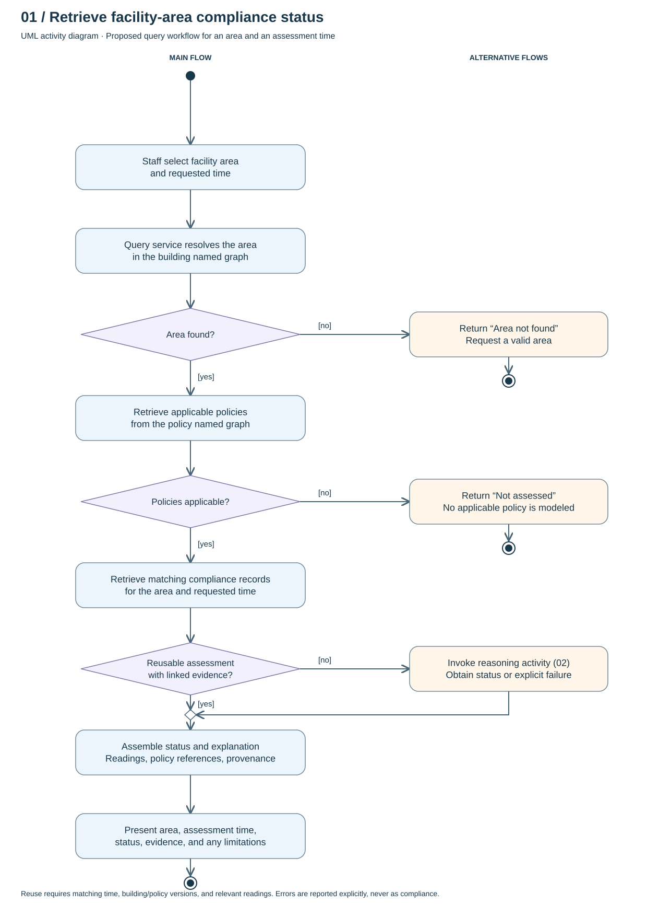
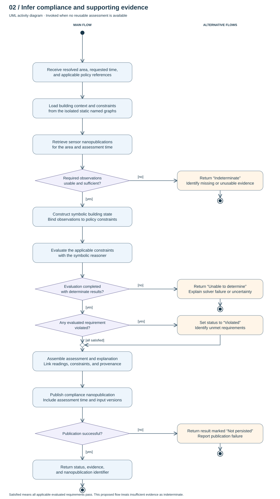

# CareAir: Explainable Reasoning for Healthcare Ventilation Compliance

## Abstract

Smart building technologies enable stakeholders to monitor building conditions through continuous streams of sensor data. In healthcare facilities, these capabilities can help assess whether building systems meet guidelines intended to protect patients and staff. This is particularly important during equipment failures, system shutdowns, and public health emergencies, when facilities administrators and clinical teams must coordinate their responses.

This project investigates how ventilation systems in smart healthcare facilities support compliance with guidelines for airborne infection control, including those issued by the Centers for Disease Control and Prevention (CDC). It aims to systematically identify conditions that do not satisfy applicable requirements and surface the evidence behind those findings, helping hospital teams recognize and respond to potential compliance gaps.

I’ve framed this as **assessing compliance and identifying supporting evidence**, rather than guaranteeing compliance. That keeps the description precise while making the project’s purpose clear.

## Project Overview Diagram 

Our system integrates a building model, time-varying sensor readings, and compliance policies to assess ventilation conditions across a healthcare facility. The building model provides the spatial and operational context, including zone properties and ventilation connections. Sensor readings capture changing conditions, while applicable policies are represented as symbolic constraints. As new readings arrive, the system updates its representation of the building’s state and symbolically infers whether each zone satisfies its applicable requirements. When a requirement is violated, it identifies the relevant measurements and unmet constraints, providing evidence that helps explain the finding.

### System Architecture 

The architecture combines a static knowledge graph with a temporal collection of nanopublications. Within the static knowledge graph, the building model and compliance policies occupy isolated named graphs. The building graph describes hospital zones, room properties, HVAC equipment, and ventilation connections. The policy graph represents the requirements applicable to those zones.

Incoming sensor readings are published as nanopublications, preserving their observation time, source, and relationship to the building model. A symbolic reasoner combines these observations with building context and applicable policy constraints to infer zone-level compliance. Each assessment is published as a separate nanopublication that links its result to the supporting readings and the policies used in the assessment.

When an administrator or hospital staff member searches for a zone or HVAC system, the query service combines information from both static graphs and the nanopublication store. This allows users to inspect compliance over time, identify zones served by a particular HVAC system, and examine the evidence behind an inferred status.

One distinction to preserve: a zone’s compliance status and an HVAC system’s operational status are separate assertions. If the system also infers HVAC faults or operational states, those should be recorded in their own status nanopublications, with supporting evidence.

### Operational Flow

_These proposed UML activity diagrams describe the query and reasoning workflows. Rounded rectangles denote actions, diamonds denote decisions or merges, bracketed labels denote guards, filled circles denote entry, and bullseyes denote activity termination._

#### Retrieve compliance status of hospital facility

A staff member selects an area and a time. The query service resolves the area through the building named graph, retrieves requirements from the policy named graph, and searches the nanopublication store for a reusable assessment. If one is unavailable, it invokes the reasoning activity. The response combines the assessment with its readings, applicable constraints, and provenance.

A reusable assessment must match the requested time, building and policy versions, and relevant observations. “Latest” must follow an explicit freshness policy; historical results retain their assessment time. Unknown areas return a lookup error. Areas without modeled applicable requirements return “Not assessed.” Reasoning failures are returned explicitly instead of a compliance verdict.

#### Infer Status and evidence 

The reasoner combines building context, applicable symbolic constraints, and time-relevant observations. Sufficient usable observations allow constraint evaluation. A completed evaluation yields satisfied or violated requirements. The resulting assessment links its evidence, input versions, and inference provenance and is published as a nanopublication.

Missing or unusable required observations return “Indeterminate.” Solver failures or unresolved evaluations return an explicit inability to determine status. Publication failure preserves the computed result in the response but marks it as not persisted; it does not imply compliance failure or successful publication.

The current proposal requires sufficient evidence for all applicable checks before issuing an overall verdict. Partial per-policy assessments can be added if supported by the implementation. “Satisfied” refers only to evaluated applicable requirements. Merely finding a satisfying assignment for incomplete observations would not establish observed compliance.

Each nanopublication carries an assertion, provenance, and publication information. Compliance assertions link to the sensor nanopublications and versioned policy/building inputs used. A zone compliance verdict does not by itself establish an HVAC fault or causal effect.

## Point of Contact 
* Ahosan Habib : <habiba5@rpi.edu>
* Nipun Deelaka : <pathin@rpi.edu>
* Andy Cheng : <cheng11@rpi.edu>
* Carina Liu : <liuc17@rpi.edu>

## List of Resources

List resources you think a reader would benefit from to use your project. We list some examples you could make available below.

<table>
  <tr>
    <th>Resources</th>
    <th>Links</th>
  </tr>
  <tr>
    <td>1. Ontology</td>
    <td>(a) <a href="https://raw.githubusercontent.com/tetherless-world/study-cohort-ontology/master/Ontologies/studycohort.owl">Your Ontology</a></td>
  </tr>
  <tr>
    <td>2. Term List</td>
    <td>(a) <a href="./knowledge-graph.html">Mapped Vocabularies</a> </td>
  </tr>
  <tr>
    <td>2. Competency Questions</td>
    <td>(a) <a href="./knowledge-graph.html">SPARQL Queries</a> </td>
  </tr>
  <tr>
    <td>3. Presentations:</td>
    <td>(a) <a href="./ontology-resource.html#ontologyreused">Project presentations during class</a> </td>
  </tr>
</table>

## Acknowledgements

The development of this ontology was conducted under the advisement of Dr. Deborah McGuinness and Ms. Elisa Kendall, along with guidance from our mentors Jade Franklin, Danielle Villa, and Kelsey Rook, as part of the Fall 2026 CSCI 4340 / 6340 Ontologies Course. We sincerely thank them for their time, effort, and patience in guiding us through the development process.
