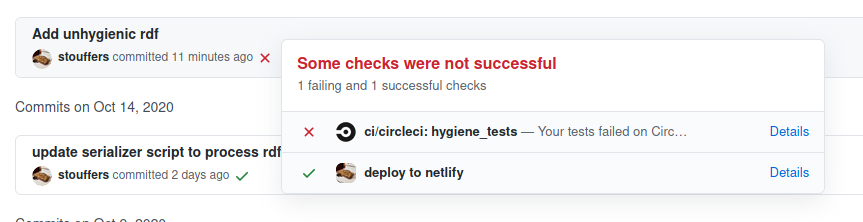
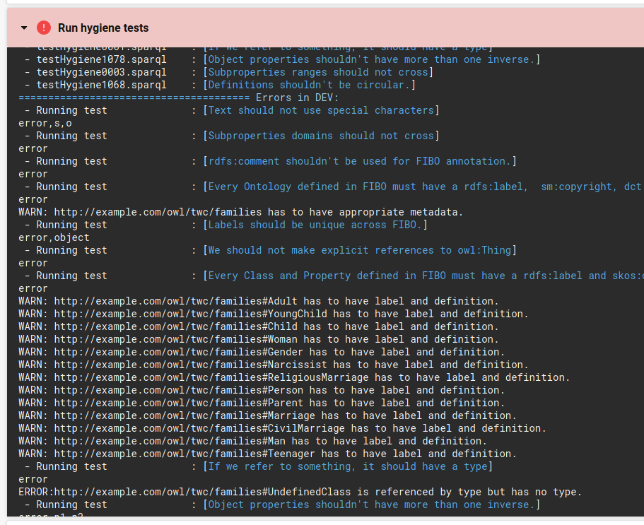

# Ontology Development

## Git Serializer

The git serializer will run whenever you make a git commit and will ensure that your ontology source files are formatted in such a way that they can be easily diffed when changes are made.

The serializer requires Java and should work with version 8 or later.
If you don't have Java installed on your machine, download and install it from
[the Java website](https://java.com/en/download/).

Installing the serializer will involve modifications to a hidden folder within the repository: `.git`.
**Make sure that the file browser you are using is capable of displaying hidden files**.

Instructions for installing the serializer:

1. Download the
    [rdf-toolkit jar file](https://jenkins.edmcouncil.org/job/rdf-toolkit-build/lastSuccessfulBuild/artifact/target/scala-2.12/rdf-toolkit.jar)
    and place it in `.git/hooks/` within the ontology-engineering repository.
1. Download (right click and select "Save link as...") the
    [pre-commit script](https://raw.githubusercontent.com/tetherless-world/ontology-engineering/master/serializer/pre-commit)
    and place it in `.git/hooks/`.
    * Make sure to save the file **without** a file extension (i.e. you want it as `pre-commit` instead of `pre-commit.txt`).
        Behavior for this varies by OS, but if you have an option to save as a particular file type, select "All files".
    * **MacOS and Linux users** will also need to make the file executable.
        To do this, run the following command from your project root after you have copied in the pre-commit script: `chmod +x .git/hooks/pre-commit`
1. In `.git/hooks/pre-commit`, set line 12 (`export JAVA_HOME="...`) to match your java installation.
    * If you don't know where or what that is, [this site may help](https://www.baeldung.com/find-java-home).
        `JAVA_HOME` should be a path the points to the java installation directory, which will vary from system to system.
        The `JAVA_HOME` directory should have a `bin` folder containing the `java` executable.
    * The set value of `JAVA_HOME` should be in quotation marks.
    * If, in the past, you have configured your environment to set the `JAVA_HOME` environment variable, you can simply comment the line out: `#export JAVA_HOME=...`.
        Only do this if you are certain you have already configured `JAVA_HOME`.
1. To make sure everything is working, open a command line interface (e.g. Terminal in SourceTree) and navigate to the ontology-engineering repository directory.
    When you run `git commit`, you should see output similar to below preceding the normal git output:

    ``` text
    rdf-toolkit: sesame-serializer: This is the pre-commit hook
    rdf-toolkit: sesame-serializer: java_home = /usr/lib/jvm/default
    rdf-toolkit: sesame-serializer: whichJava = /usr/lib/jvm/default/bin/java
    openjdk version "1.8.0_265"
    OpenJDK Runtime Environment (build 1.8.0_265-b01)
    OpenJDK 64-Bit Server VM (build 25.265-b01, mixed mode)
    rdf-toolkit: sesame-serializer: versionJava =  1.8.0_265
    rdf-toolkit: sesame-serializer: java_major=1
    rdf-toolkit: sesame-serializer: java_minor=8
    rdf-toolkit: sesame-serializer: Found rdf-toolkit: /home/sam/workspace/ontology-engineering/.git/hooks/rdf-toolkit.jar
    ```

## Ontology Hygiene

Every time you push commits to your branch, a continuous integration job will run ontology hygiene checks on your branch.
These checks will examine the ontologies in the repository and report errors if the ontologies do not conform to certain best practices.

### Scope of Hygiene Checks

The checks will pick up ontologies in files with extensions `.rdf`, `.ttl`, or `.jsonld`.
These files can be anywhere in the repository.

Resources in your ontology that do not contain `twc` in the namespace will not be checked.
This is done to prevent checking of imported ontologies.
**All of the resources for ontologies you develop must contain `twc` in the namespace.**

### Errors and Warnings

If the hygiene checks find errors in your ontologies, then the CI job will fail.
This will update the status of your latest commit to indicate that it did not pass checks.
**When submitting assignments, your ontologies must pass all hygiene checks.**

The checks will also detect less severe ontology issues that are treated as warnings instead of errors.
At first, warnings will not affect the passing status of the hygiene checks and will simply be logged in the CI output.
Later on in the course, however, the CI job will be altered so that it will fail if any warnings are detected.
Because of this, it is recommended that you check the CI logs periodically as you build your ontology to be aware of any warnings that may be accumulating.

### Getting to the Hygiene CI Job

You can view details about the hygiene test runs on the project [CircleCI page](https://app.circleci.com/pipelines/github/tetherless-world/ontology-engineering).
To have permissions to view the project CI page, you will need to sign up for CircleCI using the same GitHub account that is used for this class.

An easy way to get to the hygiene output for a particular commit on GitHub is via the commit status.
The commit status is represented as a small icon next to the commit message that will be either a green check mark, yellow circle, or red X.
To get to the hygiene output, click on the commit status icon and then click on "Details" next to the "hygiene_tests" check.
This will bring you to a page containing details about the CircleCI job that was run for that commit.



On the CircleCI job page, you can view the hygiene logs for that job by going to to the "Steps" tab and expanding the "Run hygiene tests" step.
**Note: Any errors reported in the "Tests" tab will not list all occurrences of the error.**
Because of this, it is recommended to look in the logs when attempting to debug job failures.

### Interpreting Hygiene Logs



There will be a lot of debug output in the logs that can be ignored. The relevant section for test results will be below the following line:

``` text
======================================= Errors in DEV:
```

Note that there will be a similar section labeled `Errors in PROD`.  This section should be ignored.

Each individual check will have a line like the following:

``` text
 - Running test              : [Text should not use special characters]
```

This will be followed by a header line that indicates the output format.
The header line will be something like `error` or `error,s,o`, so don't assume that seeing something like this indicates an error.

After the header line, any errors or warnings will be printed.
These lines will be in the format `ERROR: ...` or `WARN: ...`.


## Setting up Blazegraph tutorial

### Install Java

Find install link [here](https://bit.ly/38kxlR4)

Ubuntu users can run the following command 

* `sudo apt update && sudo apt install default-jdk`

### Download blazegraph: 

You can find the latest release [here](https://github.com/blazegraph/database/releases/) 

Download the jar file

### Create a working directory 

Create a directory called “blazegraph”

Move the jar file into that directory

### Download the ontology file 

Download validation ontology by first going to [here](https://bit.ly/3eClMpE)

Right click and save this file into your working directory

### Start Blazegraph 
Open a terminal window

* Linux: Press Ctrl+Alt+t
* Windows: Search for 'cmd'
* Mac: Double click /Applications/Utilities/Terminal

Within the terminal, change to your working directory

* `cd blazegraph`

Run blazegraph

* `java -server -Xmx4g -jar blazegraph.jar`

### Open blazegraph UI
Once blazegraph has started, use a web browser to go to the URL that is specified 

### Load the ontology
Go to the Update tab

Click 'Choose File' and load the ontology file

Specify the Type as 'RDF Data and the Format as 'Turtle'

Press the Update button and switch over to the query tab -- we are ready to begin!
