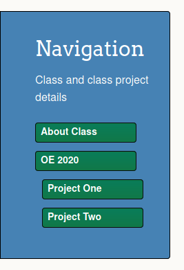
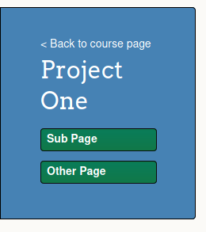

## Nav Menu

The nav menu contains both static and configurable items.
The static items are specified in the html template in `_layouts/default.html`.
Course year specific items are configured via YAML files.

Each course year will have its own YAML file in `_data/years`
e.g. the fall 2020 course is in `_data/years/2020.yml`.
Each year specified in this way will be rendered as a nav link on the main menu.
The year YAML file contains the nav label and relative path for that course year to create a nav link.
Example `_data/years/2020.yml`:
```yaml
name: OE 2020
path: oe2020
```

Also within the year YAML file is a `projects` list containing info for each project of that year.
This list will be used to populate a sub-menu of the year's projects that is visible when the user is on that year's page.
The sub-menu for the most recent year will be visible by default if the user is not on a year page.
Each project list item contains `name` and `path` fields to specify the project nav label and relative path respectively.
In this case, the `path` is relative to the project's year.

Example `projects` list:
```yaml
projects:
  - name: Project One
    path: project1
  - name: Project Two
    path: project2
```


<br>
*{{ main_nav_capt }}*

Additionally there is a `project_nav` list that dictates the contents of the nav menu for the project pages.
Each element of the `project_nav` list contains a `name` field and a `path` field,
which is relative to the project page.
There can also be list items with a `section` field.  These items are rendered as non-link items.

Example `project_nav` list:
```yaml
project_nav:
  - name: Sub Page
    path: sub_page
  - name: Other Page
    path: other_page
```



<br>
*{{ proj_nav_capt }}*
