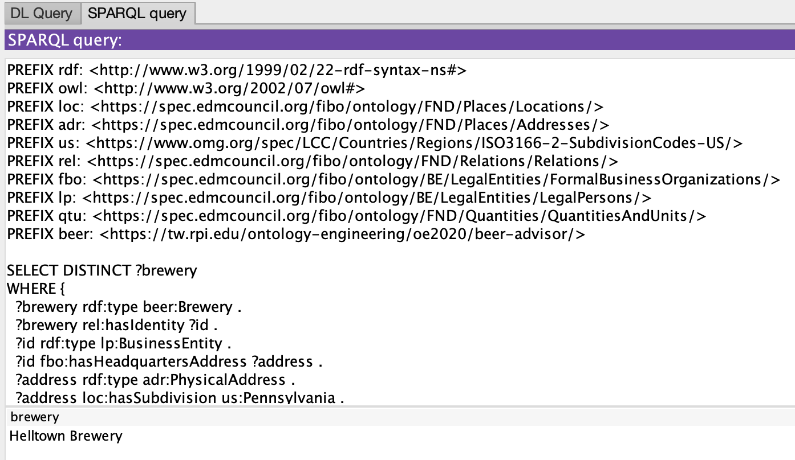
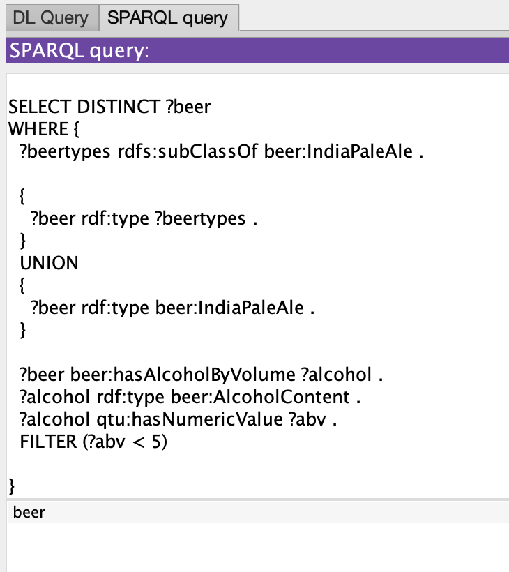
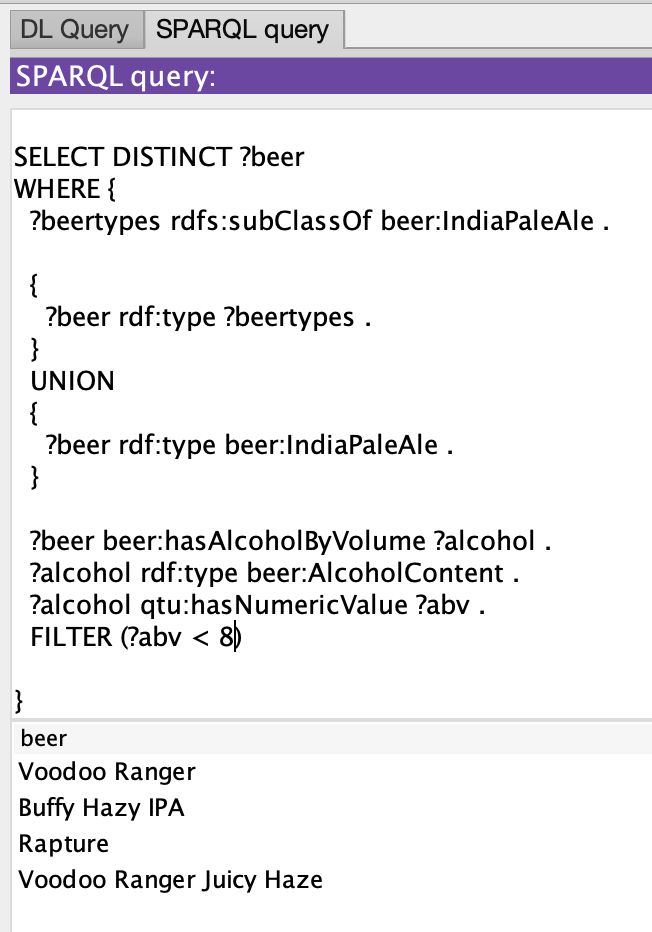
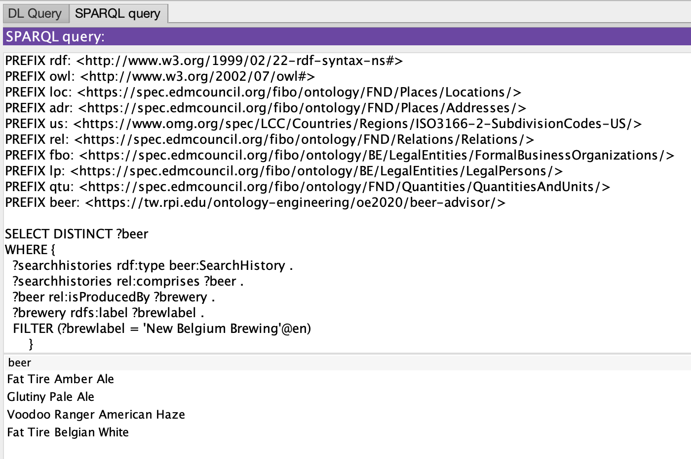

---
---

## Static Demo

To run the demo, first download the queries below. After this, you will want to run each query individually as described in the following subsections.
- [Queries](files/query)

### Query 1
This query is supposed to provide the answer for Competency Question 2: What is a brewery in Pennsylvania that makes IPAs under 8%?
In order to answer this question, the following SPARQL query is proposed:

```sparql
PREFIX rdf: <http://www.w3.org/1999/02/22-rdf-syntax-ns#>
PREFIX owl: <http://www.w3.org/2002/07/owl#>
PREFIX loc: <https://spec.edmcouncil.org/fibo/ontology/FND/Places/Locations/>
PREFIX adr: <https://spec.edmcouncil.org/fibo/ontology/FND/Places/Addresses/>
PREFIX us: <https://www.omg.org/spec/LCC/Countries/Regions/ISO3166-2-SubdivisionCodes-US/>
PREFIX rel: <https://spec.edmcouncil.org/fibo/ontology/FND/Relations/Relations/>
PREFIX fbo: <https://spec.edmcouncil.org/fibo/ontology/BE/LegalEntities/FormalBusinessOrganizations/>
PREFIX lp: <https://spec.edmcouncil.org/fibo/ontology/BE/LegalEntities/LegalPersons/>
PREFIX qtu: <https://spec.edmcouncil.org/fibo/ontology/FND/Quantities/QuantitiesAndUnits/>
PREFIX beer: <https://tw.rpi.edu/ontology-engineering/oe2020/beer-advisor/>

SELECT DISTINCT ?brewery
WHERE {
  ?brewery rdf:type beer:Brewery .
  ?brewery rel:hasIdentity ?id .
  ?id rdf:type lp:BusinessEntity .
  ?id fbo:hasHeadquartersAddress ?address .
  ?address rdf:type adr:PhysicalAddress .
  ?address loc:hasSubdivision us:Pennsylvania .
   
  ?beertypes rdfs:subClassOf beer:IndiaPaleAle .
  
  {
    ?beer rdf:type ?beertypes .
  }
  UNION
  {
    ?beer rdf:type beer:IndiaPaleAle .
  }
  
  ?beer rel:isProducedBy ?brewery .
  
  ?beer beer:hasAlcoholByVolume ?alcohol .
  ?alcohol rdf:type beer:AlcoholContent .
  ?alcohol qtu:hasNumericValue ?abv .
  FILTER (?abv < 8)  
}
```

This query sample will provide the following answer:

|brewery|
|-----------|
| Helltown Brewery|

The image below shows the implementation of Query 1 in Protege. Note that the answer is Helltown, a brewery located in PA that produces Buffy Haze, an IPA with 6.7% ABV.


### Query 2

This query is supposed to provide the answer for Competency Question 3: What is an IPA that is 5% ABV or below?
In order to answer this question, the following SPARQL query is proposed:

```sparql
PREFIX rdf: <http://www.w3.org/1999/02/22-rdf-syntax-ns#>
PREFIX owl: <http://www.w3.org/2002/07/owl#>
PREFIX loc: <https://spec.edmcouncil.org/fibo/ontology/FND/Places/Locations/>
PREFIX adr: <https://spec.edmcouncil.org/fibo/ontology/FND/Places/Addresses/>
PREFIX us: <https://www.omg.org/spec/LCC/Countries/Regions/ISO3166-2-SubdivisionCodes-US/>
PREFIX rel: <https://spec.edmcouncil.org/fibo/ontology/FND/Relations/Relations/>
PREFIX fbo: <https://spec.edmcouncil.org/fibo/ontology/BE/LegalEntities/FormalBusinessOrganizations/>
PREFIX lp: <https://spec.edmcouncil.org/fibo/ontology/BE/LegalEntities/LegalPersons/>
PREFIX qtu: <https://spec.edmcouncil.org/fibo/ontology/FND/Quantities/QuantitiesAndUnits/>
PREFIX beer: <https://tw.rpi.edu/ontology-engineering/oe2020/beer-advisor/>

SELECT DISTINCT ?beer
WHERE {
  ?beertypes rdfs:subClassOf beer:IndiaPaleAle .
  
  {
    ?beer rdf:type ?beertypes .
  }
  UNION
  {
    ?beer rdf:type beer:IndiaPaleAle .
  }
  
  ?beer beer:hasAlcoholByVolume ?alcohol .
  ?alcohol rdf:type beer:AlcoholContent .
  ?alcohol qtu:hasNumericValue ?abv .
  FILTER (?abv < 5)
  
}
```

This query sample will provide the following answer:

|beer|
|-----------|
| |

The image below shows the implementation of Query 2 in Protege. Note that there is no beer displayed as an answer. This is actually correct because there is no IPA under 5% ABV.

As an optional test, you can also change the range on the ABV in this query to prove that it works.


### Query 3

This query is supposed to provide the answer for Competency Question 4: I really like New Belgium’s IPA’s, what other beers have people searched for
from New Belgium?
In order to answer this question, the following SPARQL query is proposed:

```sparql
PREFIX rdf: <http://www.w3.org/1999/02/22-rdf-syntax-ns#>
PREFIX owl: <http://www.w3.org/2002/07/owl#>
PREFIX loc: <https://spec.edmcouncil.org/fibo/ontology/FND/Places/Locations/>
PREFIX adr: <https://spec.edmcouncil.org/fibo/ontology/FND/Places/Addresses/>
PREFIX us: <https://www.omg.org/spec/LCC/Countries/Regions/ISO3166-2-SubdivisionCodes-US/>
PREFIX rel: <https://spec.edmcouncil.org/fibo/ontology/FND/Relations/Relations/>
PREFIX fbo: <https://spec.edmcouncil.org/fibo/ontology/BE/LegalEntities/FormalBusinessOrganizations/>
PREFIX lp: <https://spec.edmcouncil.org/fibo/ontology/BE/LegalEntities/LegalPersons/>
PREFIX qtu: <https://spec.edmcouncil.org/fibo/ontology/FND/Quantities/QuantitiesAndUnits/>
PREFIX beer: <https://tw.rpi.edu/ontology-engineering/oe2020/beer-advisor/>

SELECT DISTINCT ?beer
WHERE {
  ?searchhistories rdf:type beer:SearchHistory .
  ?searchhistories rel:comprises ?beer .
  ?beer rel:isProducedBy ?brewery .  
  ?brewery rdfs:label ?brewlabel .
  FILTER (?brewlabel = 'New Belgium Brewing'@en)
      }
```

This query sample will provide the following answer:

|beer|
|-----------|
| Fat Tire Amber Ale |
| Fat Tire Belgian White |
| Glutiny Pale Ale |
| Voodoo Ranger American Haze |


The image below shows the implementation of Query 3 in Protege. Note that a list of beers is provided as answer to this query.


