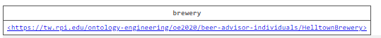
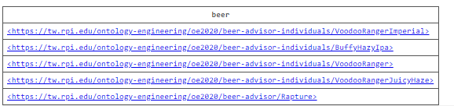
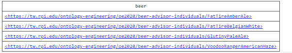

---
---

## Static Demo

To run the demo, first download the queries below. After this, you will want to run each query individually.

# Query 1

For question 2, the output should be Helltown Brewery.

# Query 2

For question 3, the output shoudl for now return all instances of IPA's.

# Query 3

For question 4, the output should be Fat Tire Amber Ale, Fat Tire Belgian White, Glutiny Pale Ale, and Voodoo Ranger American Haze.

- [Queries](files/query)