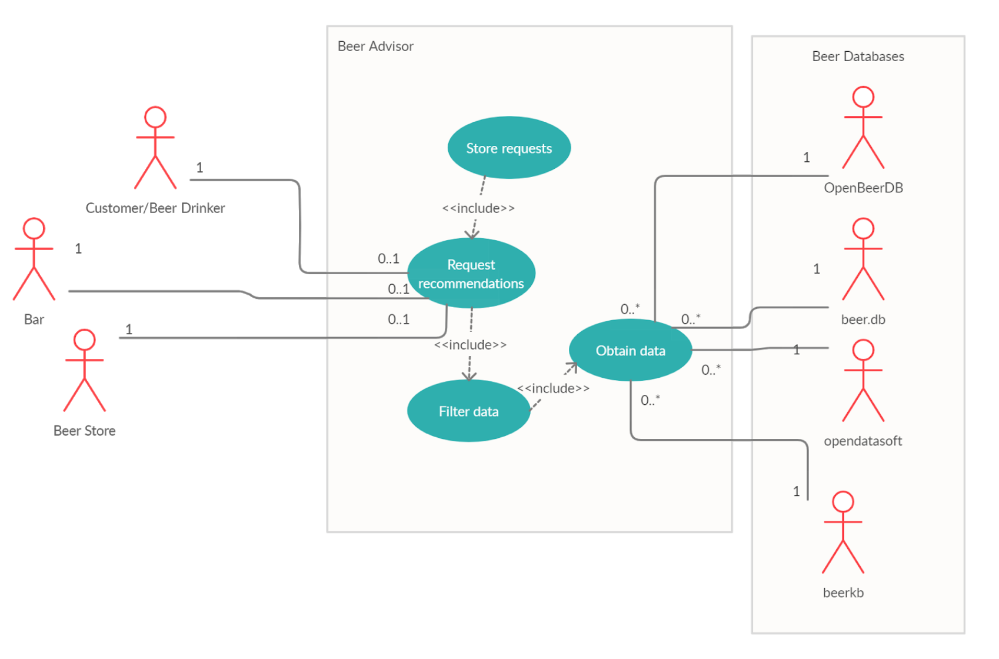

## Abstract

Beer is one of the oldest alcoholic drinks created by humans and we have been creating different types of beers for millennia. Therefore, due to the wide variety of beers with different flavor profiles and styles, choosing a beer is not a simple matter. In this context, the Beer Advisor helps people in the difficult task which is finding the perfect beer and to do so the beer ontology was developed. This ontology is meant to provide users with a way of finding beers that are suitable to different specifications. The ontology combines information coming from different sources in order to create a complete and yet comprehensive classification of beers that can be used by a ontology-enabled application made for beer recommendation. Recommendations are provided depending on many attributes such as beer style, alcohol content, bitterness, sweetness and color. Users can also find recommendations based off the search history and preferences of other users, and similariteis between different styles of beers. In addition, the ontology also allow users to look for beers that are produced by a determined brewery or in a specific location. The beer ontology enables all these different features by using many existing ontologies such as FIBO FND and BE ontologies and extending them to fit the purposes of beer classification.
 

## Point of Contact

<ul>
<li>Lucas Standaert (standl at rpi dot edu) </li>
Lucas Standaert is a current Applied Mathematics masters student at RPI who will be graduating in Spring 2021 who enjoys a variety of different kinds of beers, but prefers IPA's and Pale Ales.
<li>Anna Yaroslaski (yarosa2 at rpi dot edu) </li>
<li>Marcelo de Castro Fernandes (decasm3 at rpi dot edu) </li>
<li>Sam Stouffer (stoufs2 at rpi dot edu) </li>
</ul>

## Project Overview Diagram

A general idea of the Beer-Advisor project is displayed in the figure below. Beer consumers, distributors and sellers are considered potential users that use the application searching for beer recommendations. The ontology-enabled application is expected to collect information from databases and the ontology is used for organizing all that information in a graph-like knowledge base. The application will then use this organized knowledge to recommend beers given the specific characteristics required by the user.

## List of Resources

This section summarizes some resources that might be useful for someone interested in the Beer-otology.

<table>
  <tr>
    <th>Resources</th>
    <th>Links</th>
  </tr>
  <tr>
    <td>1. Documentation</td>
    <td>(a) <a href="./usecase">Use Case Section</a></td>
  </tr>
  <tr>
    <td>2. Ontology</td>
    <td>(a) <a href="https://raw.githubusercontent.com/tetherless-world/ontology-engineering/beer-advisor/oe2020/beer-advisor/beer-advisor.rdf">Beer Ontology</a> 
        (b) <a href="https://raw.githubusercontent.com/tetherless-world/ontology-engineering/beer-advisor/oe2020/beer-advisor/beer-advisor-individuals.rdf">Individuals</a>
    </td>
  </tr>
  <tr>
    <td>3. Term List</td>
    <td>(a) <a href="./termlist">Mapped Vocabularies</a> </td>
  </tr>
  <tr>
    <td>4. Competency Questions</td>
    <td>(a) <a href="./demo">SPARQL Queries</a> </td>
  </tr>
  <tr>
    <td>5. Presentations:</td>
    <td>(a) <a href="./presentations">Project presentations during class</a> </td>
  </tr>
  <tr>
    <td>6. Getting involved:</td>
    <td>(a) <a href="./gettinginvolved">Contact Information</a> </td>
  </tr>
</table>

## Acknowledgements

The authors would like to thank Elisa Kendall, Sam Stouffer and Prof. Deborah McGuiness, for their continuing support in technical matters during the development of this ontology. The authors would also like to thank Evan Wallace and Pete Rivett for providing important insights and expertise that greatly assisted this project.