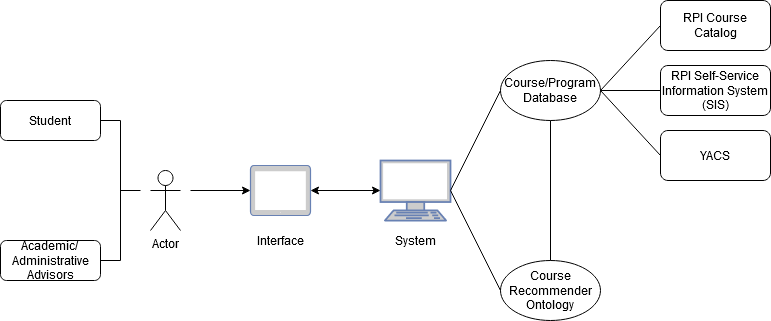
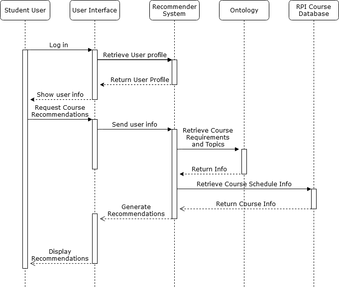

## Abstract

Students attending a university can benefit from carefully planning out which
courses they will take during the course of their academic career. Developing
such a plan of study can be difficult because students need to consider factors
such as how each course applies to their graduation requirements, whether
course schedules have conflicts, whether the courses are interesting to the
student, and whether registering for particular courses can fulfill prerequisites
for future courses. In this work, we present a Course Recommendation Ontology,
which aims to represent relevant information about courses, schedules,
graduation requirements, relationships among courses, and student interests 
to enable a recommender system.
Our ontology can be used to enable rule-based recommendations that adhere to
course requirements (such as prerequisite requirements) and provide
explanations to students about why certain courses are recommended to them.

## Project Overview Diagram

The Course Recommendation Ontology is intended to be used together with external resources
to serve the use case of recommending courses to students. The system architecture diagram below
depicts how this ontology would fit in to such an application. Course information would be retrieved
or stored from other sources, like a course catalog. A recommender system would ingest the information
about available courses, then use the Course Recommendation Ontology to help determine what courses to
recommend to the user.

Let us consider the basic flow of a student entering the course recommender system and retrieving some
recommended courses to sign up for. A recommendation system might function following the an activity
diagram like the one below. A student would enter the system by logging in, then request some course 
recommendations from the system. The recommender system would use the Course Recommendation Ontology 
to retrieve information like course prerequisites, corequisites, and topics. The system would then query
some database containing information about what course sections and schedules are being offered in
the next semester. These pieces of information would be leveraged by the recommendation system, together
with the student profile, to decide which courses to provide as recommendations. 

## Point of Contact

- Sola S. Shirai - shiras2 at rpi dot edu

- Owen Xie  - xieo at rpi dot edu

- Kelly Fellenzer - fellek at rpi dot edu

- Jacob Shomstein - shomsj at rpi dot edu

## List of Resources

1. [Ontology](ontology.md)

2. [Term List](termlist.md)

3. [Use Case and Competency Questions](usecase.md)

4. [Static Demo](demo.md) 

5. [Presentations](presentations.md)

## Acknowledgements
A huge thank you to our professors Deborah McGuinness and Elisa Kendall for providing help and insight during the 
development of our Course Recommender Ontology. Additionally, we appreciate all of Sabbir Rashid's and Shruthi Chari's 
feedback we recieved on our artifacts and presentations.  
