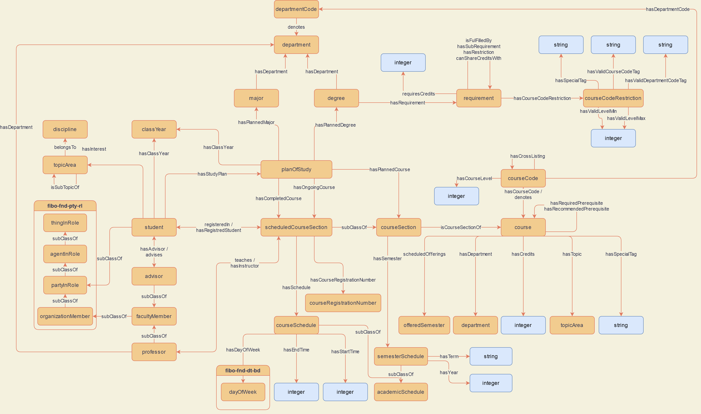
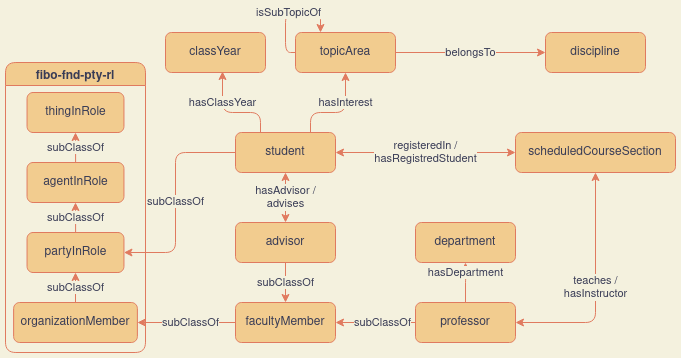
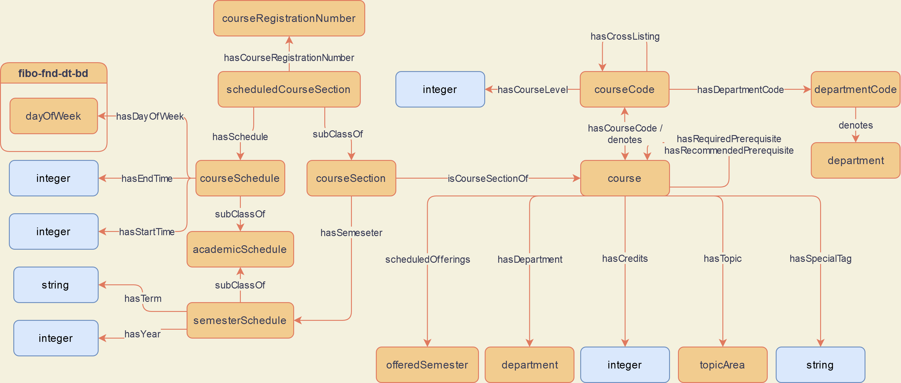

[Concept Map](#conceptual-model) | [Ontology File](course-recommender.rdf)

## Conceptual Model

The concept map above shows an overview of the classses and relationships in our ontology. In the following sections we break down this view into related components.

### People

### Courses

### Plans of Study

The conceptual model for our most recent ontology version can be seen as a [drawio file](https://drive.google.com/file/d/1b3JVHcvj6Lowty8aPcan0jGcSv3qkH0Z/view?usp=sharing).

## Ontologies

- [Main Ontology][oe-current]
- [Individuals][oe-current-ind]

### Previous Versions

| Ontology                    | Individuals                  |
|-----------------------------|------------------------------|
| [OE 12][oe-12-ont]          | [OE 12][oe-12-ind]           |
| [OE 11][oe-11-ont]          | [OE 11][oe-11-ind]           |
| [OE 10][oe-10-ont]          | [OE 10][oe-10-ind]           |
| [OE 9][oe-9-ont]            | [OE 9][oe-9-ind]             |
| [OE 8][oe-8-ont]            | [OE 8][oe-8-ind]             |
| [OE 7][oe-7-ont]            |                              |

[oe-current]: https://raw.githubusercontent.com/tetherless-world/ontology-engineering/course-recommender/oe2020/course-recommender/course-recommender.rdf
[oe-current-ind]: https://raw.githubusercontent.com/tetherless-world/ontology-engineering/course-recommender/oe2020/course-recommender/course-recommender-individuals.rdf

[oe-12-ont]: https://raw.githubusercontent.com/tetherless-world/ontology-engineering/7dd19e4a8a78e7143a5ff6002fd206ed4b20bf13/oe2020/course-recommender/course-recommender.rdf
[oe-12-ind]: https://raw.githubusercontent.com/tetherless-world/ontology-engineering/7dd19e4a8a78e7143a5ff6002fd206ed4b20bf13/oe2020/course-recommender/course-recommender-individuals.rdf

[oe-11-ont]: https://raw.githubusercontent.com/tetherless-world/ontology-engineering/4316f30ca8a93fd652ff4d4861c7ba101e28c7fa/oe2020/course-recommender/course-recommender.rdf
[oe-11-ind]: https://raw.githubusercontent.com/tetherless-world/ontology-engineering/4316f30ca8a93fd652ff4d4861c7ba101e28c7fa/oe2020/course-recommender/course-recommender-individuals.rdf

[oe-10-ont]: https://raw.githubusercontent.com/tetherless-world/ontology-engineering/f611a01bbe4915a8af9f6bfa2e8a11d371b7ed0e/oe2020/course-recommender/course-recommender.rdf
[oe-10-ind]: https://raw.githubusercontent.com/tetherless-world/ontology-engineering/f611a01bbe4915a8af9f6bfa2e8a11d371b7ed0e/oe2020/course-recommender/course-recommender-individuals.rdf

[oe-9-ont]: https://raw.githubusercontent.com/tetherless-world/ontology-engineering/83366e952dae6beb86ddcd660f004076a31b81ea/oe2020/course-recommender/course-recommender.rdf
[oe-9-ind]: https://raw.githubusercontent.com/tetherless-world/ontology-engineering/83366e952dae6beb86ddcd660f004076a31b81ea/oe2020/course-recommender/course-recommender-individuals.rdf

[oe-8-ont]: https://raw.githubusercontent.com/tetherless-world/ontology-engineering/1d4ed76076bb7bc6687dd92ace36fc8734f34995/oe2020/course-recommender/course-recommender.rdf
[oe-8-ind]: https://raw.githubusercontent.com/tetherless-world/ontology-engineering/83366e952dae6beb86ddcd660f004076a31b81ea/oe2020/course-recommender/course-recommender-individuals.rdf

[oe-7-ont]: https://raw.githubusercontent.com/tetherless-world/ontology-engineering/5f9f5249fb24d6367fbf894c1673205298ef0f96/oe2020/course-recommender/course-recommender.rdf
