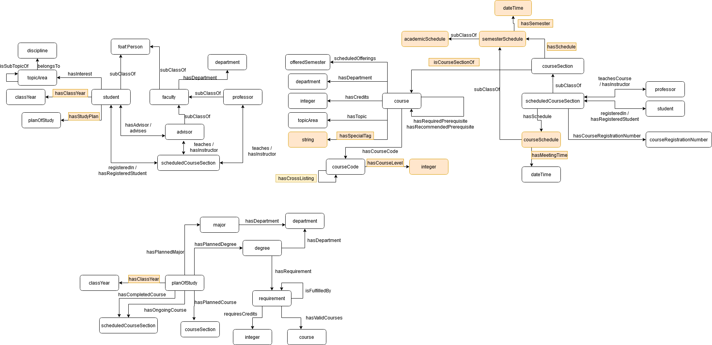

[Concept Map](#conceptual-model) | [Ontology File](course-recommender.rdf)

## Conceptual Model

Conceptual Model

## Ontologies

**Link:**

-[Version 1 Ontology](https://github.com/tetherless-world/ontology-engineering/blob/301ebc3e5839f448a85420aaf4c3f6198c0536d6/oe2020/course-recommender/course-recommender.rdf)

**View the ontology documentation at:**
