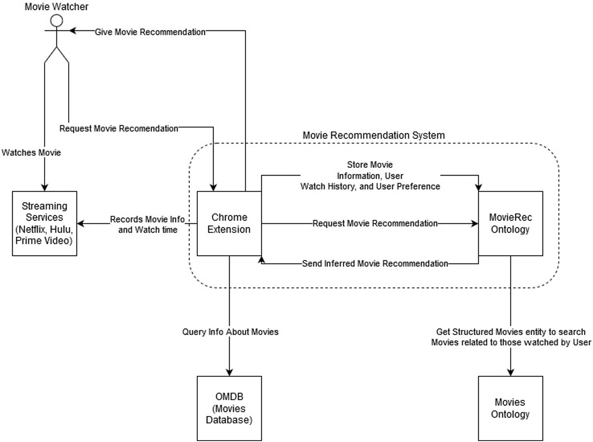

## Point of Contact
* Justin Chen (chenj37)
* Liam Haining (hainil)
* Dhruv Patel (pateld7)

## Abstract

Everyone loves great movies, but finding them can be difficult at times. Most (if not all) streaming services have their own way of providing recommendations, but these are limited only to their own services, so you won’t get recommendations on Netflix based on your watch history on Hulu. By joining watch history across multiple streaming providers and creating recommendations through an ontology in an explainable way, users could get an even better series of recommendations.

The main sources of general data for this system will be IMDB and other movie rating sites. The personalized data will come from the user’s watch history, tracked by the system. We anticipate that users of the system will be able to have a more efficient movie searching process, as they will have less trouble both finding movies they are legitimately interested in and finding the streaming service associated with said movie.

[Link to the class](https://tetherless-world.github.io/ontology-engineering/)

## Project Overview Diagram

The following image provides a basic overview of how the system functions with a user of the system. A movie watcher using the system will make a request for a recommendation via one of a couple different potential triggers, leading to the system retrieving that information from the ontology and storing the relevant information in its own data storage. That information is then reported back to the user in a readable fashion.

## List of Resources

Here is a compounded list of the most important resources.

1. [Use Case](https://drive.google.com/file/d/1FwBu-j_ZyAdFDsD5Ttgvm7c8tafzuUxd/view?usp=sharing)
2. [Terminology](https://docs.google.com/spreadsheets/d/1dhIHuSWCLPY0zbKTdcqWqbwCWUBuRrtol_B_y6KmWEY/edit?usp=sharing)
3. [Concept Map & Ontology](https://movie-recommender--rpi-ontology-engineering.netlify.app/oe2020/movie-recommender/ontology)
4. [Competency Questions & Queries](https://movie-recommender--rpi-ontology-engineering.netlify.app/oe2020/movie-recommender/demo)
5. [Presentations](https://movie-recommender--rpi-ontology-engineering.netlify.app/oe2020/movie-recommender/presentations)

[Live Demo](https://movie-recommender--rpi-ontology-engineering.netlify.app/oe2020/movie-recommender/demo)
[Static Demo](https://movie-recommender--rpi-ontology-engineering.netlify.app/oe2020/movie-recommender/demo)

The Movie Recommender team encourages viewers to utilize the open source resources however they wish, and to continue providing ideas and help towards the advancement of the ontology.

## Acknowledgements

We would like to thank the Fall 2020 Ontologies instructors Professor Deborah McGuinness and Elisa Kendall for all their hard work. We would also like to thank course manager Rebecca Cowen, and the teaching assistants Shruthi Chari and Sabbir Muhammed Rashid.
