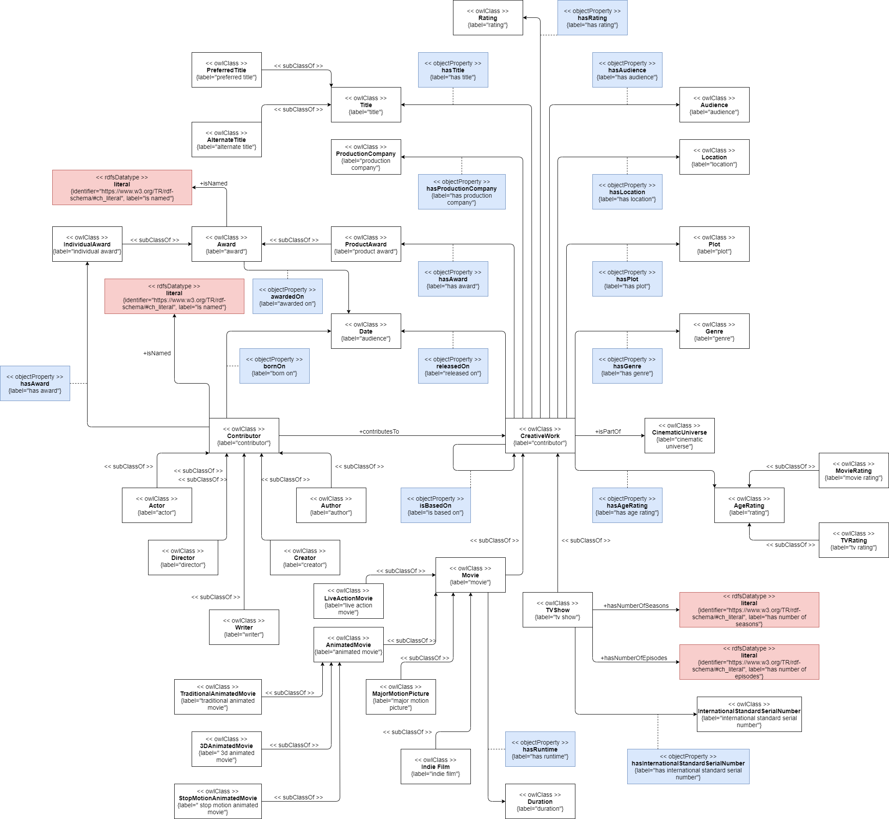
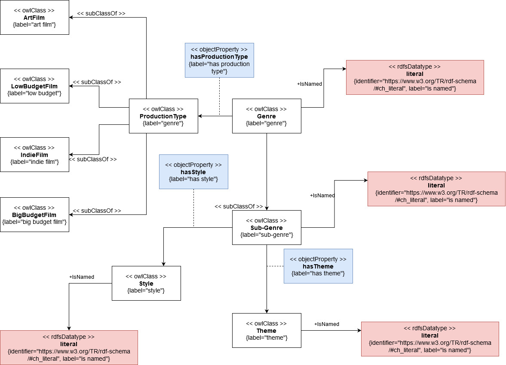
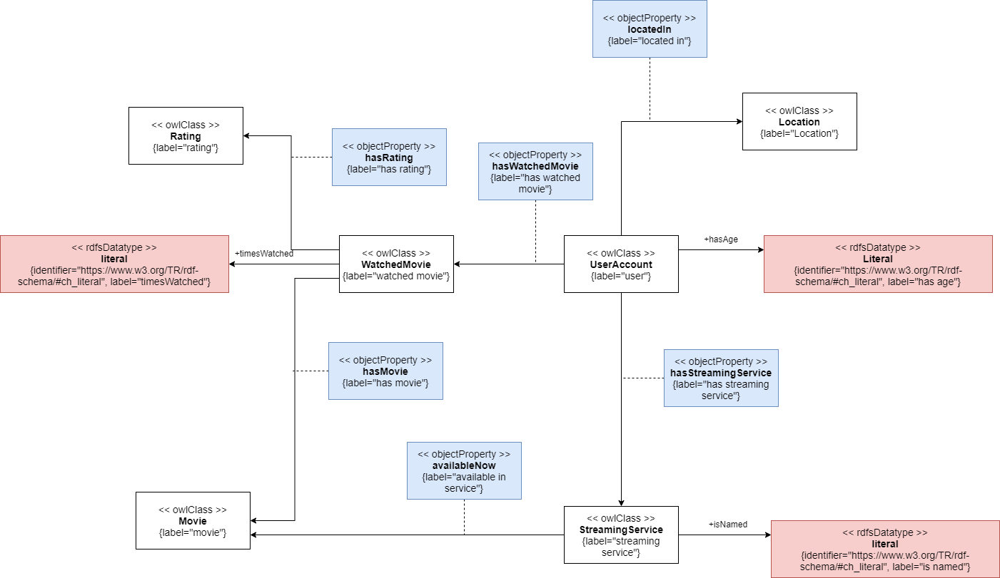

[Concept Map](#conceptual-model) | [Ontology File](#ontologies)

## Conceptual Model

General Model [(Full Size)](https://raw.githubusercontent.com/tetherless-world/ontology-engineering/movie-recommender/oe2020/movie-recommender/images/conceptualModel.png):

Genre Model [(Full Size)](https://raw.githubusercontent.com/tetherless-world/ontology-engineering/movie-recommender/oe2020/movie-recommender/images/genresConceptualModel.jpg):

User Model [(Full Size)](https://raw.githubusercontent.com/tetherless-world/ontology-engineering/movie-recommender/oe2020/movie-recommender/images/userAccount.png):

## Ontologies

**Link to current version:**

- Current Version (OE 10)
    - [Ontology](https://github.com/tetherless-world/ontology-engineering/blob/movie-recommender/oe2020/movie-recommender/movie-recommender.rdf)
    - [Individuals](https://github.com/tetherless-world/ontology-engineering/blob/movie-recommender/oe2020/movie-recommender/movie-recommender-individuals.rdf)

**Link to past versions:**

- Version 4 (OE 9)
    - [Ontology](https://drive.google.com/file/d/1XryOQJe_h0wOGZHPHF5ss-kCeKv5pent/view?usp=sharing)
    - [Individuals](https://drive.google.com/file/d/14YaUmhAJmDt_ItMQAYdlDIE79Ru_TKI3/view?usp=sharing)
- Version 3 (OE 8)
    - [Ontology](https://drive.google.com/file/d/1JN5Uro4wnQkYhcmj44V3rfWO6Cxc8iTu/view?usp=sharing)
    - [Individuals](https://drive.google.com/file/d/18tEkaSxnA0dXV7nk9A1JKYuWjcPkMSG6/view?usp=sharing)
- [Version 2 Ontology (OE 7)](https://drive.google.com/file/d/1lcfccbxgRu_YG590d4Lfwp3UPoziYQWA/view?usp=sharing)
- [Version 1 Ontology (OE 6)](https://drive.google.com/file/d/1YPB6cCIfXY1cSC047wm9jWTZ--pIk-kz/view?usp=sharing)

**View the ontology documentation at:**
