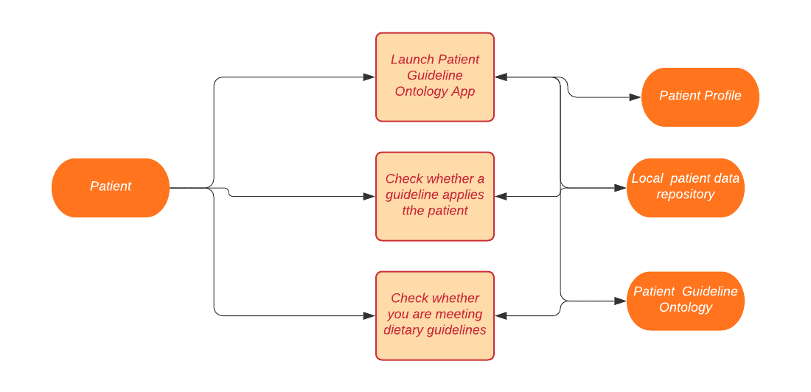

## Co-Investigators
Liam Feehery, [LinkedIn](https://www.linkedin.com/in/liam-feehery-6b6a0b199/)

Ishita Padhiar, [LinkedIn](https://www.linkedin.com/in/ishita-padhiar-470183151/)

Travis Peterson, [LinkedIn](https://www.linkedin.com/in/travis-j-peterson/)

Bolun "Namir" Xia, [LinkedIn](https://www.linkedin.com/in/bolun-namir-xia-a1974399/)

## Description
The application of  semantic web techniques to create intelligent systems in different domains is an  active area of research in both academia and industry. In this work, we attempt to support an intelligent system in the clinical domain  to better assist the health needs and concerns of the diabetic populations. There exist several guidelines and evidence-based sources of information for people facing a chronic disease such as type-2 diabetes to read and review. However, the amount of information contained can be difficult to review for non-experts and additionally patients might  seek to be informed about the evidence behind the recommendations. Our system can be used  to make such information gathering and sorting a far easier process for every party involved as well as provide any helpful information to the users of the system related to their query. To create our system, we developed an ontology model to bring together the information of the patient and the associated clinical guidelines that can be used to aid them. This model lends itself to drawing better inferences on patient data as well as provides the ability to query information on patient data and on the guidelines they match. Furthermore, to evaluate our ontology, we designed competency questions keeping in mind the questions that users would want assistance with when dealing with medical guidelines. We demonstrate that our model was able to address these questions with answers that would enable users in their food and lifestyle decision-making.

Currently there are many sources that include lifestyle guidelines for diabetic patients, such as WebMD, Mayo Clinic, and the American Diabetes Association Guidelines. However, access to these sources and answers to important questions are often obscured by an abundance of expert-level information that is not easily consumable by patients or that of information whose provenance needs to be understood . Further, once the user is at an authoritative source, there is often further difficulty in obtaining the answers that the user is specifically looking for. We aimed to address these issues  through  a semantic solution, in the form of our Patient Guideline Ontology (PGO), which connects patients with guidelines from the American Diabetes Association that are relevant to them.  We do so by creating a semantic representation of guidelines that splits the guideline into sets of restrictions and recommendations. We match patients to restrictions and then return any relevant recommendations. With PGO we can find which guidelines are relevant to a particular patient and then provide them the resulting recommendations.

## Project Overview Diagram

## Link to Our Class
[Ontology Engineering](https://tw.rpi.edu/web/Courses/Ontologies/2020)

## Introduction to Demo

Our static demonstration walks through how we answer our competency questions with SPARQL queries.

Here is the link: [Static Demo](https://patient-guideline-recommender--rpi-ontology-engineering.netlify.app/oe2020/patient-guideline-recommender/demo)

## Call to Action

As problems of modernity become more and more apparent in our societies, diabetes, as a disease, is becoming more and more prevalent. As such, we need to increase our attention towards caring for the needs of diabetic patients, since they may not have the expertise or the time to do it themselves. So, come, our brethrens, let us all contribute to a project such as this, and do something beneficial for the diabetic patients in our society!

## Acknowledgements
Prof. Deborah McGuinness, who taught us in this class;

Mrs. Elisa Kendall, who helped us a lot with semantics encoding and ontology validation and review;

Ms. Shruthi Chari, who became more or less a fellow team member in helping us in our work;

Mr. Sam Stouffer, who helped us with serialization and hygiene tests;

Mr. Henrique Oliveira Santos and Oshani Seneviratne, who helped us resolve ontology encoding issues;

RPI HEALS, from which we drew inspiration.
