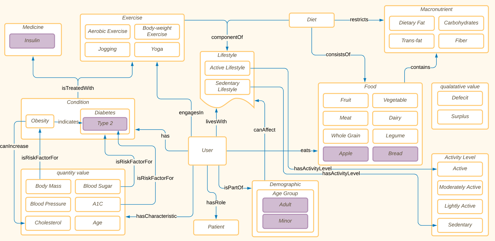
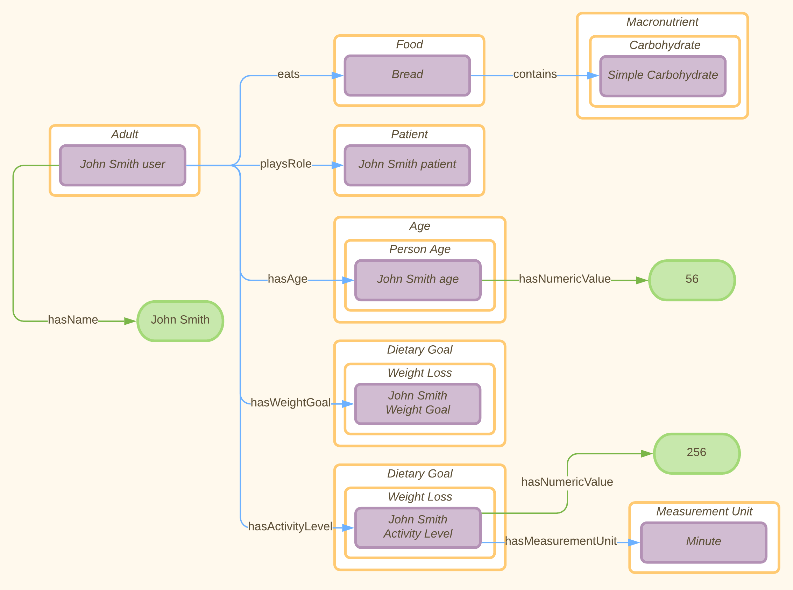
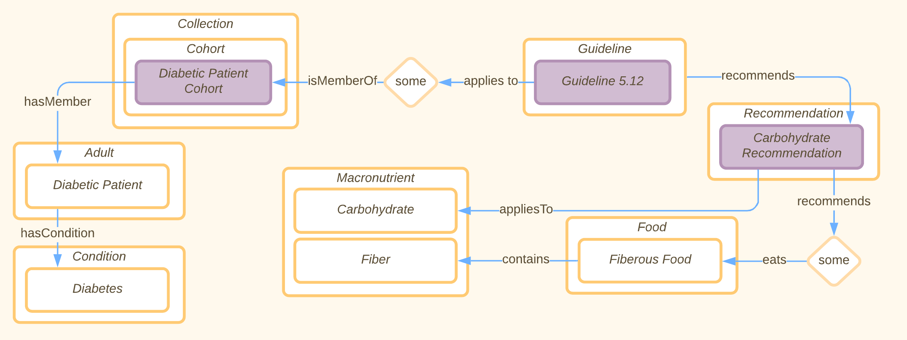
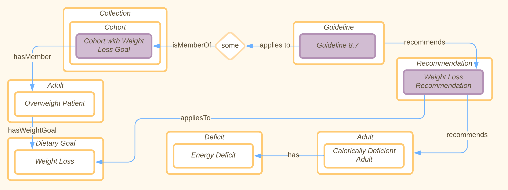

[Concept Map](#conceptual-model) | [Ontology File](#ontologies)

## Conceptual Model
**User Conceptual Model:**

This is our overview diagram of the system as it interacts with users and patients. We have a couple key relationships that we look at here, including exercise and activity level, health conditions, and food/ dietary modeling. Our patient also has some basic demographic information such as age group. We characterize a user's activity level using the reasoner and given the amount that they workout in a week. 

**Individual Conceptual Model:**

This diagram contains a model of what a user might look like in the system. In this case, we can see an example of properties that a user might have, which we can ultimately use to characterize our user as members of different cohorts. Certain relationships exist as object properties, such as hasAge, eats, playsRole, hasWeightGoal, and hasActivityLevel. Other relationships existed as data properties, such as hasActivityLevel, and hasName. 

**Guideline 5.12 Conceptual Model:**

This diagram represents Guideline 5.12 in our ontology. Guideline 5.12, which states “All adults, and particularly those with type 2 diabetes, should decrease the amount of time spent in daily sedentary behavior. Prolonged sitting should be interrupted every 30 min for blood glucose benefits, particularly in adults with type 2 diabetes,” is represented with a restriction (applies to some Diabetic Patient Cohort) and a recommendation (recommends Carbohydrate Recommendation). The diabetic patient cohort’s members are all patients that have diabetes, which allows (after the reasoner has been run) a SPARQL query to determine whether or not the current user is a member of the cohort (and therefore the guideline applies to them). 

**Guideline 8.7 Conceptual Model:**

Similar to the previous diagram, this one represents Guideline 8.7 in our ontology, which states “As all energy-deficit food intake will result in weight loss, eating plans should be individualized to meet the patient's protein, fat, and carbohydrate needs while still promoting weight loss.” This is represented as applying to members of a cohort that have weight loss goals, and recommends having an energy deficit.

## Ontologies

**Link:**
[Ontology Link](patient-guideline-recommender.rdf)

[Individual Ontology](patient-guideline-recommender-individuals.rdf)

**Previous Ontologies Link:**

[Version 1 - OE-6](https://drive.google.com/file/d/1MjOd3Fz1jb3mDt64vZkIe7u_w7uQwK4M/view?usp=sharing)

[Version 2 - OE-7](https://drive.google.com/file/d/1ExcOr2hMCnMStTiu90XM5VITMIBKxtov/view?usp=sharing)

[Version 3 - OE-8](https://drive.google.com/drive/folders/16OjjC46xGAQiJ299rv04HXnSRf374rjX?usp=sharing)

[Version 4 - OE-9](https://drive.google.com/drive/folders/1WU7ojUufQWvg6pWD1iEpZkH6EaGexJ0_?usp=sharing)

[Version 5 - OE-10](https://drive.google.com/drive/folders/1071X--WPvpQzO9k4Pd6l1nIhrNV9Q3ls?usp=sharing)

[Version 6 - OE-11](https://drive.google.com/drive/folders/11nHSO4Xz9lCPcIOfIs1boXp85pxKIESv?usp=sharing)

**View the ontology documentation at:**
