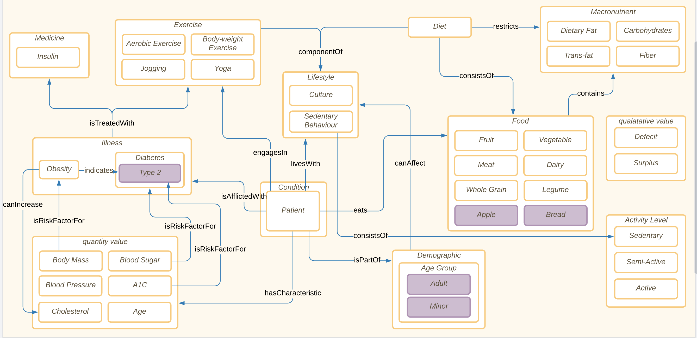
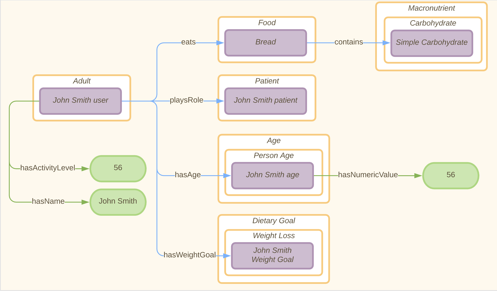

[Concept Map](#conceptual-model) | [Ontology File](#ontologies)

## Conceptual Model

## Ontologies

**Link:**
[Ontology Link](patient-guideline-recommender.rdf)

[Individual Ontology](patient-guideline-recommender-individuals.rdf)

**Previous Ontologies Link:**

[OE-7](files/OE_7_PatientGuidelineRecommender.rdf)

[OE-8](files/OE_6_patient-guideline-recommender.rdf)

**View the ontology documentation at:**
