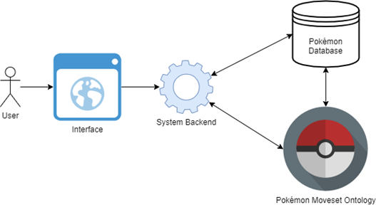

## Pokemon-Moveset-Application Team
Mitchell Falkow, Jade Franklin, Zhepeng Luo, John Slowik

## Abstract
As games become increasingly complicated, professional gamers and their audience are faced with a growing amount of information they need to understand and navigate to intelligently participate and compete.  In most cases, players simply memorize these facts and navigate them by intuition and trial-and-error, resulting in potentially large time costs to answer questions about new styles of play.  A technique for efficiently encoding the multiple layers of complexity and available information is absent; such a tool could greatly improve the accessibility of complex games for both veteran and novice players. Ontologies encode, relate, and can reason on abstract information (which can be changing, versioned, and distributed); as such, they fit these requirements perfectly.  Here, we demonstrate this on the Pokémon franchise: it has a healthy esports community, and there is a particular problem involving relatively simple mechanics that is greatly complicated by the scale of the game: teaching a specific Pokémon a specific move.  Although our technique can answer a number sub-questions players may find useful, this specific task requires players to memorize, minimally, hundreds of unique Pokémon, hundreds of unique moves, which Pokémon can learn which moves, and then navigate this information in its entirety to find a solution.

## A Super Breif Introduction to Pokémon
Pokémon is a turn based role-playing game where the player collects creatures, called Pokémon.  The primary gameplay involves Pokémon battling, wherein two Pokémon take turns using moves to inflict damage or status effects on each other.  Players can carry up to six Pokémon, though they can - and almost always - do have many more stored elsewhere. Pokémon can know at most four moves, which are determined by a number of factors, and change as the player adventures through the game. For example, a Pokémon's level, a measure that reflects and increases with a Pokémon's general power; when a Pokémon acheives certain levels, they can learn specific moves.  The specific level and move a Pokémon learns varys from species to species.

Pokémon is a Nintendo game franchise that dates back to 1996, and has since seen the release of dozens of games following the same core gameplay from above.  It is broadly considered to be one of the most successful gaming franchise ever, and unsurprisingly has developed a large community of fans that hold tournaments where players battle each other and events where players generally share their enthusiasm for the games.  

The primary appeal of the game is a combination of adventure/role-playing elements, intuitive rock-paper-scissors battling mechanics, and collect-'em-all features; the accessibility and cohesion of these features has garnerd the game's large audience, in tandem with excellent management by the game's developing studio, Nintendo, who regularly released new games that added new Pokémon and mechanics while keeping the core gameplay intact, and held public relations events and sponsorships with other groups.

## The Problem: Breeding and Move Inheritance
As mentioned in the abstract, our project is a demonstration deployment of an ontology that encodes information from the Pokémon game, with the goal of answering certain player question about the game - for now, most of the supported questions are simple, such as "What moves can Pokémon X learn?"  The question we're primarily interested in answering is "How can Pokémon X learn move Y?" - with the restriction that Pokémon X can only learn Y through inheritance.

Inheritance is one of four ways a Pokémon can learn a move.  The first, as mentioned previously, is through levelling; as a Pokémon wins battles, it gains experience.  When enough experience is gained, the Pokémon will level up, which may mean that it can learn a new move.  The second is by use of an item - certain items in the game, when used, will teach a Pokémon a move.  Though not all moves can be learned by all Pokémon, and not all moves can be taught from an item, this is none-the-less useful, in particular for moves that can only be taught from an item.  The third way a Pokémon can learn a move is from a tutor - that is, some npc's in the game can teach the Pokémon the move.  Finally, moves can be inherited: when two Pokémon breed and produce a child (Pokémon are living creatures, after all) the child has a chance to be born knowing one or more of the moves its parents knew; this process is called Move Inheritance.  This is an important mechanic, as certain moves cannot be learned by a Pokémon via levelling, items, or tutors, and must be inherited from a Pokémon of a different species that knows the move.  For reasons that will soon become apparent, these moves are known as Egg Moves for the Pokémon in question.

A naive approach may find this problem simple at first: find a Pokémon that can learn the move, breed it with the Pokémon species you would like to inherit the move, done. E-z p-z.  However, this process is complicated by a breeding restriction called Egg Groups (hence the moves being known as "Egg" Moves).  An Egg Group is a class of Pokémon that are allowed to breed together - for example, the Field Egg Group is unable to breed with Pokémon from the Water-1 Egg Group.  What makes the problem more interesting is that some Pokémon are in two Egg Groups at once; this means that the Pokémon that knows the move you want to learn may not be directly breedable, meaning you need to find a Pokémon that can inherit it *and* can breed with the Pokémon that can learn the move and your Pokémon.  This technique is known as breed-chaining, and can include more than one in-between Pokémon inheriting the move. The problem gains substance due to the scale and distribution of egg moves - there are many moves, Pokémon, and egg groups to take into consideration when attempting to form a working breed-chain.

## Project Overview Diagram
The system in the current work is limited greatly in scope from a fully working application.  A working framework for the ontology has been deployed and tested; however, it only handles a few Pokémon, Moves, and Items - sufficient to demonstrate all the core functionality. The user interface, system backend, and connection with external databases was cut from the project scope.  As pictured below, a user would interact with the user interface, which would supply the user with answers to queries through communication with the system backend - which itself would retrieve the answer by interacting directly with the ontology, and in some cases communicating other networked databases.  In its current implementation, the Ontology itself does not need to access external databases, but such an interaction wouldn't be out of the question in a full implementation.

## Future Applications of this Work
There are several uses for this system that go beyond game information management.  Ontologies are a go-to for encoding user preferences and inferring what that user might like; an anologue for movies might be if the user likes Star Wars, the system could recommend that they watch Star Treck; or, if the user likes action-adventure movies, the system might recommend Indiana Jones.  For the Pokémon game and community, this idea has both basic and advanced implementations.  A basic recommendation might be encoding what types of moves or Pokémon a particular user prefers; the system could recommend what moves or Pokémon work well with those Pokémon or move sets - recall that a player will usually have a team of 6 Pokémon, where each Pokémon knows four moves; it's extremely common for all the moves and Pokémon to be completely unique, and there are almost innumerable combinations of moves and Pokémon to form such teams.  It might also be possible to encode play styles and, through use of information on team compositions and effectiveness in different circumstances, infer how to improve or counter them.  Giving players such resources could help them improve, and give them ideas on how to explore new ways of playing the game.  Most players have fun exploring these combinations - it can take hours or days to assemble a team of Pokémon, and more to experiment with is effectiveness; with such a tool, players could explore combinations and be given preliminary information on the effectiveness of these combinations, which would increase the value of the time they spend playing - as they can vet their choices before committing to them.

Another useful function Ontologies serve is encoding version information - becuase the Pokémon franchise is spread out over many games, the rules of the game and Pokémon available have varied over time.  It would be entirely within reason to setup the Ontology to encode information for specific generations,

## List of Resources

- [Ontology](ontology.md)

- [Term List](termlist.md)

- [Use Case and Competency Questions](usecase.md)

- [Demonstrations](demo.md)

- [Presentations](presentations.md)

## Acknowledgements
The project team would like to thank professors Deborah McGuinness and Elisa Kendal for their continuing technical support and guidance on the project. Additionally, the team appreaciates all of Sabbir Rashid’s and Shruthi Chari’s feedback on the artifacts and advice on the query.
