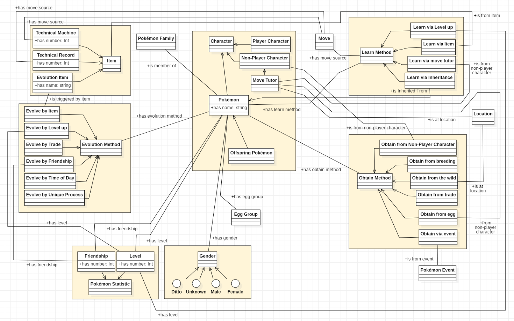
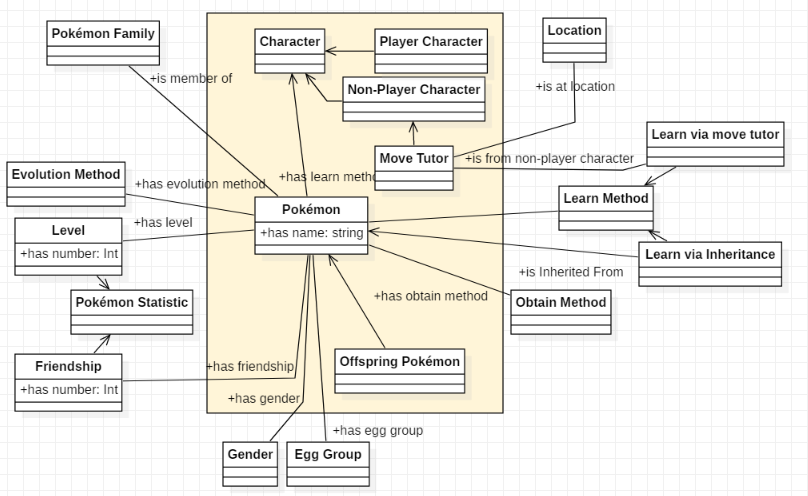
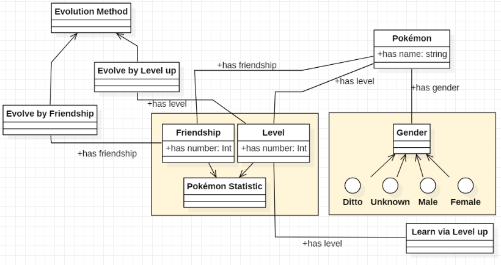
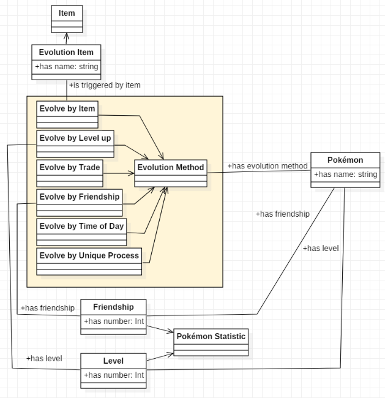
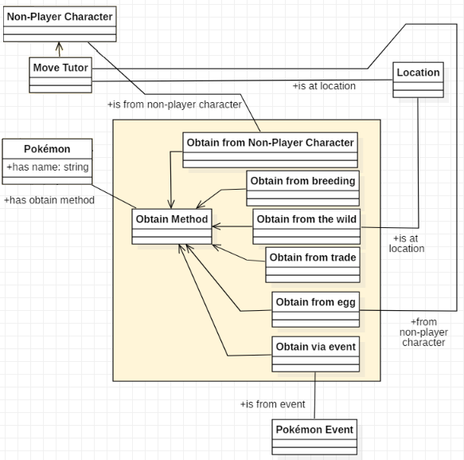
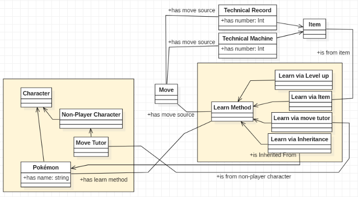

[Concept Map](#conceptual-model) | [Ontology Downloads](#ontology-downloads)

## Conceptual Model

Concept Map Overview Model:

Overview of the Pokemon Moveset Ontology. We have divided the classes into seven general groups: characters (including Pokemon), Pokemon statistics and genders, methods for learning new moves, obtaining new moves, and obtaining new Pokemon, and Pokemon items. We go into more detail on each of these below.

Concept Map -- Characters and Pokemon Model:

Here we have characters in the Pokemon universe -- most importantly, this includes Pokemon themselves, as well as non-player characters like the Move Tutor and the player character. Pokemon have a variety of connections to other classes, including having an egg group, Pokemon family, level, friendship, and zero or more of each of the three methods. Non-player characters also have a few connections, which we go into detail on in future sections.

Concept Map -- Pokemon Statistics and Genders:

These are Pokemon-specific values. Gender determines what other Pokemon a Pokemon can breed with -- male and female pokemon can breed with female and male, respectively, and unknown gender Pokemon can only breed with the shape-shifting Ditto pokemon (which has its own gender). Each pokemon also has a level, which determines how powerful a Pokemon is. Pokemon learn moves or evolve at specific levels. They additionally have a Friendship value, which determines how much a Pokemon likes the player character -- pokemon which have a high Friendship value may evolve.

Concept Map -- Evolution Methods:

For a Pokemon, Evolution is the process a Pokemon goes through of transforming from one Pokemon species into another. As different Pokemon species can learn different moves, and more evolved forms tend to be more powerful, it is ideal for the player to trigger Evolutions. Pokemon can evolve under a variety of conditions, here termed Evolution Methods. These are: evolve by item, in which a Pokemon is given an Evolution Item to hold, Evolve by Level-Up, in which a Pokemon reaches a certain Level and evolves, Evolve by Trade, in which a Pokemon is traded to another Player and evolves, Evolve by Friendship, in which a Pokemon evolves after reaching the maximum Friendship value, Evolve by Time of Day, in which a Pokemon evolves by level-up during night or day, and Evolve by Unique Process, which is specific to each Pokemon which has this method.

Concept Map -- Obtain Methods:

Pokemon can be obtained in a variety of ways (called here Obtain Methods). The most common is to catch a Pokemon in the wild at a specific location, but Pokemon can also be give nto the player by a non-player character, obtained by breeding a Pokemon with another Pokemon, obtained from an egg given to the player by a non-player character, or obtained from a special Pokemon Event.

Concept Map -- Learn Methods:

Learn Methods describe the conditions under which Pokemon learn new moves. Most commonly, Pokemon learn moves by reaching a specific Level. They may also learn moves from haing a specific Item -- either a Technical Machine or Techinical Record -- used on them, by being taught a move by the Move Tutor character, or by inheriting a Move from another Pokemon through breeding.

- [download PDF](files/OE10_PokemontologyGroup_Model.pdf) 
- [download MDJ](files/OE10_Pokemontology_Group_Conceptual_Model.mdj)

## Ontology Downloads

| Ontology                    | Individuals                 |
|-----------------------------|-----------------------------|
| [Latest][oe-ont] 			  | [Latest][oe-ind] 			|
| [OE 12][oe-12-ont]          | [OE 12][oe-12-ind]          |
| [OE 11][oe-11-ont]          | [OE 11][oe-11-ind]          |
| [OE 10][oe-10-ont]          | [OE 10][oe-10-ind]          |
| [OE 9][oe-9-ont]            | [OE 9][oe-9-ind]            |
| [OE 8][oe-8-ont]            | [OE 8][oe-8-ind]            |
| [OE 7][oe-7-ont]            |                             |

<!-- LATEST -->
[oe-ont]: https://raw.githubusercontent.com/tetherless-world/ontology-engineering/pokemon-moveset-application/oe2020/pokemon-moveset-application/pokemon-moveset.rdf
[oe-ind]: https://raw.githubusercontent.com/tetherless-world/ontology-engineering/pokemon-moveset-application/oe2020/pokemon-moveset-application/pokemon-moveset-individuals.rdf

<!-- OE 12 -->
[oe-12-ont]: https://raw.githubusercontent.com/tetherless-world/ontology-engineering/pokemon-moveset-application/oe2020/pokemon-moveset-application/archived/OE12_PokemonMovesetOntology.rdf
[oe-12-ind]: https://raw.githubusercontent.com/tetherless-world/ontology-engineering/pokemon-moveset-application/oe2020/pokemon-moveset-application/archived/OE12_PokemonMovesetOntology_Individuals.rdf

<!-- OE 11 -->
[oe-11-ont]: https://raw.githubusercontent.com/tetherless-world/ontology-engineering/pokemon-moveset-application/oe2020/pokemon-moveset-application/archived/OE11_PokemonMovesetOntology.rdf
[oe-11-ind]: https://raw.githubusercontent.com/tetherless-world/ontology-engineering/pokemon-moveset-application/oe2020/pokemon-moveset-application/archived/OE11_PokemonMovesetOntology_Individuals.rdf

<!-- OE 10 -->
[oe-10-ont]: https://raw.githubusercontent.com/tetherless-world/ontology-engineering/pokemon-moveset-application/oe2020/pokemon-moveset-application/archived/OE10_PokemonMovesetOntology.rdf
[oe-10-ind]: https://raw.githubusercontent.com/tetherless-world/ontology-engineering/pokemon-moveset-application/oe2020/pokemon-moveset-application/archived/OE10_PokemonMovesetOntology_Individuals.rdf

<!-- OE 9 -->
[oe-9-ont]: https://raw.githubusercontent.com/tetherless-world/ontology-engineering/pokemon-moveset-application/oe2020/pokemon-moveset-application/archived/OE9_PokemonMovesetOntology.rdf
[oe-9-ind]: https://raw.githubusercontent.com/tetherless-world/ontology-engineering/pokemon-moveset-application/oe2020/pokemon-moveset-application/archived/OE9_PokemonMovesetOntology_Individuals.rdf

<!-- OE 8 -->
[oe-8-ont]: https://raw.githubusercontent.com/tetherless-world/ontology-engineering/pokemon-moveset-application/oe2020/pokemon-moveset-application/archived/OE8_PokemonMovesetOntology.rdf
[oe-8-ind]: https://raw.githubusercontent.com/tetherless-world/ontology-engineering/pokemon-moveset-application/oe2020/pokemon-moveset-application/archived/OE8_PokemonMovesetOntology_Individuals.rdf

<!-- OE 7 -->
[oe-7-ont]: https://raw.githubusercontent.com/tetherless-world/ontology-engineering/pokemon-moveset-application/oe2020/pokemon-moveset-application/archived/OE7_PokemonMovesetOntology.rdf

<!-- **View the ontology documentation at:** Coming soon! -->
