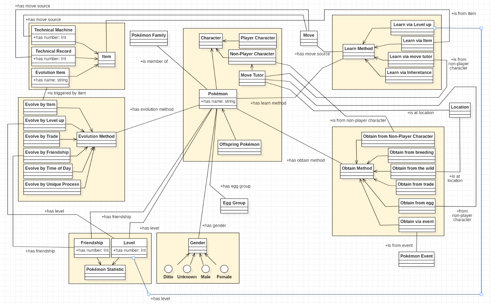

[Concept Map](#conceptual-model) | [Ontology File](#ontologies)

## Conceptual Model

Concept Map General Model:[download PDF](files/OE8_PokemontologyGroup_Model.pdf)[download MDJ](files/OE8_Pokemontology_Group_Conceptual_Model.mdj)

## Ontologies

**Link to current version:** 

- [Ontology Link](pokemon-moveset.rdf)

- [Individual Link](pokemon-moveset-individuals.rdf)

**Link to Previous versions:**
- OE-8:
	- [Ontology](archived/OE_8_pokemon-moveset.rdf)
	- [Individuals](archived/OE_8_pokemon-moveset-individuals.rdf)
- [OE-7](archived/OE_7_pokemon-moveset.rdf)

**View the ontology documentation at:** Coming soon!
