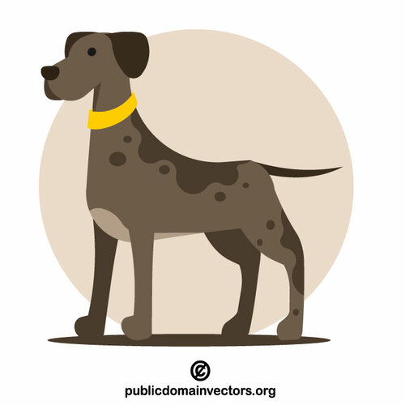
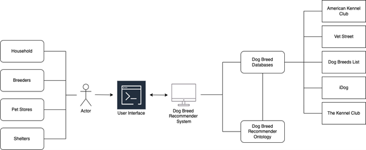
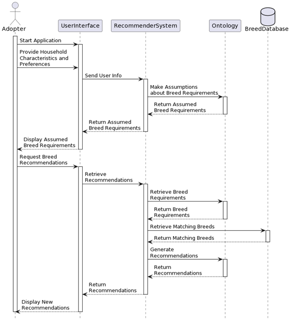
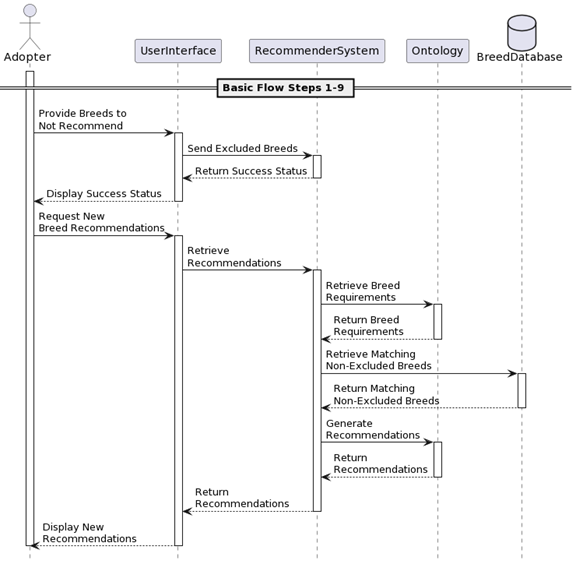
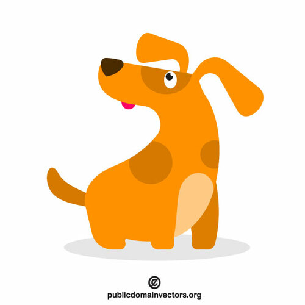

## Abstract

When looking for a dog to adopt, there is no automated method to match potential owner preferences to appropriate dog breeds. Currently potential owners need to go to the internet and try to manually find a breed that will meet specific needs of an individual or a family. It is often difficult to find a breed if there are multiple criteria and constraints. Some sites offer breed selector quizzes, but few explain their rankings and different quizes are rarely in agreement. To address this need to meet multiple, sometimes conflicting, requirements of finding a matching breed of dog to adopt, we propose an ontology-based solution that  ultimately forms the basis of a recommender of dog breeds to households, given some specific characteristics of the homeowner, their home, family, and personal preferences. The proposed ontology-supported application recommends dog breeds to households given some specific characteristics of the homeowners like home size, activity level, child friendliness. Additionally, the recommendation will provide a list of other potential dog breeds that may suit the family’s needs, to account for any potential subjective factors like cuteness.

## Project Overview Diagrams

The Dog Breed Ontology is intended to be used with external resouces, primarily dog breed information sources, to recommend dog breeds to potential adopters. Below is the imagined system's architecture which shows how our ontology would be used. A user interface would ingest information about the potential adopter, potentially using natural language processing on a given description of the adopter. Several potential sources of dog breed information are also shown.

Below is an activity diagram of the basic flow of the system. A user enters household and individual information, and any personal preferences, which are used by the ontology to reason what requirements a breed needs to fulfill. After the user confirms that any assumptions made by the system are correct, the recommender uses the reasoning capabilities of the ontology to classify each dog breed and determine which breeds are the best fit. These are then returned to the user. 

It may be that the user is unsatisfied with the results, either because they do not like a specific breed that was recommended or because they realized they needed to give the system more information about their needs and preferences. The below activity diagram shows that process. 

## Point of Contact

Ashley Choi: <choia5@rpi.edu>

Debjani Ray-Majumder: <raymad@rpi.edu>

Danielle Villa: <villad4@rpi.edu>

## List of Resources

<table>
  <tr>
    <th>Resources</th>
    <th>Links</th>
  </tr>
  <tr>
    <td>1. Ontology</td>
    <td>(a) <a href="https://raw.githubusercontent.com/tetherless-world/ontology-engineering/3db93d1b10911829c64fb1d1fda0dd4b033ac006/oe2022/dog-breed-ontology/find-a-pet.rdf">Base Ontology</a>   (b) <a href="https://raw.githubusercontent.com/tetherless-world/ontology-engineering/411a147b864f13eecf2c84701550626bf3190622/oe2022/dog-breed-ontology/find-a-pet-individuals-small.rdf">Small Set of Individuals Ontology</a>   (c) <a href="https://github.com/tetherless-world/ontology-engineering/raw/c78b8c60b6f6687c8d719997c7fe1d45fb20c664/oe2022/dog-breed-ontology/find-a-pet-individuals.rdf">Large Set of Individuals</a> </td>
  </tr>
  <tr>
    <td>2. Term List</td>
    <td> <a href="https://dog-breed-ontology--rpi-ontology-engineering.netlify.app/oe2022/dog-breed-ontology/termlist">Mapped Vocabularies</a> </td>
  </tr>
  <tr>
    <td>2. Competency Questions</td>
    <td> <a href="https://dog-breed-ontology--rpi-ontology-engineering.netlify.app/oe2022/dog-breed-ontology/demo">Demonstrations and SPARQL Queries</a> </td>
  </tr>
  <tr>
    <td>3. Presentations:</td>
    <td> <a href="https://dog-breed-ontology--rpi-ontology-engineering.netlify.app/oe2022/dog-breed-ontology/presentations">Project presentations during class</a> </td>
  </tr>
</table>

## Acknowledgements

This work is undertaken as a part of Fall 2022 CSCI 6340 Ontologies. We would like to thank our professors Dr. Deborah McGuinness and Ms. Elisa Kendall for their teaching and guidance. We would also like to thank our mentors Jade Franklin and Sola Shirai for their help and feedback, and Sabbir Rashid for his advice on query writing. 

