[Concept Map](#conceptual-model) | [Ontology File](#ontologies) | [Ontologies Reused](#ontologies-reused) | [Ontology Prefixes](#ontology-prefixes)

## Conceptual Model

The overall problem we are trying to solve is how to model US breeds and potential adopters such that the system can infer which breeds would work well with the potential adopters. The following diagrams explain how we have solved that problem. The ontology is split into two main parts: describing the breeds, and describing the potential adopters. 
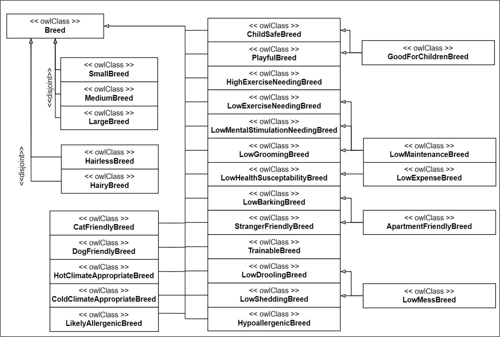
Our ontology models dog breeds and classifies them based on what potential adopters might require or prefer. These are the types of breeds that our system can infer. Some of them are distinct oposites, such as hypoallergenic and likely allergenic breeds, which are used to speed up our reasoning process. Other breed subtypes, such as a trainable breed, are based on the characteristic values that are assigned to them by various organizations. Note that only 1 organization has to characterize a breed a certain way for the breed to be classified that way. This is a potential avenue for future work, especially since users may have a varying level of trust in different organizations.
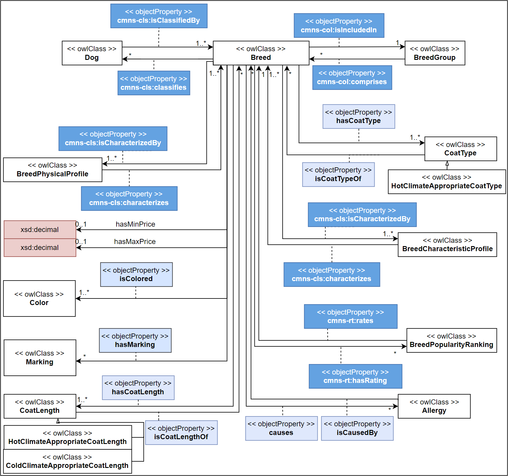
The above image describes our conceptual model with regards to how we model dog breeds. This includes the object properties that connect each breed with the classes that describe it. Cardinality is also expressed. The goal was not to have the system infer what is and is not a breed, but rather to place restrictions on what information is and is not required for a breed.
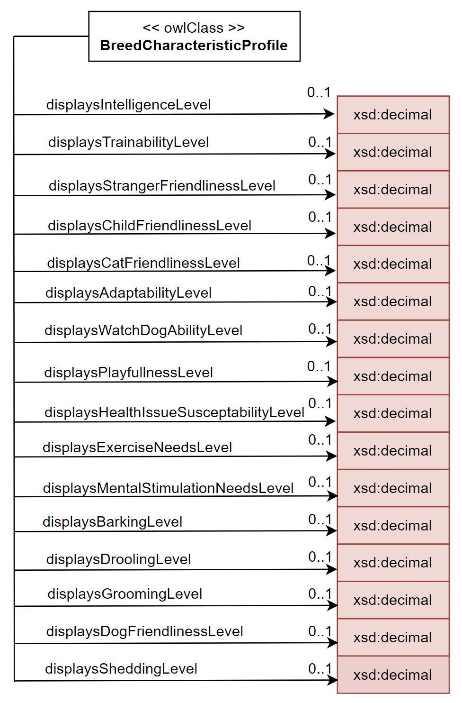
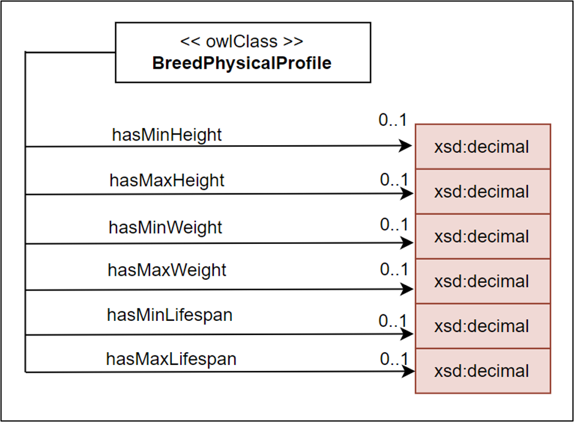
Each of these profiles are sets of data properties that describe a breed. Each object property in the breed characteristic profile is a value between 0 and 1 that indicate how much a breed embodies that characteristic. For example, a characteristic given 1/5 stars is given a value of 0.2, and 5/5 stars is given a value of 1.0. The values in a breed physical profile have no upper limit, but should be positive. 
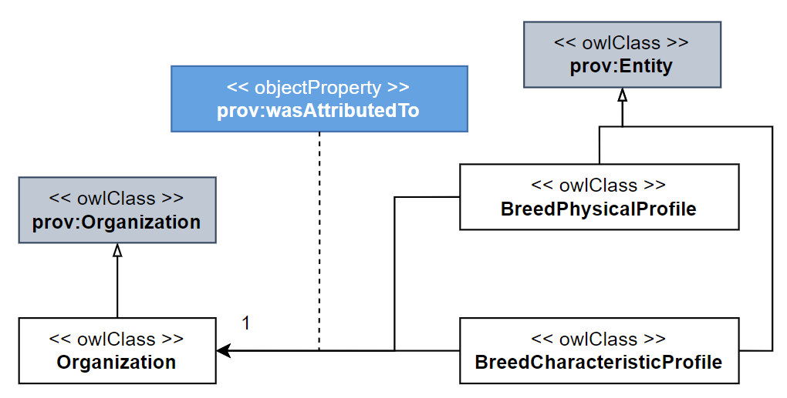
Each profile is attributed to the organization (eg. The American Kennel Club) that provided the information. This allows us to explicitly track provenance through this part of the ontology, which is especially important since some sources may disagree on breed characteristics. 
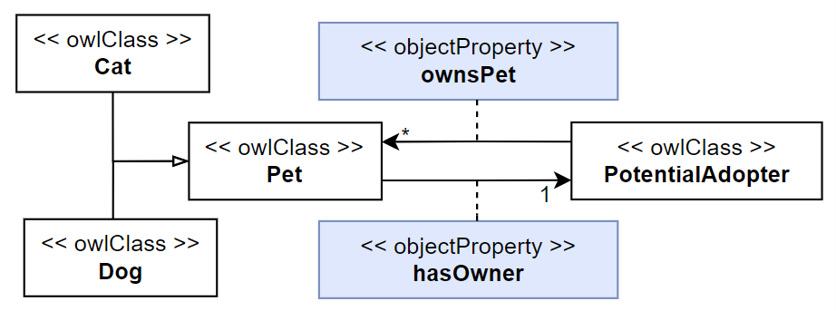
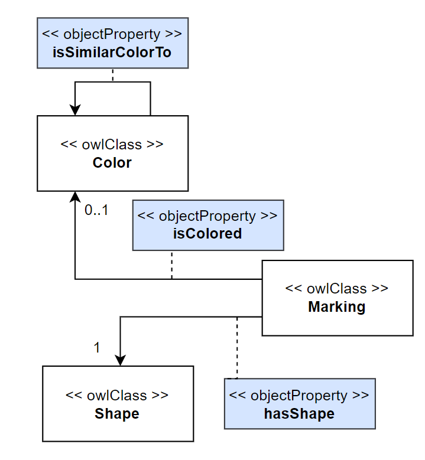
Potential adopters may have existing pets that a new dog would have to get along with, and this is how we model that. Markings are also broken up as a shape and its color(s). We use the 2022 AKC colors and marking names as instances. Markings and colors are modeled in case a potential adopter has a preference for the look of their dog, though this is an optional requirement for the system to fulfill in recommendations. Ensuring that a new dog is likely to get along with new pets is not optional.
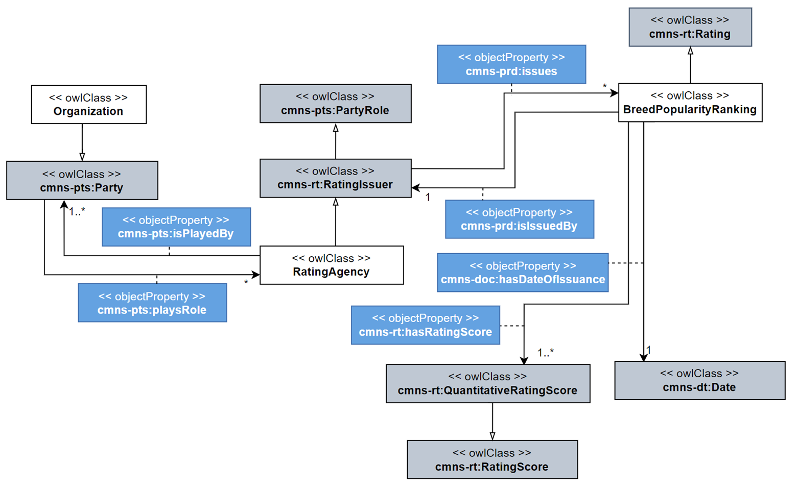
We cannot model cuteness, since that's subjective, we instead model the popularity rankings for each breed, as reported by the AKC. Cute and recognizable breeds are often desirable for adopters, but that is not directly characterized by dog organizations. This model shows how we do that using the existing Commons Ratings ontology. Since we allow for any organization could be the rating provider, additional rankings could be added in the future.
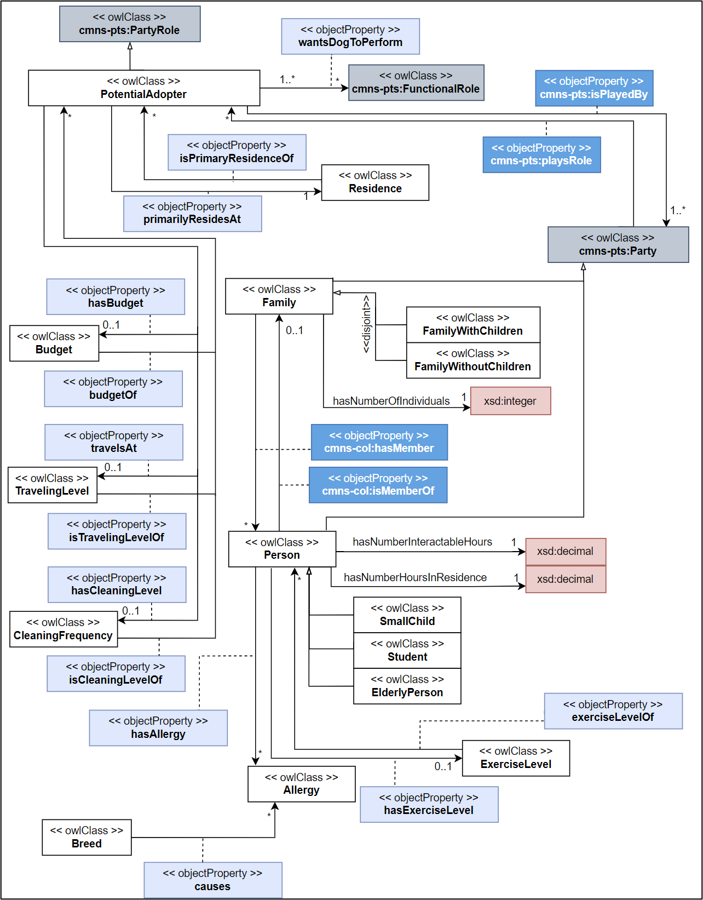
The above image describes our conceptual model with regards to how we model potential adopters. An adopter can be a family or an individual person, and have a variety of characteristics that affect what dogs are the best fit for them. This includes the object properties that connect each adopter with the classes that describe it. It also shows how we model famililies and allergies (a dog allergy is an instance of the Allergy class).
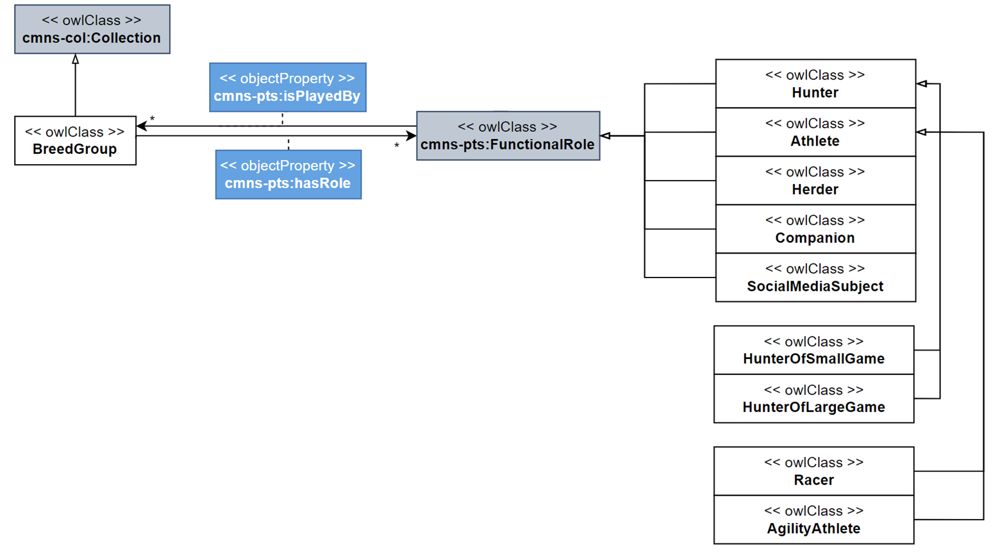
Some adopters may want a dog for a certain purpose, such as herding, and most breeds were bred for a certain purpose, such as hunting. We model that using functional roles. Since it's not guaranteed to be good at the purpose it's bred for (since most dogs are not working dogs in the US) this is an optional requirement of the system and overall trainability is prioritized.
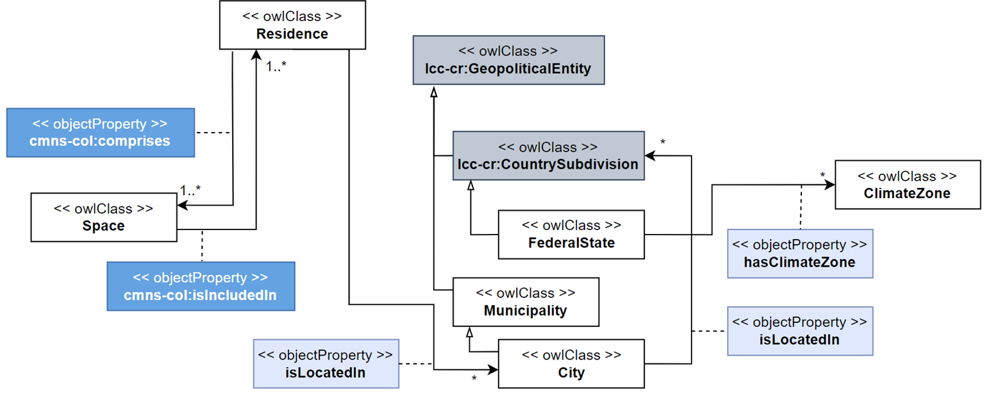
We model an adopter's residence with its location so that we can recommend breeds that are well suited for the climate. We use the IECC climate zones, and allow for a state to have mutiple climate zones. Modeling counties for more specific climate zone data is a potential for future work. 
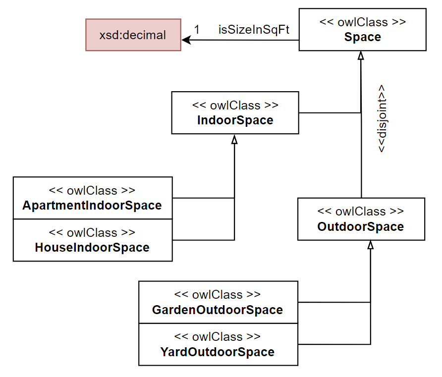
Each residence is made up of a set of spaces, some indoors and some outdoors. Spaces that are covered but not temperature controlled, such as patios or screened-in porches, are considered outdoor spaces. This is modeled so that dogs that need a lot of exercise are not limited by a lack of outdoor spaces.
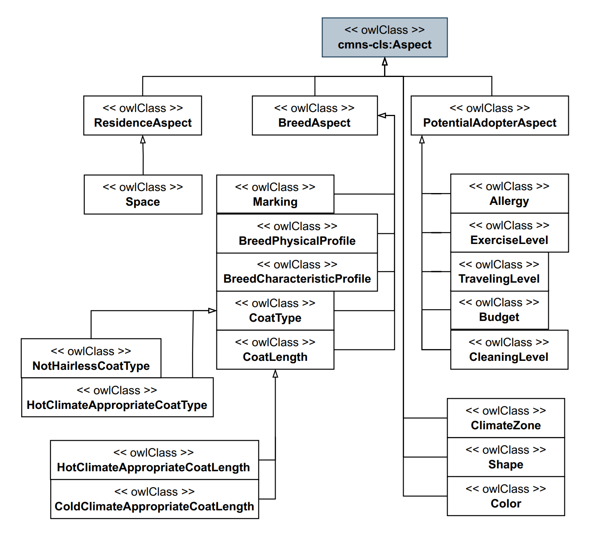
This model shows how the varous characteristics of other entities are organized. 

### Previous Versions

- [Version 5 (OE 10)](files/ConceptualModel_v6.pdf) [SVG](files/ConceptualModel_v6.svg) CURRENT
- [Version 5 (OE 10)](files/ConceptualModel_v5.pdf) [SVG](files/ConceptualModel_v5.svg) 
- [Version 4 (OE 9)](files/ConceptualModel_v4.pdf) [SVG](files/ConceptualModel_v4.svg)
- [Version 3 (OE 8)](files/ConceptualModel_v3.pdf)
- [Version 2 (OE 6)](files/ConceptualModel_v2.pdf)
- [Version 1 (OE 5)](files/ConceptualModel_v1.pdf)

## Ontologies

- [Version 8 (OE 13)](https://raw.githubusercontent.com/tetherless-world/ontology-engineering/411a147b864f13eecf2c84701550626bf3190622/oe2022/dog-breed-ontology/find-a-pet.rdf) [Large Individuals](https://github.com/tetherless-world/ontology-engineering/raw/411a147b864f13eecf2c84701550626bf3190622/oe2022/dog-breed-ontology/find-a-pet-individuals.rdf) [Small Individuals](https://raw.githubusercontent.com/tetherless-world/ontology-engineering/411a147b864f13eecf2c84701550626bf3190622/oe2022/dog-breed-ontology/find-a-pet-individuals-small.rdf) CURRENT
- [Version 7 (OE 12)](https://raw.githubusercontent.com/tetherless-world/ontology-engineering/c4c5af171820eedcb7108cc069a69637fe25a02a/oe2022/dog-breed-ontology/find-a-pet.rdf) [Large Individuals](https://github.com/tetherless-world/ontology-engineering/raw/c4c5af171820eedcb7108cc069a69637fe25a02a/oe2022/dog-breed-ontology/find-a-pet-individuals.rdf) [Small Individuals](https://raw.githubusercontent.com/tetherless-world/ontology-engineering/c4c5af171820eedcb7108cc069a69637fe25a02a/oe2022/dog-breed-ontology/find-a-pet-individuals-small.rdf) 
- [Version 6 (OE 11)](https://raw.githubusercontent.com/tetherless-world/ontology-engineering/68ee5cc09ddc8a4af8b5d85b31565d2733f38613/oe2022/dog-breed-ontology/find-a-pet.rdf) [Individuals](https://github.com/tetherless-world/ontology-engineering/raw/68ee5cc09ddc8a4af8b5d85b31565d2733f38613/oe2022/dog-breed-ontology/find-a-pet-individuals.rdf) 
- [Version 5 (OE 10)](https://raw.githubusercontent.com/tetherless-world/ontology-engineering/c1f3e28aecb3212c01b1f88fa362049ae3272d31/oe2022/dog-breed-ontology/find-a-pet.rdf) [Individuals](https://raw.githubusercontent.com/tetherless-world/ontology-engineering/c1f3e28aecb3212c01b1f88fa362049ae3272d31/oe2022/dog-breed-ontology/find-a-pet-individuals.rdf)
- [Version 4 (OE 9)](https://raw.githubusercontent.com/tetherless-world/ontology-engineering/006ce23f62757847531bcb106831490d4c43f14b/oe2022/dog-breed-ontology/find-a-pet.rdf) [Individuals](https://raw.githubusercontent.com/tetherless-world/ontology-engineering/006ce23f62757847531bcb106831490d4c43f14b/oe2022/dog-breed-ontology/find-a-pet-individuals.rdf)
- [Version 3 (OE 8)](https://raw.githubusercontent.com/tetherless-world/ontology-engineering/c65013f0f13175273378c6a35a18031150a03e32/oe2022/dog-breed-ontology/find-a-pet.rdf) [Individuals](https://raw.githubusercontent.com/tetherless-world/ontology-engineering/c65013f0f13175273378c6a35a18031150a03e32/oe2022/dog-breed-ontology/find-a-pet-individuals.rdf) 
- [Version 2 (OE 7)](https://raw.githubusercontent.com/tetherless-world/ontology-engineering/3ffedc3e1063ee3ddeb0f233c9d43d29989e17bc/oe2022/dog-breed-ontology/find-a-pet.rdf)
- [Version 1 (OE 6)](https://raw.githubusercontent.com/tetherless-world/ontology-engineering/40b9433c732a6adc31d5fb0dd1c953f172dbd228/oe2022/dog-breed-ontology/find-a-pet.rdf) 

## Ontologies Reused
- [OMG Annotation Vocabulary v.2022-08-01](https://www.omg.org/spec/Commons/20220801/AnnotationVocabulary/)
- [OMG Classifiers v.2022-08-01](https://www.omg.org/spec/Commons/20220801/Classifiers/)
- [OMG Collections v.2022-08-01](https://www.omg.org/spec/Commons/20220801/Collections/)
- [OMG Documents v.2022-06-01](https://www.omg.org/spec/Commons/20220601/Documents/)
- [OMG Dates & Times v.2022-08-01](https://www.omg.org/spec/Commons/20220801/DatesAndTimes/)
- [OMG Products & Services v.2022-07-01](https://www.omg.org/spec/Commons/20220701/ProductsAndServices/)
- [OMG Parties & Situations v.2022-09-01](https://www.omg.org/spec/Commons/20220901/PartiesAndSituations/)
- [OMG Ratings v.2022-10-01](https://www.omg.org/spec/Commons/20221001/Ratings/)
- [Purl DC Terms v.2020-01-20](http://purl.org/dc/terms/)
- [LCC Country Representation v.2022-11-01](https://www.omg.org/spec/LCC/20221101/Countries/CountryRepresentation/)
- [LCC ISO3166-2 US Subdivision Codes v.2022-11-01](https://www.omg.org/spec/LCC/20221101Countries/Regions/ISO3166-2-SubdivisionCodes-US/)
- [PROVO v.2013-04-30](http://www.w3.org/ns/prov-o-20130430/)
- [W3C OWL v.2002](http://www.w3.org/2002/07/owl#)
- [W3C RDF v.1999](http://www.w3.org/1999/02/22-rdf-syntax-ns#)
- [W3C RDFS v.2000](http://www.w3.org/2000/01/rdf-schema#)
- [W3C SKOS v.2004](http://www.w3.org/2004/02/skos/core#)
- [W3C XSD v.2001](http://www.w3.org/2001/XMLSchema#)

## Ontology Prefixes
- cmns-av="https://www.omg.org/spec/Commons/AnnotationVocabulary/"
- cmns-cls="https://www.omg.org/spec/Commons/Classifiers/"
- cmns-col="https://www.omg.org/spec/Commons/Collections/"
- cmns-doc="https://www.omg.org/spec/Commons/Documents/"
- cmns-dt="https://www.omg.org/spec/Commons/DatesAndTimes/"
- cmns-prd="https://www.omg.org/spec/Commons/ProductsAndServices/"
- cmns-pts="https://www.omg.org/spec/Commons/PartiesAndSituations/"
- cmns-rt="https://www.omg.org/spec/Commons/Ratings/"
- dct="http://purl.org/dc/terms/"
- lcc-3166-2-us="https://www.omg.org/spec/LCC/Countries/Regions/ISO3166-2-SubdivisionCodes-US/"
- lcc-cr="https://www.omg.org/spec/LCC/Countries/CountryRepresentation/"
- prov="http://www.w3.org/ns/prov#"
- oe2022-dogs="https://tw.rpi.edu/ontology-engineering/oe2022/find-a-pet/"
- oe2022-dogs-ind="https://tw.rpi.edu/ontology-engineering/oe2022/find-a-pet-individuals/"
- owl="http://www.w3.org/2002/07/owl#"
- rdf="http://www.w3.org/1999/02/22-rdf-syntax-ns#"
- rdfs="http://www.w3.org/2000/01/rdf-schema#"
- skos="http://www.w3.org/2004/02/skos/core#"
- xsd="http://www.w3.org/2001/XMLSchema#"

