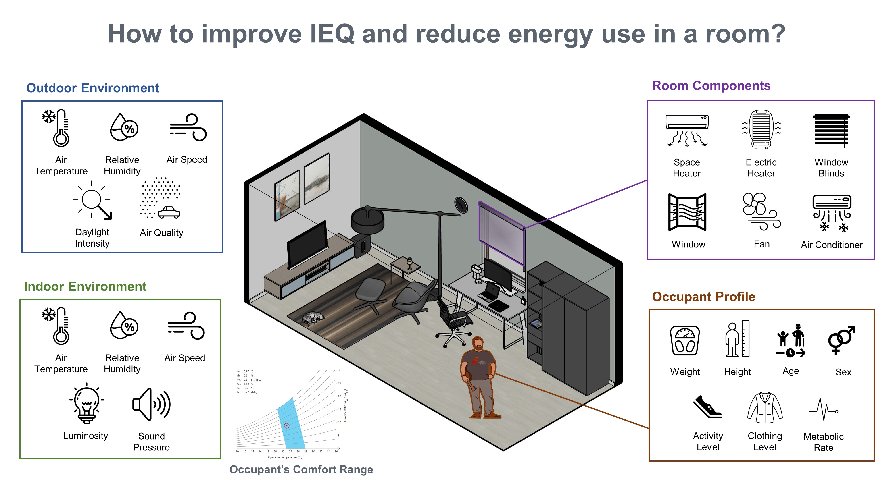
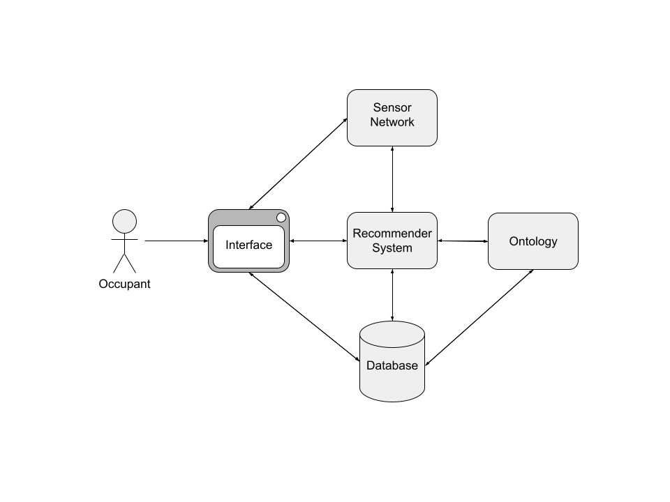
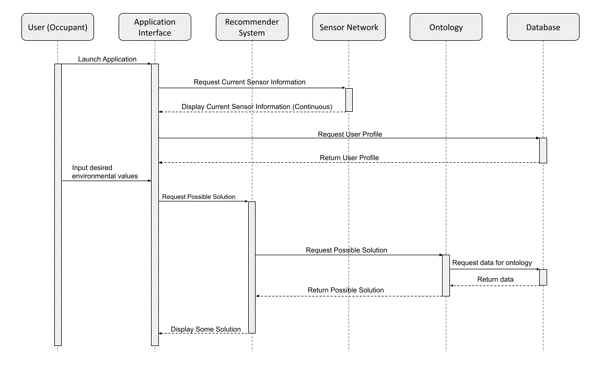

## Abstract

This project aims to develop an ontology that recommends a viable solution to improve indoor environmental quality (IEQ) for occupants and reduce energy use in a room. Buildings consume one-third of the world’s energy and are some of the major energy consumers on the planet. In commercial and residential buildings, 46.2% of the energy is consumed for heating, cooling, ventilation, and lighting. Occupants use this energy for enhancing IEQ which is affected by many factors including temperature, humidity, airflow, air quality, etc.; however, it is difficult to find a suitable solution for the improvement because each building is under different environmental conditions, and every occupant has different clothing level and metabolic rate.  In this project, we propose an ontology that suggests a viable solution to enhance IEQ and decrease energy use by combining several sets of knowledge: indoor environmental conditions, outdoor environmental conditions, and occupant profile. In future works, this ontology can be a basis to develop an industrial-scale IEQ management system by integrating 3D geometric models and thermodynamic simulation modules.

## Project Overview Diagrams

### System Diagram

This diagram shows how the main actors in our system interact, particularly the occupant carrying out possible interactions with the system through the interface. The interface is able to display or update information from a room's sensor network, the recommender system itself, and the system's database, while the underlying ontology utilizes the database and supports the recommender system.

### Activity Diagram

The above activity diagram elaborates on the interaction of system components in a normal activity flow. The user, an occupant in the room that the system is currently acting on, initiates the flow by launching the application, which displays the current status of the environment via available sensors. Additionally, the user profiles of the current occupants are requested from the database, and appropriate calculations to determine a user's optimal environment are carried out if needed. Before running the recommender, the user may augment the calculated ideal environment with their current environmental preferences.

Initialization of the recommender system requires the support of the ontology, which creates a knowledge graph based on the current status of the database. Using inference and queries, the ontology relays a possible solution, based on an action that can be imposed on some room component, to the recommender system, which displays said solution to the user. From here, the user may take this advice and choose to run the recommender again at any point, repeating the latter steps of the system's normal flow.

## Point of Contact

Chung, Jihoon (chungj11@rpi.edu)

Rook, Kelsey (rookk@rpi.edu)

Jacoby-Cooper, Gabriel (rensselaer@gabrieljc.me)

## List of Resources

1. [Ontology](ontology.md)

2. [Term List](termlist.md)

3. [Use Case](usecase.md)

4. [Static Demo](demo.md) 

5. [Presentations](presentations.md)

6. [Getting Involved](gettinginvolved.md)

## Link to Our Class
[Ontology Engineering](https://github.com/tetherless-world/ontology-engineering/tree/master/oe2022/indoor-environment-manager)

## Call to Action
Buildings are some of the largest energy consumers on this planet, and the frequency of using HVAC systems has upsurged due to global warming. As such, we need to increase our attention towards exploring efficient usage of the HVAC system, since a tremendous amount of energy consumption accelerates carbon footprint. Therefore, join our community and contribute to this project. Even some feedback is helpful. Let's transform a way of making occupants feel comfortable in a building for our planet!

## Acknowledgements

We greatly appreciate our professor Deborah McGuinness' and Elisa Kendall's help and insight during the development of our Indoor Environmental Management System Ontology. Thank you to Jade Franklin and Sola Shirai for providing feedbacks on our artifacts and presentations. Furthermore, we are thankful to Professor Dennis Shelden for sharing his insight with us as a domain expert.

