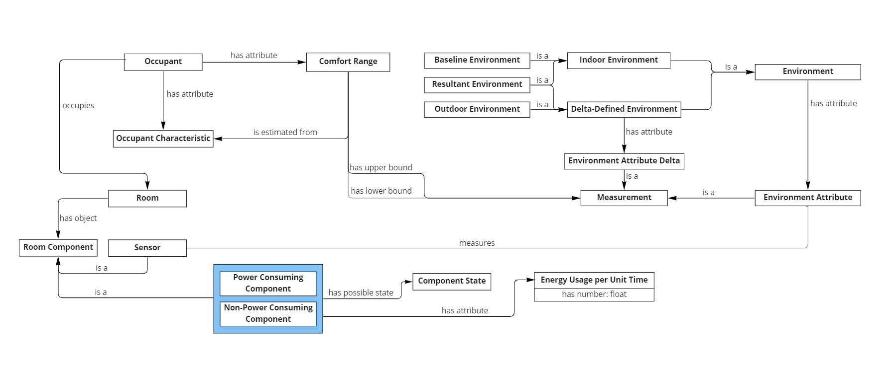
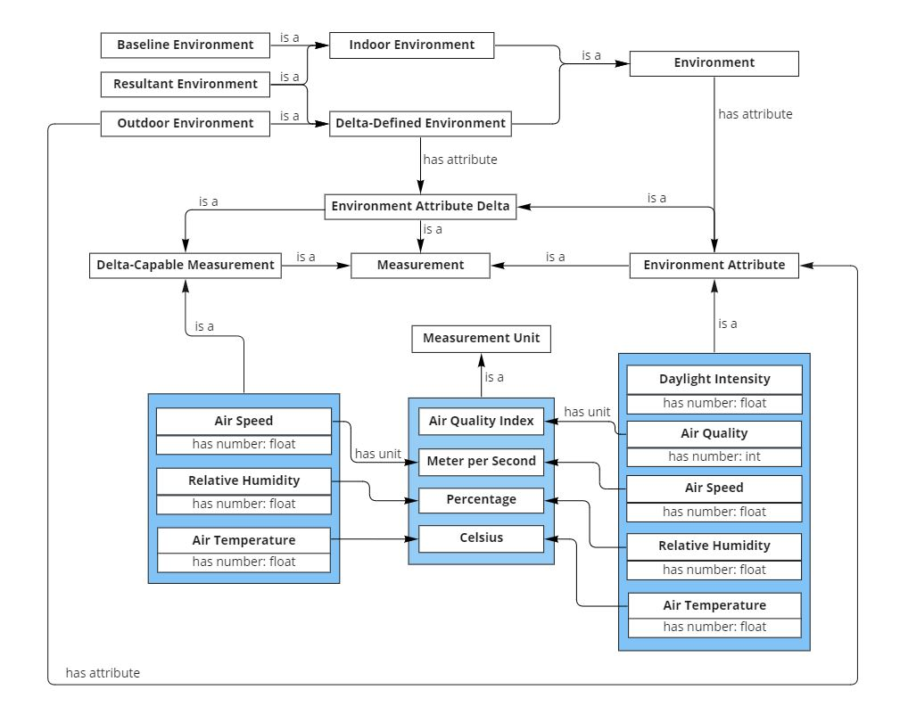
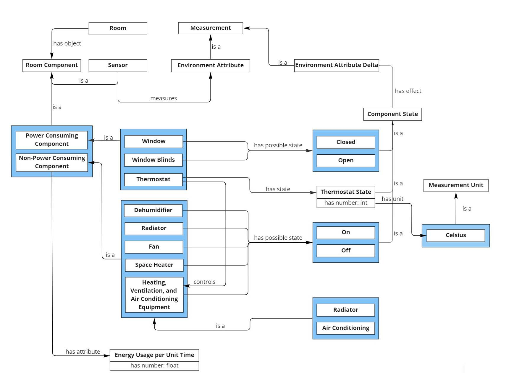
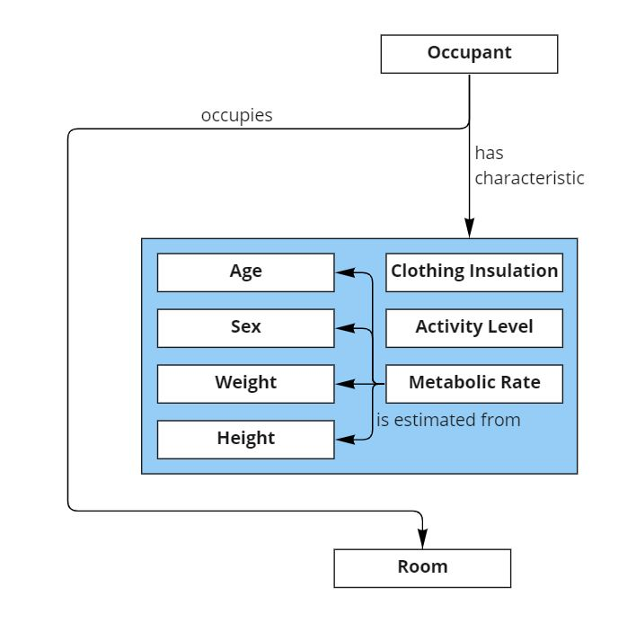

[Concept Map](#conceptual-model) | [Ontology File](#ontologies) | [Ontologies Reused](#ontologies-reused) | [Ontology Prefixes](#ontology-prefixes)

## Conceptual Model

An overview of the relationship between several categories of concepts the ontology uses, including a room the system could operate in as well as its occupants, attributes pertaining to the room’s environment, items in the room that affect its environment, various relevant measurements, attributes of the occupants, and types of comfort the occupant may experience. The diagram also depicts the relationship between the state of said room and its energy usage.

### Previous Versions

<!--- [Version 3 (OE 8)](https://drive.google.com/file/d/1TKyZMECKkrVbj1IumNUA7Mr-ySvIPOyF/view?usp=sharing)-->
- [Version 2 (OE 6)](https://drive.google.com/file/d/1flNzd0NzZzrsa6nSemaQal0lpTnElB1l/view?usp=sharing)
- [Version 1 (OE 5)](https://drive.google.com/file/d/1yJqxKVTRcumLYXdhePVD13OTwe4al6JT/view?usp=sharing)

## Ontology

- [Latest](https://raw.githubusercontent.com/tetherless-world/ontology-engineering/indoor-environment-manager/oe2022/indoor-environment-manager/indoor-environment-manager.rdf)
<!--- [Version 3 (OE 8_Individual)](https://drive.google.com/file/d/1gspmaP-d7qbCS4ZU1jS9XG0_4Nj6MljA/view?usp=sharing)-->
<!--- [Version 3 (OE 8)](https://drive.google.com/file/d/1CQ9toPMEqJIb5dmBIoXTL2tqsq8NUYY_/view?usp=sharing)-->
- [Version 2 (OE 7)](https://drive.google.com/file/d/1kZn1TZ6qzmR0K9AIHrB7CrPFo4l4MAuw/view?usp=sharing)
- [Version 1 (OE 6)](https://drive.google.com/file/d/1qHudx_rdA53kvdJMw_BnMlFNXQtTLNBy/view?usp=sharing)

### Accompanying Suite of Ontologies

## Ontologies Reused

We group the ontologies we reuse by the purpose and the use-cases they are intended to serve, as vocabularies for.

### Ontology Prefixes

<table style="width:100%">
  <tr>
    <th>Prefix</th>
    <th>Links</th>
  </tr>
  <tr>
    <td>rdf</td>
    <td><a href="http://www.w3.org/1999/02/22-rdf-syntax-ns">Resource Description Framework</a></td>
  </tr>
  <tr>
    <td>rdfs</td>
    <td><a href="http://www.w3.org/2000/01/rdf-schema"> RDF Schema</a> </td>
  </tr>
  <tr>
    <td>owl</td>
    <td><a href="http://www.w3.org/2002/07/owl#">Web Ontology Language </a> </td>
  </tr>
  <tr>
    <td> xsd</td>
    <td> <a href="http://www.w3.org/2001/XMLSchema#">XML Schema Definition</a></td>
  </tr>
  <tr>
    <td>dct</td>
    <td> <a href="http://purl.org/dc/terms/">Dublin Core Term</a> </td>
  </tr>
  <tr>
    <td>skos</td>
    <td> <a href="http://www.w3.org/2004/02/skos/core#">Simple Knowledge Organization System</a></td>
  </tr>
  <tr>
    <td>sco</td>
    <td> <a href="https://idea.tw.rpi.edu/projects/heals/studycohort/"> Study Cohort Ontology</a> </td>
  </tr>
  <tr>
    <td>chear</td>
    <td> <a href="http://hadatac.org/ont/chear#">Children’s Health Exposure Analysis Resource</a></td>
  </tr>
  <tr>
    <td>hasco</td>
    <td> <a href="http://hadatac.org/ont/hasco#"> Human-Aware Science Ontology</a> </td>
  </tr>
  <tr>
    <td>fibo-fnd-utl-av</td>
    <td> <a href="http://www.omg.org/spec/EDMC-FIBO/FND/Utilities/AnnotationVocabulary/">Financial Industry Business
        Ontology</a> </td>
  </tr>
  <tr>
    <td>sio</td>
    <td> <a href="http://semanticscience.org/resource/">SemanticScience Integrated Ontology</a> </td>
  </tr>
  <tr>
    <td>obo</td>
    <td> <a href="http://purl.obolibrary.org/obo/">OBO Foundry</a> </td>
  </tr>
  <tr>
    <td>stato</td>
    <td> <a href="http://purl.obolibrary.org/obo/STATO_">The Statistical Methods Ontolgy</a> </td>
  </tr>
  <tr>
    <td>uo</td>
    <td><a href="http://purl.obolibrary.org/obo/UO_"> Units of Measurement Ontology</a> </td>
  </tr>
  <tr>
    <td>pato</td>
    <td> <a href="http://purl.obolibrary.org/obo/PATO_"> Human Phenotypic Quality Ontology</a> </td>
  </tr>
  <tr>
    <td>ncit</td>
    <td> <a href="http://purl.obolibrary.org/obo/NCI_">National Cancer Institute Thesarus</a> </td>
  </tr>
  <tr>
    <td>provcare</td>
    <td> <a href="http://www.case.edu/ProvCaRe/provcare#">Provenance for Clinical + Healthcare Research</a> </td>
  </tr>
  <tr>
    <td>ocre</td>
    <td> <a href="http://purl.org/net/OCRe/OCRe.owl/#"> Ontology of Clinical Research</a> </td>
  </tr>
</table>
