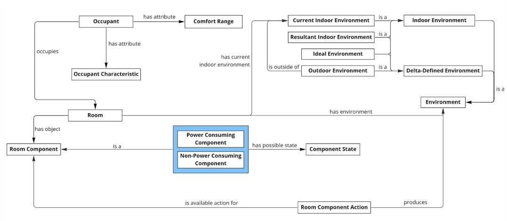
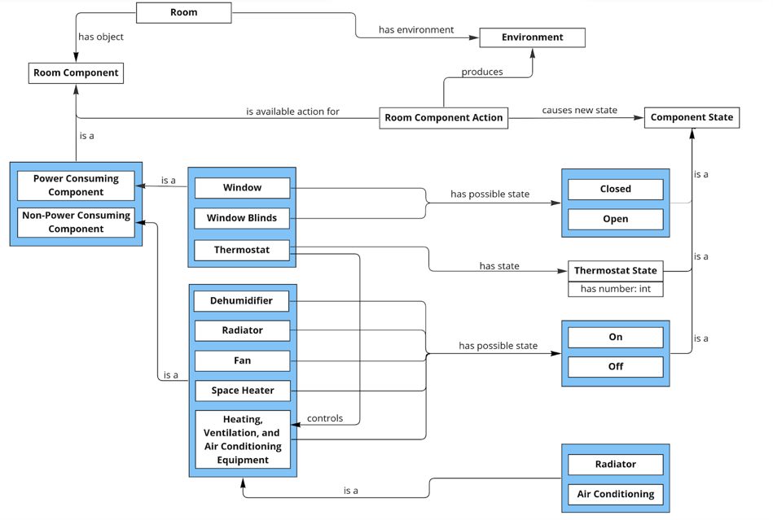
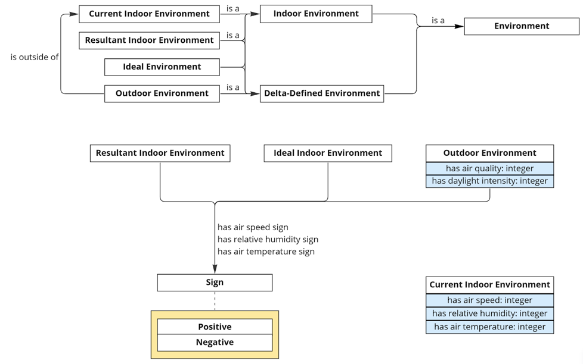
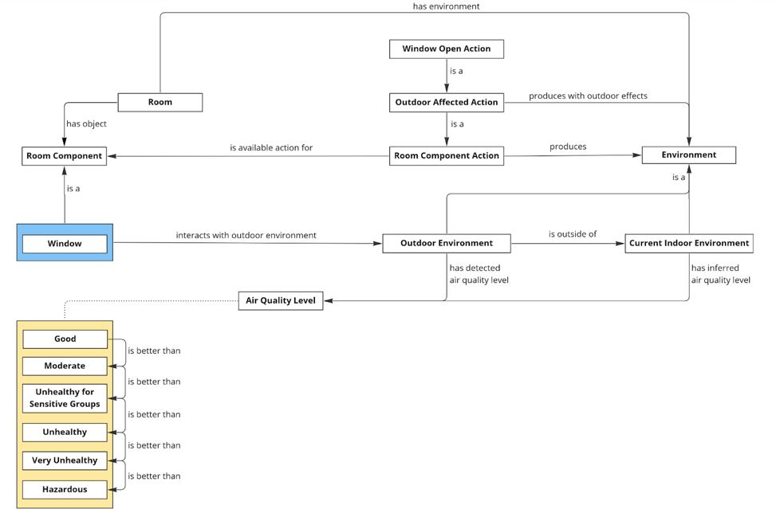

[Concept Map](#conceptual-model) | [Ontology File](#ontologies) 

## Conceptual Model

We aim to create a system that, given a small room containing specified environment-affecting components as well as the demographic information for up to several occupants, will suggest an action to take that will increase the overall comfort of the occupants. Our ontology supports this reasoning by connecting a room and its components, occupants, and environment.

### Ontology Overview

This concept map shows how the most important high-level resources are connected in our ontology. Central to our project is a Room, which has Room Components— objects in the room that have some effect on the room’s environment— and one or more Occupants, which have various characteristics from which we may calculate a comfort range. Room components are either Power Consuming or Non-Power Consuming, with priority given to actions that use Non-Power Consuming Components during action recommendation. Each Room Component has multiple possible Component States and Component Actions; each action produces a new component state, as well as a different Environment. Additionally, each Room has one or more associated environments, including Indoor Environments, which refer to the Current Indoor Environment and some set of possible indoor environments, and Delta-Defined Environments, which are Environments defined by their difference from some other Environment. The Current Indoor Environment is defined in absolutes, while Resultant Indoor Environments are also Delta-Defined Environments. One Ideal Environment should exist, representing some environment that satisfies the comfort needs of the occupants as closely and possible. An Outdoor Environment is some environment associated with an Indoor Environment such that there is some influence on the Indoor Environment that can be exerted by opening a Window. This Outdoor Environment is expressed as the difference from the Current Indoor Environment, as its effect on the Indoor Environment is dependent on whether it has a negative or positive difference from the Indoor Environment’s attributes.

### Room Component

This diagram shows, in more detail, what Room Components are considered in our system as well as their possible states. Each Room Component Action is associated with a particular Room Component, causes the component to have a new Component State, and produces a new Environment— specifically a Resultant Environment, defined in terms of the change the Room Component Action produces.

### Environment

This diagram reiterates the various subclasses of Environment created in our ontology, as well as a clarification of the attributes each type of Environment should have. The Current Indoor Environment is defined in absolute terms of air speed, relative humidity, and air temperature. The Outdoor Environment associated with an Indoor Environment has its air speed, humidity, and temperature defined in relative terms, but also has two absolute attributes, air quality and daylight intensity, which are so defined because of the assumption that the default Indoor Environment air quality is Good, and lack of daylight will never affect air speed and humidity, or decrease indoor temperature. The remainder of Outdoor Environment attributes, as well as Resultant and Ideal Indoor Environment attributes, are, for the scope of this project, described in general terms as having a Positive or Negative difference from the Current Indoor Environment.

### Air Quality

This diagram shows how our ontology models the relationship between outdoor and indoor air quality, which is a special case: while turning some component on and off will be one-to-one with an increase or decrease in some environment attribute, actions that allow an Outdoor Environment to start or stop affecting the Current Indoor Environment depend on the status of the Outdoor Environment to determine what the Resultant Indoor Environment will be. To infer such a result, we use a specific Outdoor Affected Action, which takes into account some Outdoor Environment to produce a Resultant Indoor Environment with an inferred Air Quality Level.

### Previous Versions

- [Version 5 (OE 12)](https://docs.google.com/document/d/e/2PACX-1vSw7lUhroHhFwmxZBdyKkvm6LnfRIOyQBr9keHI-LKNRx5j0NTQQxeY5LHw033ltmrAoSu5JqzxsjZ2/pub)
- [Version 4 (OE 10)](https://drive.google.com/file/d/1KBWr0WCVRvt_qdKMcTlZXjD_QgQer4YE/view?usp=sharing)
- [Version 3 (OE 8)](https://drive.google.com/file/d/1TKyZMECKkrVbj1IumNUA7Mr-ySvIPOyF/view?usp=sharing)
- [Version 2 (OE 6)](https://drive.google.com/file/d/1flNzd0NzZzrsa6nSemaQal0lpTnElB1l/view?usp=sharing)
- [Version 1 (OE 5)](https://drive.google.com/file/d/1yJqxKVTRcumLYXdhePVD13OTwe4al6JT/view?usp=sharing)

## Ontologies
- [Main Ontology][oe-current]
- [Individuals][oe-current-ind]

### Previous Versions

| Ontology           | Individuals        |
|--------------------|--------------------|
| [OE 12][oe-12-ont] | [OE 12][oe-12-ind] |
| [OE 11][oe-11-ont] | [OE 11][oe-11-ind] |
| [OE 10][oe-10-ont] | [OE 10][oe-10-ind] |
| [OE 9][oe-9-ont]   | [OE 9][oe-9-ind]   |
| [OE 8][oe-8-ont]   | [OE 8][oe-8-ind]   |
| [OE 7][oe-7-ont]   |                    |
| [OE 6][oe-6-ont]   |                    |

[oe-current]: https://raw.githubusercontent.com/tetherless-world/ontology-engineering/indoor-environment-manager/oe2022/indoor-environment-manager/indoor-environment-manager.rdf
[oe-current-ind]: https://raw.githubusercontent.com/tetherless-world/ontology-engineering/indoor-environment-manager/oe2022/indoor-environment-manager/indoor-environment-manager.rdf

[oe-12-ont]: https://drive.google.com/file/d/11uVhW-qgY005TOwi-H152UvaQTYIiOUY/view?usp=sharing
[oe-12-ind]: https://drive.google.com/file/d/1N55UUCLIGEq-8gVhx3f_b5eE49TrrC01/view?usp=sharing
[oe-11-ont]: https://drive.google.com/file/d/1gOtpz000tBmWOUtOfVh8W2RF1SHovrD8/view?usp=sharing
[oe-11-ind]: https://drive.google.com/file/d/1ZcgGlIWQOYBKQWuUiqO4qNrhIUYw5X9j/view?usp=sharing
[oe-10-ont]: https://drive.google.com/file/d/1M_FfvxS6xvrCq5pnMeRqFJcIN969zbwc/view?usp=sharing
[oe-10-ind]: https://drive.google.com/file/d/1r4iUpwzEIUncyLHu_VcJzimzkoXJqX3M/view?usp=sharing
[oe-9-ont]: https://drive.google.com/file/d/1QiKPg36jOS_NoAcNAliklzrmH8wYVLt1/view?usp=sharing
[oe-9-ind]: https://drive.google.com/file/d/1ZpGk-20tPBv9HFSCIzYNEfKFIdDXIsbm/view?usp=sharing
[oe-8-ont]: https://drive.google.com/file/d/1CQ9toPMEqJIb5dmBIoXTL2tqsq8NUYY_/view?usp=sharing
[oe-8-ind]: https://drive.google.com/file/d/1gspmaP-d7qbCS4ZU1jS9XG0_4Nj6MljA/view?usp=sharing
[oe-7-ont]: https://drive.google.com/file/d/1kZn1TZ6qzmR0K9AIHrB7CrPFo4l4MAuw/view?usp=sharing
[oe-6-ont]: https://drive.google.com/file/d/1qHudx_rdA53kvdJMw_BnMlFNXQtTLNBy/view?usp=sharing
