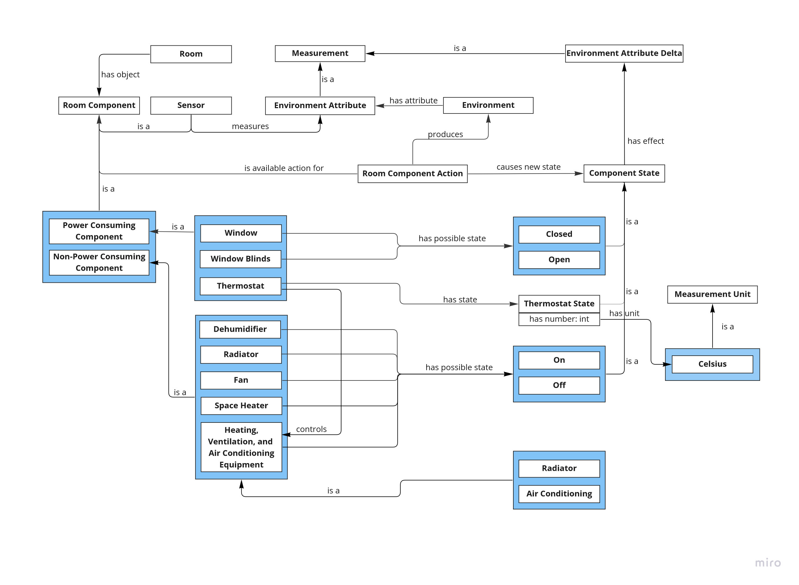
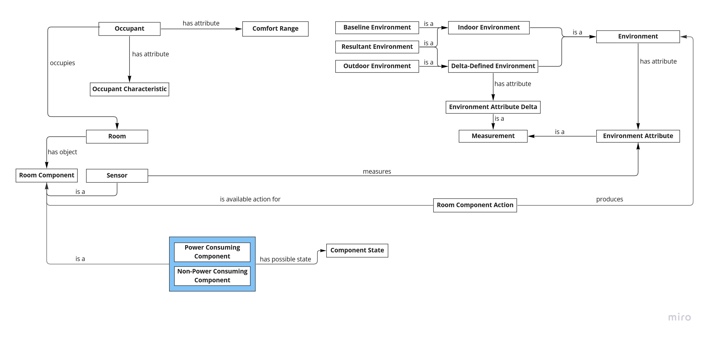
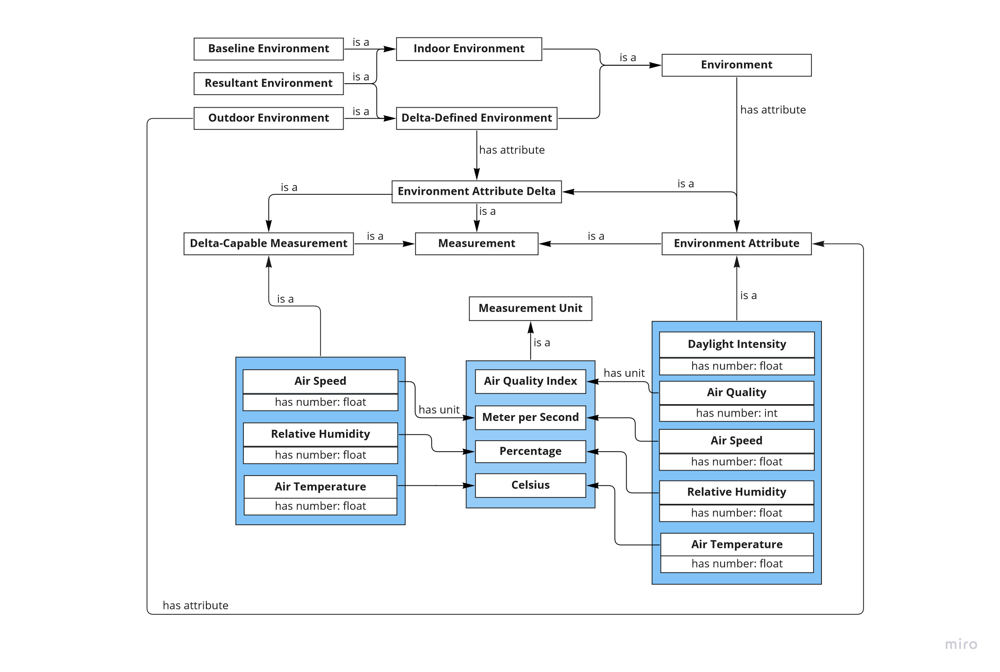
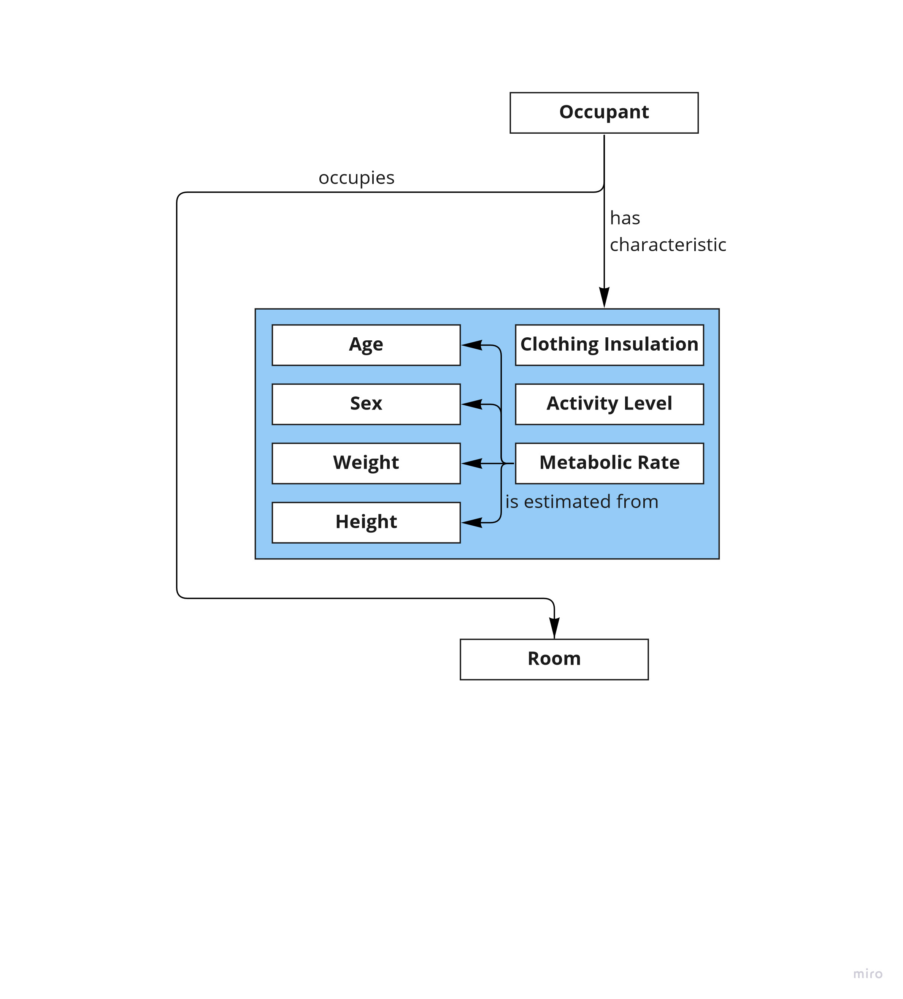
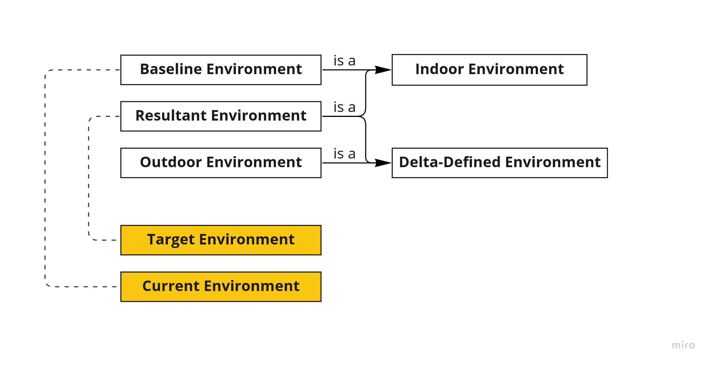

[Concept Map](#conceptual-model) | [Ontology File](#ontologies) 

## Conceptual Model

An overview of the relationship between several categories of concepts the ontology uses, including a room the system could operate in as well as its occupants, attributes pertaining to the room’s environment, items in the room that affect its environment, various relevant measurements, attributes of the occupants, and types of comfort the occupant may experience. The diagram also depicts the relationship between the state of said room and its energy usage.

### Previous Versions

<!--- [Version 4 (OE 10)](https://drive.google.com/file/d/1KBWr0WCVRvt_qdKMcTlZXjD_QgQer4YE/view?usp=sharing)-->
- [Version 3 (OE 8)](https://drive.google.com/file/d/1TKyZMECKkrVbj1IumNUA7Mr-ySvIPOyF/view?usp=sharing)
- [Version 2 (OE 6)](https://drive.google.com/file/d/1flNzd0NzZzrsa6nSemaQal0lpTnElB1l/view?usp=sharing)
- [Version 1 (OE 5)](https://drive.google.com/file/d/1yJqxKVTRcumLYXdhePVD13OTwe4al6JT/view?usp=sharing)

## Ontologies
- [Main Ontology][oe-current]
- [Individuals][oe-current-ind]

### Previous Versions

| Ontology           | Individuals       |
|--------------------|-------------------|
| [OE 10][oe-10-ont] | [OE 10][oe-10-ind] |
| [OE 9][oe-9-ont]   | [OE 11][oe-9-ind] |
| [OE 8][oe-8-ont]   | [OE 8][oe-8-ind]  |
| [OE 7][oe-7-ont]   |                   |
| [OE 6][oe-6-ont]   |                   |

[oe-current]: https://raw.githubusercontent.com/tetherless-world/ontology-engineering/indoor-environment-manager/oe2022/indoor-environment-manager/indoor-environment-manager.rdf
[oe-current-ind]: https://raw.githubusercontent.com/tetherless-world/ontology-engineering/indoor-environment-manager/oe2022/indoor-environment-manager/indoor-environment-manager.rdf

[oe-10-ont]: https://drive.google.com/file/d/1M_FfvxS6xvrCq5pnMeRqFJcIN969zbwc/view?usp=sharing
[oe-10-ind]: https://drive.google.com/file/d/1r4iUpwzEIUncyLHu_VcJzimzkoXJqX3M/view?usp=sharing
[oe-9-ont]: https://drive.google.com/file/d/1QiKPg36jOS_NoAcNAliklzrmH8wYVLt1/view?usp=sharing
[oe-9-ind]: https://drive.google.com/file/d/1ZpGk-20tPBv9HFSCIzYNEfKFIdDXIsbm/view?usp=sharing
[oe-8-ont]: https://drive.google.com/file/d/1CQ9toPMEqJIb5dmBIoXTL2tqsq8NUYY_/view?usp=sharing
[oe-8-ind]: https://drive.google.com/file/d/1gspmaP-d7qbCS4ZU1jS9XG0_4Nj6MljA/view?usp=sharing
[oe-7-ont]: https://drive.google.com/file/d/1kZn1TZ6qzmR0K9AIHrB7CrPFo4l4MAuw/view?usp=sharing
[oe-6-ont]: https://drive.google.com/file/d/1qHudx_rdA53kvdJMw_BnMlFNXQtTLNBy/view?usp=sharing
