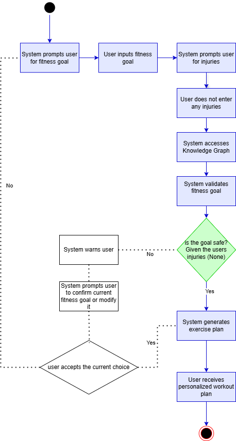
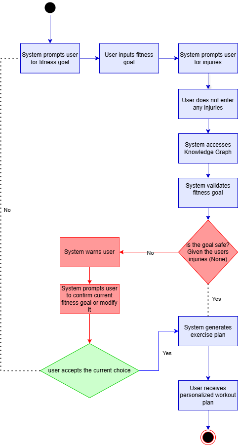

## Abstract

FitMe is a personalized health and wellness assistant designed to empower users in achieving their unique fitness goals by offering tailored guidance in exercise. For individuals at all skill levels, FitMe creates custom workout plans that consider personal fitness objectives and any injuries, ensuring safety and effectiveness. Many aspiring gym-goers struggle with starting their fitness journey, often unsure how to begin or discouraged by a lack of progress from ineffective routines. While professional coaching services are available, many beginners hesitate to invest in them, especially if they’re unsure about long-term commitment. FitMe bridges this gap by providing accessible, actionable advice to help users avoid common mistakes and stay motivated. Whether the goal is weight loss, strength building, or endurance enhancement, FitMe transforms fitness from an intimidating challenge into a simple, sustainable, and rewarding journey, promoting healthier lifestyles and lasting change.

<iframe src = "images/LiftingWeights.jpg" style="width:100%; height: 500px"></iframe>

## Project Overview Diagrams

The FitMe Ontology was intended to be able to not only recommend workout plans to users, but also nutrional plans. This was going to be achieved through various food datasets
and calorie balancing equations. The below diagrams show the overall vision of the ontology. However, our focus was on the exercise portion for the duration of this semester.

###### System Architecture:

In our proposed system, Users interact with the System UI to request personalized exercise recommendations. The UI communicates with a REST API, which forwards the request to the Recommendation Engine. The engine leverages an ontology for structured reasoning and retrieves data via a SPARQL query system connected to a knowledge graph and metadata database. Based on this data, the engine generates tailored recommendations, which are sent back to the user through the API and UI.

###### Normal Flow:

In a normal flow scenario, the user will request a goal from the system, and when prompted to enter any injuries, the user will not provide any. The system will validate the user's goal, generate exercises that align with that goal, and determine that, given their injuries (none), it is safe to provide all the recommendations it generated for the user's specified goal. It will then provide those recommendations. See below for our normal flow diagram.

###### Alternate Flow:

In an alternate flow scenario, the user will request a goal from the system, and when prompted to enter any injuries, the user will provide none. The system will validate the user's goal, generate exercises that align with that goal, and determine that, given their injuries, it is not safe to provide all the recommendations it generated for the user's specified goal. The system will then warn the user and ask if the user would like to change their fitness goal. If the user chooses to proceed the system will provide the subset of generated recommendations that do not affect the injured area. See below for our alterate flow diagram.

## Point of Contact

Abhirup Dasgupta: <dasgua3@rpi.edu>

Anirban Acharya: <achara@rpi.edu>

Dominick Iadevaia: <iadevd@rpi.edu>

Johnny Sun: <sunj13@rpi.edu>

## List of Resources

<table>
  <tr>
    <th>Resources</th>
    <th>Links</th>
  </tr>
  <tr>
    <td>1. Ontology</td>
    <td>(a) <a href="https://github.com/tetherless-world/ontology-engineering/blob/fit-me/oe2024/fit-me/FitMe.rdf">Base Ontology</a>   
    (b) <a href="https://github.com/tetherless-world/ontology-engineering/blob/fit-me/oe2024/fit-me/FitMeIndividuals.rdf">Individuals Ontology</a> </td>
  </tr>
  <tr>
    <td>2. Term List</td>
    <td>(a) <a href="https://docs.google.com/spreadsheets/d/1o11AShrcDvBsDmHfh1mhLPsy9IG6iI0eV45EtQ8qfs8/edit?usp=sharing">Mapped Vocabularies</a> </td>
  </tr>
  <tr>
    <td>3. SPARQL Queries</td>
    <td>(a) <a href="https://fit-me--rpi-ontology-engineering.netlify.app/oe2024/fit-me/demo">Queries</a> </td>
  </tr>
  <tr>
    <td>3. Presentations:</td>
    <td>(a) <a href="https://fit-me--rpi-ontology-engineering.netlify.app/oe2024/fit-me/presentations">Project presentations during class</a> </td>
  </tr>
</table>

## Acknowledgements

The development of this ontology was conducted under the advisement of Dr. Deborah McGuinness and Ms. Elisa Kendall, along with guidance from our mentors Jade Franklin, Danielle Villa, and Kelsey Rook, as part of the Fall 2024 CSCI 4340 Ontologies Course. We sincerely thank them for their time, effort, and patience in guiding us through the development process.

<iframe src = "images/FemaleWeight.png" style="width:100%; height: 500px"></iframe>