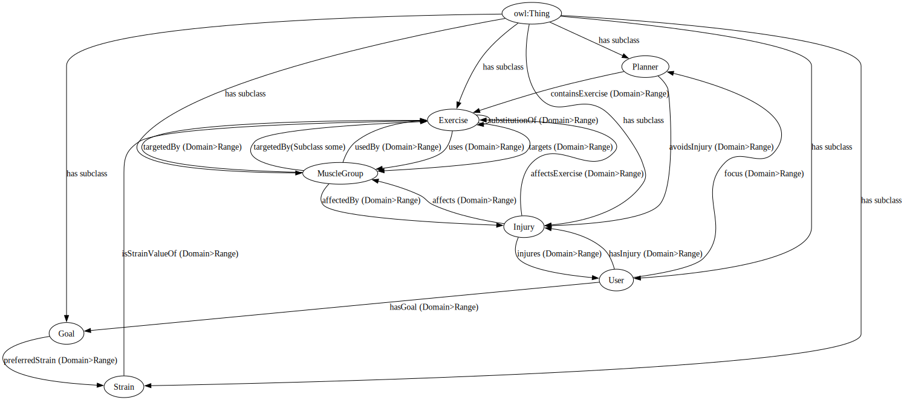
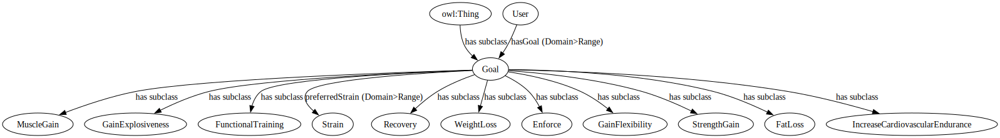
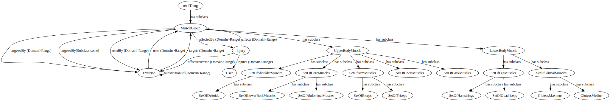
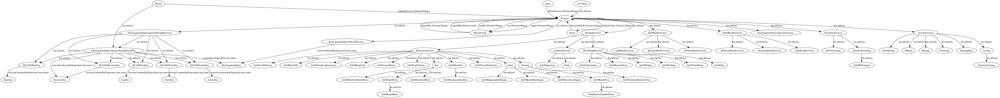
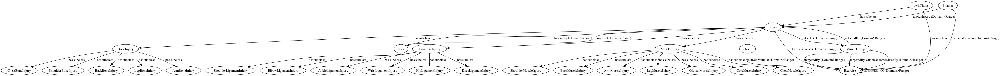
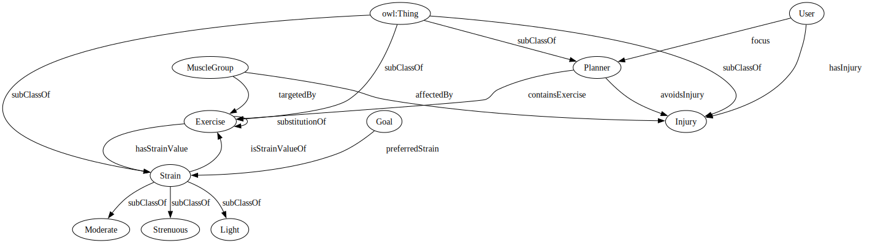
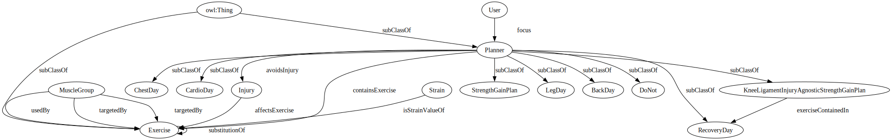

[Concept Map](#conceptual-model) | [Ontology File](#ontologies) | [Ontologies Reused](#ontologies-reused) | [Ontology Prefixes](#ontology-prefixes)

## Conceptual Model

Below is a Meta Model of our overall conceptual model.

The "Goal" Concept

The "MuscleGroup" Concept

The "Exercise" Concept

The "InjuryMap" Concept

The "Strain" Concept

The "Planner" Concept

**Link to Concept map documentation:**
  [https://docs.google.com/document/d/e/2PACX-1vSf2rasjYgI6VmdamPWe3OBvHjB_fhyHP8qWv97hUIc80GCF9lapaIV9pG74W9y_TU3xcjT3iDbWuX2/pub](https://docs.google.com/document/d/e/2PACX-1vSf2rasjYgI6VmdamPWe3OBvHjB_fhyHP8qWv97hUIc80GCF9lapaIV9pG74W9y_TU3xcjT3iDbWuX2/pub)

## Ontologies

**Link to ontology:**
[https://github.com/tetherless-world/ontology-engineering/blob/fit-me/oe2024/fit-me/FitMe.rdf](https://github.com/tetherless-world/ontology-engineering/blob/fit-me/oe2024/fit-me/FitMe.rdf)

### Previous Ontology Versions
- [Version 6 CURRENT](FitMe.rdf)
- [Version 5](archived/oldOntologies/FitMeV4.rdf)
- [Version 4](archived/oldOntologies/FitMeV3.rdf)
- [Version 3](archived/oldOntologies/FitMeV2.rdf)
- [Version 2](archived/oldOntologies/FitMeV1.rdf)
- [Version 1](archived/oldOntologies/FitMeV0.rdf)

**View the individuals ontology**
[https://github.com/tetherless-world/ontology-engineering/blob/fit-me/oe2024/fit-me/FitMeIndividuals.rdf](https://github.com/tetherless-world/ontology-engineering/blob/fit-me/oe2024/fit-me/FitMeIndividuals.rdf)

**View the inferred ontology**
[https://github.com/tetherless-world/ontology-engineering/blob/fit-me/oe2024/fit-me/FitMeReasonerAxioms.rdf](https://github.com/tetherless-world/ontology-engineering/blob/fit-me/oe2024/fit-me/FitMeReasonerAxioms.rdf)

### Accompanying Suite of Ontologies/Data Sources

- [Calories Burned During Exercise and Activities](https://www.kaggle.com/datasets/aadhavvignesh/calories-burned-during-exercise-and-activities )
- [Nutritional Facts for most common foods](https://www.kaggle.com/datasets/niharika41298/nutrition-details-for-most-common-foods )
-[Nutrient Recommendation Database](https://ods.od.nih.gov/HealthInformation/nutrientrecommendations.aspx)
- [Ontology of Physical Exercises](https://bioportal.bioontology.org/ontologies/OPE?p=summary )
- [FoodOn](https://github.com/FoodOntology/foodon/blob/master/README.Md)
- [Recipe](https://www.nutrition.gov/recipes/search)

### Ontology Prefixes

<table style="width:100%">
  <tr>
    <th>Prefix</th>
    <th>Links</th>
  </tr>
  <tr>
    <td>rdf</td>
    <td><a href="http://www.w3.org/1999/02/22-rdf-syntax-ns">Resource Description Framework</a></td>
  </tr>
  <tr>
    <td>rdfs</td>
    <td><a href="http://www.w3.org/2000/01/rdf-schema"> RDF Schema</a> </td>
  </tr>
  <tr>
    <td>owl</td>
    <td><a href="http://www.w3.org/2002/07/owl#">Web Ontology Language </a> </td>
  </tr>
  <tr>
    <td> xsd</td>
    <td> <a href="http://www.w3.org/2001/XMLSchema#">XML Schema Definition</a></td>
  </tr>
  <tr>
    <td>dct</td>
    <td> <a href="http://purl.org/dc/terms/">Dublin Core Term</a> </td>
  </tr>
  <tr>
    <td>skos</td>
    <td> <a href="http://www.w3.org/2004/02/skos/core#">Simple Knowledge Organization System</a></td>
  </tr>
  <tr>
  <td>ind</td>
  <td> <a href="https://tw.rpi.edu/ontology-engineering/oe2024/FitMeIndividual/">Individuals</a></td>
    <tr>
    <td>ex</td>
    <td> <a href="https://tw.rpi.edu/ontology-engineering/oe2024/FitMe/">FitMe Parent Class</a></td>
  </tr>
</table>
