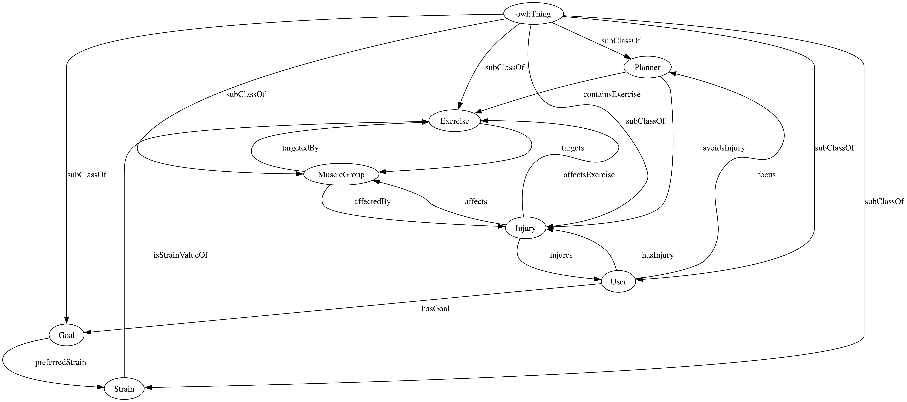

[Concept Map](#conceptual-model) | [Ontology File](#ontologies) | [Ontologies Reused](#ontologies-reused) | [Ontology Prefixes](#ontology-prefixes)

## Conceptual Model

To model the system in our usecase, we had to break the problem into a number of different domains or concepts. In the below metagraph these top level domains and the connections between them are visible. Each domain has a subgraph and explaination linked below. (Please click to enlarge) 

 
The Goal concept was added because different exercises are suited to specific objectives, like strength, endurance, or flexibility. This helps us tailor recommendations to align with each user’s fitness goals, making them more relevant and effective.
[The "Goal" Concept](images/GoalMap.png)

The MuscleGroup concept was added because it allowes the modeling of injuries and exercises that target specific areas, making recommendations more precise and safer for users.
[The "MuscleGroup" Concept](images/MuscleGroupMap.svg)

The Exercise concept simply contains the exercises that will be recommended to each user.
[The "Exercise" Concept](images/ExerciseMap.svg)

The Injury concept allows for the system to account for user injuries, ensuring that exercise recommendations are safe and avoid aggravating existing conditions.
[The "Injury" Concept](images/InjuryMap.svg)

The Strain concept was added to model how difficult a given exercise is. Although subjective, this allows the system to differentiate between light, moderate, and strenuous exercise.
[The "Strain" Concept](images/StrainMap.svg)

The Planner concept allows the system to categorize different exercise cycles and output the top results.
[The "Planner" Concept](images/Planner_Exercise_Map.svg)

**Link to Concept map documentation:**
  [https://docs.google.com/document/d/1oQwbm67mhxKlNugFvzNw8CHcuGmKjBJlpqHFa6O6pgg/edit?usp=sharing](https://docs.google.com/document/d/1oQwbm67mhxKlNugFvzNw8CHcuGmKjBJlpqHFa6O6pgg/edit?usp=sharing)

### Previous Ontology Versions
- [Version 8 (OE 13) CURRENT](https://github.com/tetherless-world/ontology-engineering/blob/fit-me/oe2024/fit-me/FitMe.rdf) [Individuals](https://github.com/tetherless-world/ontology-engineering/blob/fit-me/oe2024/fit-me/FitMeIndividuals.rdf)
- [Version 7 (OE 12)](https://github.com/tetherless-world/ontology-engineering/blob/fit-me/oe2024/fit-me/archived/oldOntologies/OE_12_FitMe.rdf) [Individuals](https://github.com/tetherless-world/ontology-engineering/blob/fit-me/oe2024/fit-me/archived/oldOntologies/OE_12_FitMe_Individuals.rdf)
- [Version 6 (OE 11)](https://github.com/tetherless-world/ontology-engineering/blob/fit-me/oe2024/fit-me/archived/oldOntologies/OE_11_FitMe.rdf) [Individuals](https://github.com/tetherless-world/ontology-engineering/blob/fit-me/oe2024/fit-me/archived/oldOntologies/OE_11_FitMe_Individuals.rdf)
- [Version 5 (OE 10)](https://github.com/tetherless-world/ontology-engineering/blob/fit-me/oe2024/fit-me/archived/oldOntologies/OE_10_FitMe.rdf)
- [Version 4 (OE 9)](https://github.com/tetherless-world/ontology-engineering/blob/fit-me/oe2024/fit-me/archived/oldOntologies/OE_9_FitMe.rdf) [Individuals](https://github.com/tetherless-world/ontology-engineering/blob/fit-me/oe2024/fit-me/archived/oldOntologies/OE_9_FitMe_Individuals.rdf)
- [Version 3 (OE 8)](https://github.com/tetherless-world/ontology-engineering/blob/fit-me/oe2024/fit-me/archived/oldOntologies/OE_8_FitMe.rdf) [Individuals](https://github.com/tetherless-world/ontology-engineering/blob/fit-me/oe2024/fit-me/archived/oldOntologies/OE_8_FitMe_Individuals.rdf)
- [Version 2 (OE 7)](https://github.com/tetherless-world/ontology-engineering/blob/fit-me/oe2024/fit-me/archived/oldOntologies/OE_7_FitMe.rdf)
- [Version 1 (OE 6)](https://github.com/tetherless-world/ontology-engineering/blob/fit-me/oe2024/fit-me/archived/oldOntologies/OE_6_FitMe.rdf)

**View the reasoner axioms**
[https://github.com/tetherless-world/ontology-engineering/blob/fit-me/oe2024/fit-me/FitMeReasonerAxioms.rdf](https://github.com/tetherless-world/ontology-engineering/blob/fit-me/oe2024/fit-me/FitMeReasonerAxioms.rdf)

### Accompanying Suite of Ontologies/Data Sources
- [Ontology of Physical Exercises](https://bioportal.bioontology.org/ontologies/OPE?p=summary )
- [Purl DC Terms v.2020-01-20](http://purl.org/dc/terms/)
- [W3C OWL v.2002](http://www.w3.org/2002/07/owl#)
- [W3C RDF v.1999](http://www.w3.org/1999/02/22-rdf-syntax-ns#)
- [W3C RDFS v.2000](http://www.w3.org/2000/01/rdf-schema#)
- [W3C SKOS v.2004](http://www.w3.org/2004/02/skos/core#)
- [W3C XSD v.2001](http://www.w3.org/2001/XMLSchema#)

### Ontology Prefixes
<table style="width:100%; border-collapse: collapse; text-align: left; border: 1px solid black;">
  <tr style="background-color: #f2f2f2; border: 1px solid black;">
    <th style="padding: 8px; border: 1px solid black;">Prefix</th>
    <th style="padding: 8px; border: 1px solid black;">Links</th>
  </tr>
  <tr>
    <td style="padding: 8px; border: 1px solid black;">rdf</td>
    <td style="padding: 8px; border: 1px solid black;"><a href="http://www.w3.org/1999/02/22-rdf-syntax-ns#">Resource Description Framework</a></td>
  </tr>
  <tr>
    <td style="padding: 8px; border: 1px solid black;">rdfs</td>
    <td style="padding: 8px; border: 1px solid black;"><a href="http://www.w3.org/2000/01/rdf-schema#">RDF Schema</a></td>
  </tr>
  <tr>
    <td style="padding: 8px; border: 1px solid black;">owl</td>
    <td style="padding: 8px; border: 1px solid black;"><a href="http://www.w3.org/2002/07/owl#">Web Ontology Language</a></td>
  </tr>
  <tr>
    <td style="padding: 8px; border: 1px solid black;">xsd</td>
    <td style="padding: 8px; border: 1px solid black;"><a href="http://www.w3.org/2001/XMLSchema#">XML Schema Definition</a></td>
  </tr>
  <tr>
    <td style="padding: 8px; border: 1px solid black;">dct</td>
    <td style="padding: 8px; border: 1px solid black;"><a href="http://purl.org/dc/terms/">Dublin Core Terms</a></td>
  </tr>
  <tr>
    <td style="padding: 8px; border: 1px solid black;">skos</td>
    <td style="padding: 8px; border: 1px solid black;"><a href="http://www.w3.org/2004/02/skos/core#">Simple Knowledge Organization System</a></td>
  </tr>
  <tr>
    <td style="padding: 8px; border: 1px solid black;">cmns-av</td>
    <td style="padding: 8px; border: 1px solid black;"><a href="https://www.omg.org/spec/Commons/AnnotationVocabulary/">Commons Annotation Vocabulary</a></td>
  </tr>
  <tr>
    <td style="padding: 8px; border: 1px solid black;">oe-fit</td>
    <td style="padding: 8px; border: 1px solid black;"><a href="https://tw.rpi.edu/ontology-engineering/oe2024/FitMe/FitMe/">FitMe Ontology</a></td>
  </tr>
</table>

