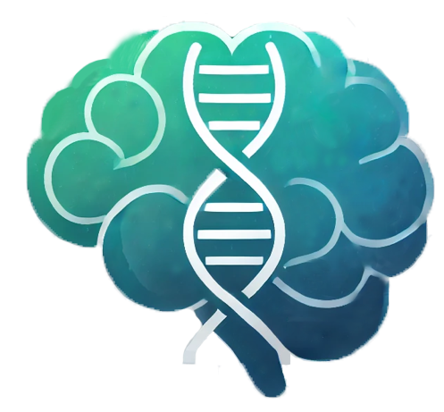

# Personalized Depression Treatment Ontology

## Abstract

The **Personalized Depression Treatment Ontology** aims to enhance the personalization of treatment plans for individuals diagnosed with depression by integrating diverse data sources, including genetic profiles, demographic information, and clinical outcomes.

This ontology serves as a decision-support tool for clinicians, enabling them to access patient-specific recommendations that improve the efficiency and effectiveness of mental health care. By mapping relationships between patient demographics, genetic markers, and therapeutic options, the ontology seeks to reduce the traditional trial-and-error approach, providing evidence-based treatment paths that account for individual variability in treatment response.

**Key features include:**

- Integration of clinical trial data, genetic studies, and real-world patient-reported outcomes.
- Continuous refinement of recommendations based on the latest research.
- A robust framework for clinicians, researchers, and genetic counselors to deliver tailored treatment strategies.

This ontology addresses critical needs in the mental health field, enhancing patient outcomes and reducing treatment resistance.

---

## Resources

Here are some resources to help you get a better understanding of our project:

1. **Ontology**
   - [PDT Ontology](./ontology)

2. **Term List**
   - [Mapped Vocabularies](./termlist)

3. **Competency Questions**
   - [Competency Questions & SPARQL Queries](./demo)

4. **Presentations**
   - [Project Presentations](./presentations)

---
