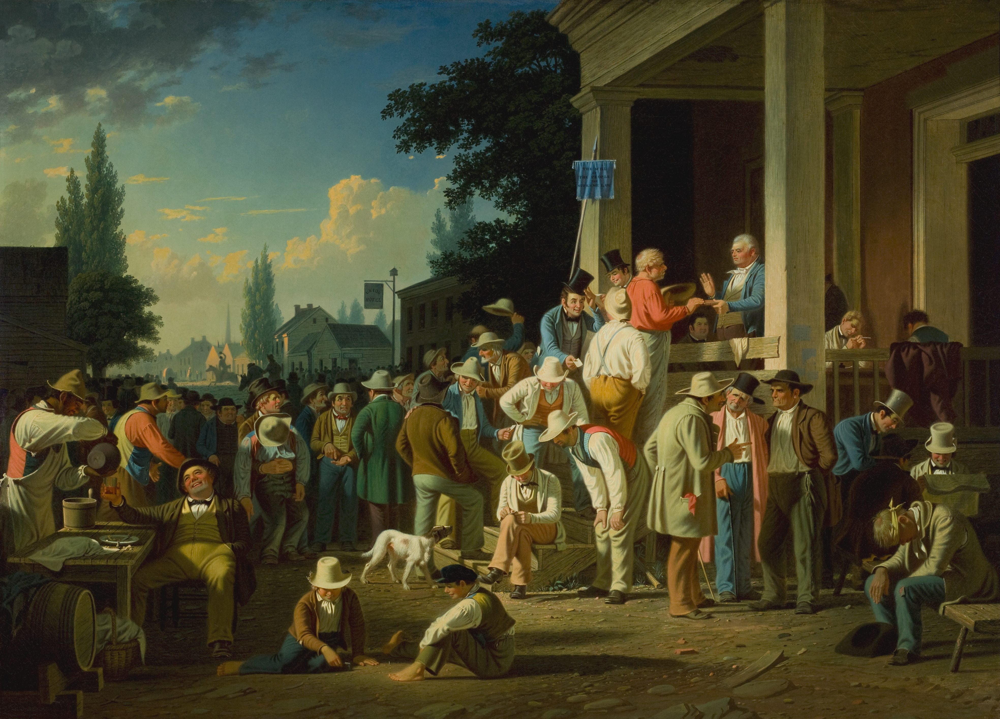

# Political Journalism Ontology

<i>The County Election</i> by George Caleb Bingham

## Abstract

We plan to develop an ontology-enabled system that allows a comparison between various news outlets and journalists that accounts for a difference in terminology and content focus that results from media outlets appealing to different audiences.
Users need to be able to connect various articles across media outlets to the same journalist or events. The ontology serves the purpose of providing a way to link these articles and events that is robust to biased reporting.
Users need a way to connect politicians or prominent figures to pieces of legislation, political issues, other politicians, political parties, elections, and articles.

A critical component of functioning democracies is a voting populace with the information necessary to make an informed vote. The relaying of this information should naturally facilitate rational citizens in voting in a manner that best suits their well-being and beliefs. Due in part to the advent of the digital age and the ad-view revenue model dominating media, there are perverse incentives that favour viewer engagement over unbiased and factual reporting.
This perverse media incentive structure naturally results in outlets finding a position on this bias/accuracy continuum that caters to a specific cross section of viewers to maximise engagement and build a viewer base. As a result outlets choose editors, journalists, stories, and language that best appeals to this base and is largely responsible for today’s polarised media climate.

## Conceptual Diagram

<iframe src="files/JournalismCMDv2.2.pdf" style="width:100%; height: 500px"></iframe>

## List of Resources

List resources you think a reader would benefit from to use your project. We list some examples you could make available below.

<table>
  <tr>
    <th>Resources</th>
    <th>Links</th>
  </tr>
  <tr>
    <td>1. Ontology</td>
    <td>(a) <a href="PoliticalJournalism.rdf">Your Ontology</a></td>
  </tr>
  <tr>
    <td>2. Term List</td>
    <td>(a) <a href="./termlist">Mapped Vocabularies</a> </td>
  </tr>
  <tr>
    <td>2. Competency Questions</td>
    <td>(a) <a href="./demo">SPARQL Queries</a> </td>
  </tr>
  <tr>
    <td>3. Presentations:</td>
    <td>(a) <a href="./presentations">Project presentations during class</a> </td>
  </tr>
</table>

## Contributors

- Avery Iorio, iorioa@rpi.edu
- Kirk Olkowski, olkowk@rpi.edu
- Nathaniel Adair, adairn@rpi.edu

## Acknowledgements

We appreciate the assistance of the course instructors, Dr. Deborah McGuinness and Ms. Elisa Kendall, as well as the assistance of the course mentors, Jade Franklin, Kelsey Rook, Danielle Villa, and Vládia Pinheiro.
