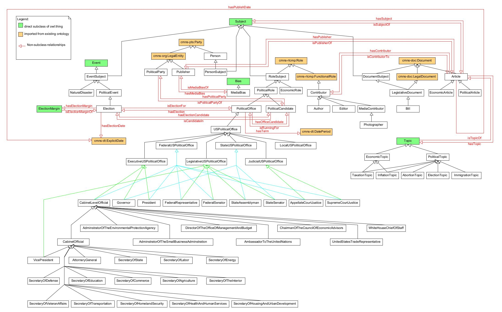

[Concept Map](#conceptual-model) | [Ontology File](#ontologies) | [Ontologies Reused](#ontologies-reused) | [Ontology Prefixes](#ontology-prefixes)

## Conceptual Model

### Overview

A complete representation of classes present in the Political Journalism Ontology. All property associations in black represent rdf:subClassOf associations. All associations in red represent associations implemented in the Political Journalism Ontology.

<iframe src="https://docs.google.com/presentation/d/e/2PACX-1vRRkIQlOvQEpMIOWADi_GV-PWNQp7BY4gDSy9FrtyPJS9cR_LIwPnUnMlzG5-eb7z2i-OGLxUSC1JCU/embed?start=false&loop=false&delayms=3000" frameborder="0" width="960" height="569" allowfullscreen="true" mozallowfullscreen="true" webkitallowfullscreen="true"></iframe>

Figure 1 shows the relations between the high level classes.

Figure 2 demonstrates how the elections are sematically represented in the ontology.

Figure 3 goes into further detail about the representation of Political Offices.

Figure 4 covers the higher level relations between the various subclasses of cmns-rlcmp:Role

Figure 5 covers the structure of Topics.

## Ontologies

### Political Journalism Ontology

**Link:**
[https://raw.githubusercontent.com/tetherless-world/ontology-engineering/refs/heads/journalism/oe2024/political-journalism/PoliticalJournalism.rdf](https://raw.githubusercontent.com/tetherless-world/ontology-engineering/refs/heads/journalism/oe2024/political-journalism/PoliticalJournalism.rdf)

#### Primary Classes and Definitions

1. Document
    - Definition: the unitary expression of some realization of an intellectual or artisitc work
    - Immediate Superclass: None
    - Example:
    - Reused From: cmns-doc
1. Article
    - Definition: a piece of writing on a particular subject in a newspaper or magazine
    - Immediate Superclass: Document
    - Example:
    - Reused From: None
1. Subject
    - Definition: a person, thing, or event that is discussed, written about, or referenced
    - Immediate Superclass: None
    - Example:
    - Reused From: None
1. Role
    - Definition: named specific behavior of something participating in a particular context
    - Immediate Superclass: None
    - Example:
    - Reused From: cmns-rlcmp
1. RoleSubject
    - Definition: a subject which is a role
    - Immediate Superclass: Subject, Role
    - Example:
    - Reused From: None
1. PoliticalRole
    - Definition: a role within a political system
    - Immediate Superclass: RoleSubject
    - Example:
    - Reused From: None
1. PoliticalOffice
    - Definition: a position of authority and responsibility in a government
    - Immediate Superclass: PoliticalRole
    - Example:
    - Reused From: None
1. PoliticalCandidate
    - Definition: a person who is seeking election to a political office
    - Immediate Superclass: PoliticalRole
    - Example:
    - Reused From: None
1. FunctionalRole
    - Definition: role representing an underlying functionality of something, such as a person, organization, process, or service, is expected to perform or deliver
    - Immediate Superclass: Role
    - Example:
    - Reused From: cmns-rlcmp
1. Contributor
    - Definition: a person who contributes to the creation of a news article
    - Immediate Superclass: FunctionalRole
    - Example:
    - Reused From: None
1. Author
    - Definition: a contributor who is responsibile for the writing on an article
    - Immediate Superclass: Contributor
    - Example:
    - Reused From: None
1. Event
    - Definition: something that happens
    - Immediate Superclass: None
    - Example:
    - Reused From: None
1. EventSubject
    - Definition: a subject which is an event
    - Immediate Superclass: Subject, Event
    - Example:
    - Reused From: None
1. PoliticalEvent
    - Definition: an event which directly affects governance
    - Immediate Superclass: EventSubject
    - Example:
    - Reused From: None
1. Election
    - Definition: a political event where votes are cast to choose someone to occupy a political role
    - Immediate Superclass: PoliticalEvent
    - Example:
    - Reused From: None
1. Party
    - Definition: person or organization
    - Immediate Superclass: Agent
    - Example:
    - Reused From: cmns-pts
1. Person
    - Definition: a human being
    - Immediate Superclass: Party
    - Example:
    - Reused From: None
1. LegalEntity
    - Definition: a legal person that is a partnership, corporation, or other organization having the capacity to negotiate contracts, assume finanacial obligations, and pay off debts, organized under the laws of some jurisdiction
    - Immediate Superclass: Formal Organization, LegalPerson
    - Example:
    - Reused From: cmns-org
1. PoliticalParty
    - Definition: a group of persons organized to acquire and exercise political power
    - Immediate Superclass: LegalEntity
    - Example:
    - Reused From: None
1. Publisher
    - Definition: an organization that publishes books, magazines, newspapers, or other text-based content
    - Immediate Superclass: LegalEntity
    - Example:
    - Reused From: None
1. Bias
    - Definition: an undue influence from political preference
    - Immediate Superclass: None
    - Example:
    - Reused From: None
1. Topic
    - Definition: a concept or issue that is discussed, written about or referenced
    - Immediate Superclass: None
    - Example:
    - Reused From: None

### Accompanying Suite of Ontologies

- [W3C OWL v.2002](http://www.w3.org/2002/07/owl#)
- [W3C RDF v.1999](http://www.w3.org/1999/02/22-rdf-syntax-ns#)
- [W3C RDFS v.2000](http://www.w3.org/2000/01/rdf-schema#)
- [W3C SKOS v.2004](http://www.w3.org/2004/02/skos/core#)
- [PURL DC Terms](http://purl.org/dc/terms/)
- [W3C XSD v.2001](http://www.w3.org/2001/XMLSchema#)
- [OMG Roles and Compositions](https://www.omg.org/spec/Commons/RolesAndCompositions/)
- [OMG Annotations Vocabulary](https://www.omg.org/spec/Commons/AnnotationVocabulary/)

<!--## Ontologies Reused

We group the ontologies we reuse by the purpose and the use-cases they are intended to serve, as vocabularies for.

### Study Design Ontologies

- [Provenance for Healthcare + Clinical Research (ProvCaRe)](https://provcare.case.edu/)
- [Human-Aware Science Ontology](http://hadatac.org/ont/hasco/)

### Medical Ontologies

- [National Cancer Institute Thesarus (NCIT)](https://provcare.case.edu/)
- [Children's Health Exposure Analysis Resource Ontology (CHEAR)](https://bioportal.bioontology.org/ontologies/NCIT)
- [Human-Disease Ontology (DOID)](https://www.ebi.ac.uk/ols/ontologies/doid")

### Mid-Level Ontologies

- [SemanticScience Integrated Ontology
  (SIO)](https://raw.githubusercontent.com/micheldumontier/semanticscience/master/ontology/sio/release/sio-subset-labels.owl)

### Statistical Ontologies

- [Units Ontology
  (UO)](https://www.google.com/search?q=UO+ontology&rlz=1C5CHFA_enIN727IN729&oq=UO+ontology&aqs=chrome..69i57j69i60.3199j0j4&sourceid=chrome&ie=UTF-8)
- [Statistical Methods Ontology (STATO)](https://www.ebi.ac.uk/ols/ontologies/stato)-->

### Ontology Prefixes

<table style="width:100%">
  <tr>
    <th>Prefix</th>
    <th>Links</th>
  </tr>
  <tr>
    <td>rdf</td>
    <td><a href="http://www.w3.org/1999/02/22-rdf-syntax-ns">Resource Description Framework</a></td>
  </tr>
  <tr>
    <td>rdfs</td>
    <td><a href="http://www.w3.org/2000/01/rdf-schema"> RDF Schema</a> </td>
  </tr>
  <tr>
    <td>owl</td>
    <td><a href="http://www.w3.org/2002/07/owl#">Web Ontology Language </a> </td>
  </tr>
  <tr>
    <td> xsd</td>
    <td> <a href="http://www.w3.org/2001/XMLSchema#">XML Schema Definition</a></td>
  </tr>
  <tr>
    <td>dct</td>
    <td> <a href="http://purl.org/dc/terms/">Dublin Core Term</a> </td>
  </tr>
  <tr>
    <td>skos</td>
    <td> <a href="http://www.w3.org/2004/02/skos/core#">Simple Knowledge Organization System</a></td>
  </tr>
  <tr>
</table>

