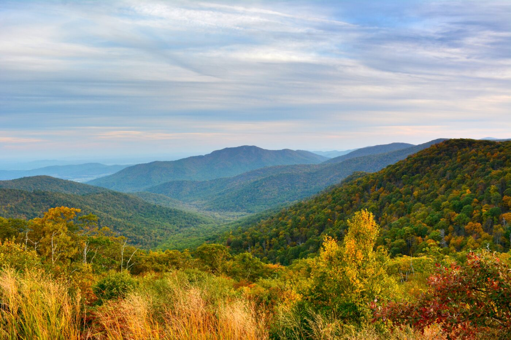
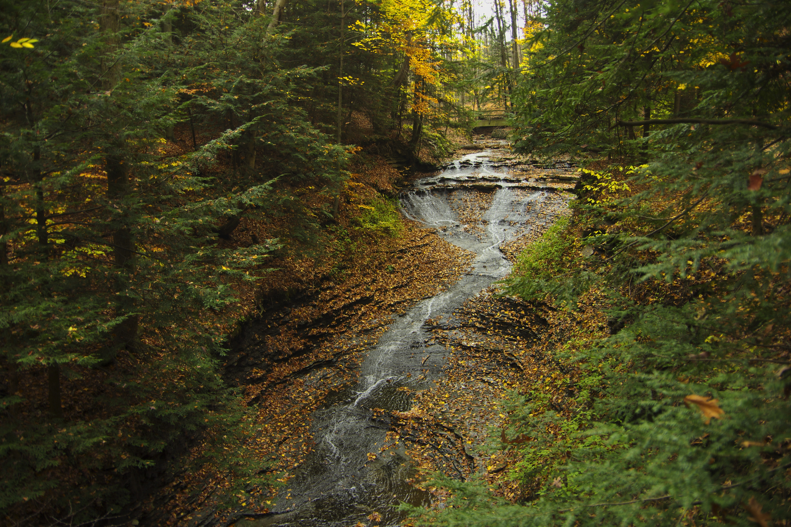
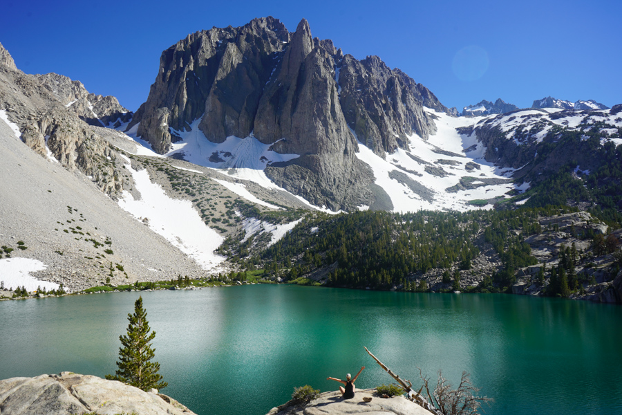
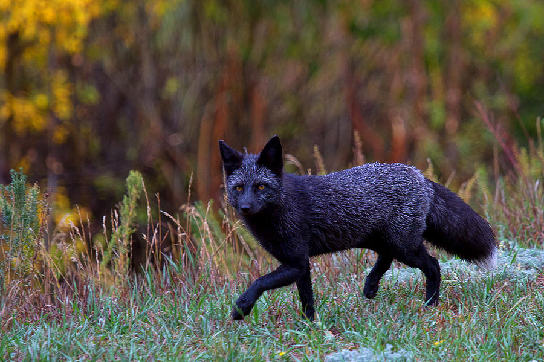
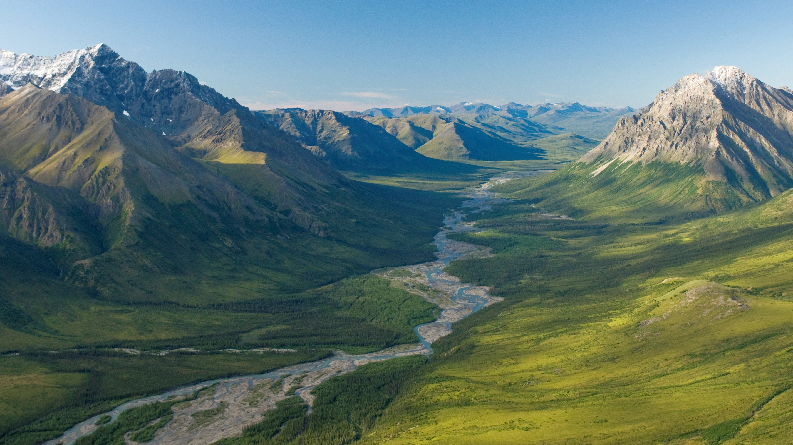

---
---

Shenandoah National Park


## Queries

The following queries were run using Snap SPARQL with a Pellit Reasoner

### Compentency Question 1
#### Question: 
Which national park has the coolest summer temperatures in the Midwest?

#### Query: 
SPARQL query to fetch parks with summer temperatures in the Midwest

```sparql
PREFIX rdf: <http://www.w3.org/1999/02/22-rdf-syntax-ns#>
PREFIX owl: <http://www.w3.org/2002/07/owl#>
PREFIX rdfs: <http://www.w3.org/2000/01/rdf-schema#>
PREFIX xsd: <http://www.w3.org/2001/XMLSchema#>
PREFIX oe-wtgw: <https://tw.rpi.edu/ontology-engineering/oe2024/when-to-go-where/WhenToGoWhere/>
PREFIX oe-wtgw-ind: <https://tw.rpi.edu/ontology-engineering/oe2024/when-to-go-where/WhenToGoWhere-individuals/>
PREFIX Locations: <https://www.omg.org/spec/Commons/Locations/>
SELECT ?park ?summerTemp
WHERE {
    ?park rdf:type oe-wtgw:NationalPark .
    ?park Locations:hasLocation ?location .
    ?location Locations:hasLongitude ?longitude .
    ?location Locations:hasLatitude ?latitude .
    ?park oe-wtgw:hasAvgSeasonalTemperature ?tempInd .
    ?tempInd rdf:type oe-wtgw:AvgSeasonalTemperature .
    ?tempInd oe-wtgw:temperatureHasSeason oe-wtgw-ind:Summer .
    ?tempInd oe-wtgw:hasTemperature ?summerTemp .
    FILTER(?longitude >= -110 && ?longitude <= -82)
    FILTER(?latitude >= 36 && ?latitude <= 49)
}
ORDER BY ASC(?summerTemp)
```

#### Result: 
Park with the coolest summer temperature

| Park                                         | Summer Temperature |
|----------------------------------------------|--------------------|
| Isle Royale National Park                   | 65                 |
| Rocky Mountain National Park                | 70                 |
| Voyageurs National Park                     | 70                 |
| Black Canyon Of The Gunnison National Park  | 70                 |
| Indiana Dunes National Park                 | 75                 |
| Wind Cave National Park                     | 75                 |
| Theodore Roosevelt National Park            | 75                 |
| Gateway Arch National Park                  | 80                 |
| Great Sand Dunes National Park              | 80                 |
| Mesa Verde National Park                    | 80                 |
| Mammoth Cave National Park                  | 80                 |
| Badlands National Park                      | 80                 |
| Canyonlands National Park                   | 95                 |
| Arches National Park                        | 95                 |

#### Description:
This competency question aims to identify the national park within the Midwest region that experiences the lowest average summer temperatures. By querying the ontology, we can retrieve and compare the average summer temperatures of various national parks located within specified longitude and latitude boundaries that define the Midwest. The result will help in understanding which park offers the coolest climate during the summer season, which can be useful for planning visits, ecological studies, and climate research.


Isle National Park

### Compentency Question 2
#### Question: 
I am new to hiking. Which national park has cool summer temperatures and hikes less than 2 miles?

#### Query: 
SPARQL query to fetch parks with short and easy hikes and cool summer temperatures

```sparql
PREFIX rdf: <http://www.w3.org/1999/02/22-rdf-syntax-ns#>
PREFIX owl: <http://www.w3.org/2002/07/owl#>
PREFIX rdfs: <http://www.w3.org/2000/01/rdf-schema#>
PREFIX xsd: <http://www.w3.org/2001/XMLSchema#>
PREFIX oe-wtgw: <https://tw.rpi.edu/ontology-engineering/oe2024/when-to-go-where/WhenToGoWhere/>
PREFIX oe-wtgw-ind: <https://tw.rpi.edu/ontology-engineering/oe2024/when-to-go-where/WhenToGoWhere-individuals/>
SELECT ?park ?summerTemp ?hike ?distance
WHERE {
    ?park rdf:type oe-wtgw:NationalPark .
    ?park oe-wtgw:hasAvgSeasonalTemperature ?tempInd .
    ?tempInd rdf:type oe-wtgw:AvgSeasonalTemperature .
    ?tempInd oe-wtgw:temperatureHasSeason oe-wtgw-ind:Summer .
    ?tempInd oe-wtgw:hasTemperature ?summerTemp .
    ?park oe-wtgw:hasHike ?hike .
    ?hike oe-wtgw:hasDistance ?distance .
    FILTER(?distance <= 2)
}
ORDER BY ASC(?summerTemp)
```

#### Result: 
Park and hike retrieved

| Park                           | Summer Temperature | Trail                     | Distance (miles) |
|--------------------------------|--------------------|---------------------------|------------------|
| Cuyahoga Valley National Park  | 75                 | Brandywine Gorge Trail     | 1.5              |
| Gateway Arch National Park     | 80                 | Gateway Arch Trail         | 1.8              |
| Mammoth Cave National Park     | 80                 | Extended Historic Tour     | 2.0              |
| Dry Tortugas National Park     | 85                 | Fort Jefferson Loop        | 0.5              |
| Carlsbad Caverns National Park| 85                 | Big Room Trail             | 1.25             |
| Biscayne National Park         | 90                 | Elliott Key Loop           | 1.1              |
| Everglades National Park       | 90                 | Anhinga Trail              | 0.8              |
| Petrified Forest National Park | 90                 | Blue Mesa Trail            | 1.0              |
| Canyonlands National Park      | 95                 | Grand View Point           | 1.8              |
| White Sands National Park      | 95                 | Dune Life Nature Trail     | 1.0              |

#### Description:
This competency question aims to identify national parks that offer cool summer temperatures and have hiking trails that are less than 2 miles in length. This information is particularly useful for new hikers who prefer shorter and easier hikes. By querying the ontology, we can retrieve and compare the average summer temperatures and trail lengths of various national parks to find suitable options for new hikers.


Cuyahoga National Park

### Compentency Question 3
#### Question: 
What are the longest hikes in California's national parks?

#### Query: 
SPARQL query to fetch longest hikes in California
(This last query was run in the normal SPARQL window)

```sparql
PREFIX rdf: <http://www.w3.org/1999/02/22-rdf-syntax-ns#>
PREFIX owl: <http://www.w3.org/2002/07/owl#>
PREFIX rdfs: <http://www.w3.org/2000/01/rdf-schema#>
PREFIX xsd: <http://www.w3.org/2001/XMLSchema#>
PREFIX oe-wtgw: <https://tw.rpi.edu/ontology-engineering/oe2024/when-to-go-where/WhenToGoWhere/>
PREFIX oe-wtgw-ind: <https://tw.rpi.edu/ontology-engineering/oe2024/when-to-go-where/WhenToGoWhere-individuals/>
SELECT ?park ?hike ?distance
WHERE {
    ?park rdf:type oe-wtgw:NationalPark .
    ?park oe-wtgw:hasState oe-wtgw-ind:California .
    ?park oe-wtgw:hasHike ?hike .
    ?hike oe-wtgw:hasDistance ?distance .
    FILTER(datatype(?distance) = xsd:decimal)
}
ORDER BY DESC(?distance)
```

#### Result: 
Longest hike retrieved

| Hike              | Distance |
|-------------------|----------|
| Lakes Trail       | 12.2 mi  |

#### Description:
This competency question aims to identify the longest hiking trails available in national parks located in California. By querying the ontology, we can retrieve and compare the distances of various hiking trails within California's national parks. This information is useful for experienced hikers looking for challenging and extended hikes.


Lakes Trail

### Compentency Question 4

#### Question:
I am near Acadia and I want to see an American bison, is the American bison native to Acadia National Park?

#### Result:

| Animal Label            |
|------------------------|
| Black Fox              |
| Coyote                 |
| Eastern Timber Wolf    |
| Moose                  |
| Northern White-tailed Deer |

#### Query:

```sparql
PREFIX rdf: <http://www.w3.org/1999/02/22-rdf-syntax-ns#>
PREFIX owl: <http://www.w3.org/2002/07/owl#>
PREFIX rdfs: <http://www.w3.org/2000/01/rdf-schema#>
PREFIX xsd: <http://www.w3.org/2001/XMLSchema#>
PREFIX oe-wtgw: <https://tw.rpi.edu/ontology-engineering/oe2024/when-to-go-where/WhenToGoWhere/>
PREFIX oe-wtgw-ind: <https://tw.rpi.edu/ontology-engineering/oe2024/when-to-go-where/WhenToGoWhere-individuals/>

SELECT ?animalLabel
WHERE {
  {
    ?animal rdf:type oe-wtgw:Animal .
    ?animal rdfs:label "american bison" .
    ?animal oe-wtgw:isAnimalOf oe-wtgw-ind:AcadiaNationalPark .
  }
  UNION
  {
    ?animal rdf:type oe-wtgw:Animal .
    ?animal rdfs:label "american bison" .
    ?animal oe-wtgw:isAnimalType ?animalType .
    ?animal2 oe-wtgw:isAnimalOf oe-wtgw-ind:AcadiaNationalPark .
    ?animalType oe-wtgw:AnimalTypeOf ?animal2 .
    ?animal2 rdfs:label ?animalLabel .
  }
}
```

#### Description:

This competency question checks whether the American bison is native to Acadia National Park by querying the ontology for wildlife associations. The ontology defines relationships between parks and the animals that inhabit them. The query reveals animals found in Acadia, such as the Black Fox, Coyote, and Moose, as a backup as they are other animals in the park. This information can help visitors set realistic wildlife expectations and guide park management in wildlife conservation planning.


Black Fox in Acadia National Park

### Compentency Question 5

#### Question:
If I want to go to the northernmost park in the United States that is the least visited in Winter, where should I go?

#### Result:

| Park                          | Latitude  | Visitors |
|------------------------------|------------|----------|
| Gates of the Arctic National Park | 67.4089    |    0     |
| Kobuk Valley National Park       | 67.3351    |   953    |
| Denali National Park             | 63.1148    | 114949   |
| Wrangell-St. Elias National Park | 61.7104    |   116    |
| Lake Clark National Park         | 60.4026    |    0     |

#### Query:

```sparql
PREFIX rdf: <http://www.w3.org/1999/02/22-rdf-syntax-ns#>
PREFIX owl: <http://www.w3.org/2002/07/owl#>
PREFIX rdfs: <http://www.w3.org/2000/01/rdf-schema#>
PREFIX xsd: <http://www.w3.org/2001/XMLSchema#>
PREFIX oe-wtgw: <https://tw.rpi.edu/ontology-engineering/oe2024/when-to-go-where/WhenToGoWhere/>
PREFIX oe-wtgw-ind: <https://tw.rpi.edu/ontology-engineering/oe2024/when-to-go-where/WhenToGoWhere-individuals/>
PREFIX Locations: <https://www.omg.org/spec/Commons/Locations/>
SELECT ?park ?latitude ?visitors
WHERE {
    ?park rdf:type oe-wtgw:NationalPark .
    ?park Locations:hasLocation ?location .
    ?location Locations:hasLatitude ?latitude .
    ?park oe-wtgw:hasAvgSeasonalVisitors ?visInd .
    ?visInd rdf:type oe-wtgw:AvgSeasonalVisitors .
    ?visInd oe-wtgw:hasSeason oe-wtgw-ind:Fall .
    ?visInd oe-wtgw:hasVisitors ?visitors
}
ORDER BY DESC(?latitude) ASC(?visitors)
```

#### Description:

This query identifies the least visited national parks during the winter season based on their latitude, focusing on parks located farthest to the north. Understanding park visitation statistics relative to geographic location is useful for managing visitor flow, conducting conservation efforts, and promoting lesser-known parks. The query results reveal that parks such as Gates of the Arctic and Lake Clark National Parks, located in Alaska, have the fewest fall visitors, highlighting their remote and less-accessible nature.


Gates of the Artic National Park