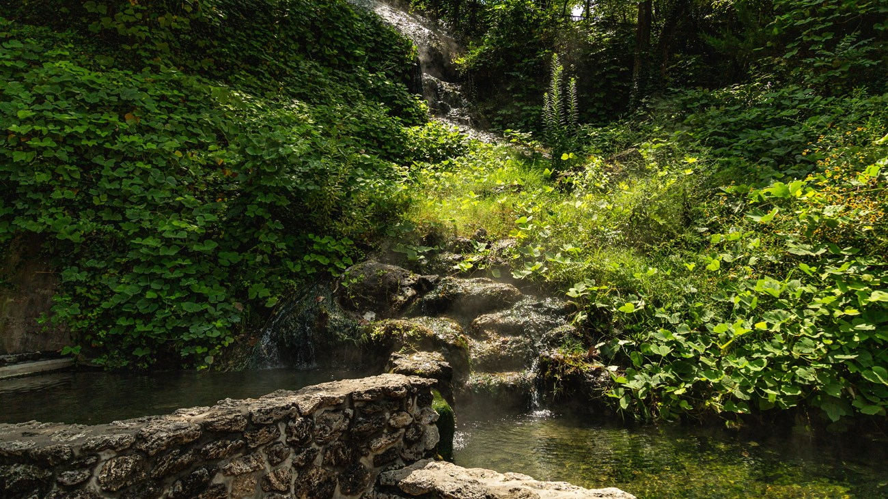

Hot Springs National Park

## Maintenenance Policy

Our maintainance policy is primarily focused on ensuring that our data remains available for use as long as possible. We will never change the name of our ontology or its URL. This will ensure that references to our ontology will always be valid and that we will not break applications that may come to rely on our ontology in the future. Any future changes to the ontology will be appropriately documented both in the headers of the ontology itself and in accompanying documentation. Future versions of the ontology with “breaking changes” will be hosted at new URLs so that previous versions of the ontology continue to be available.

One point that is important to pay attention to in the maintenance of this ontology is the maintenance of the individuals ontology. Currently the entire individuals ontology is generated from the [notebook](experiments/DataScrapingWhenToGoWhere.ipynb) in the experiments directory. If updates need to be made and individuals are to be regenerated the data sources used to regenerate individuals should be reassessed. In addition data should be as up to date as possible so any updates made to data should be cause to re-generate the individuals ontology.

## Evolution Policy

So far several data sources have been captured to generate individuals for different components of the when to go where ontology. There are still some components of the ontology for which sufficient data sources have not been found. Work needs to be done in the direction of completing the task of generating individuals for all classes in the ontology. Once all of these data sources have been found, work can be done into identifying state parks or international parks to be added to the ontology as well as relevant data sources.

- Samyuth Sagi: sagis2@rpi.edu
- Tyler Layton: laytot@rpi.edu
- Ben Rodgers: rodgeb@rpi.edu
- Annabelle Choi: choia7@rpi.edu