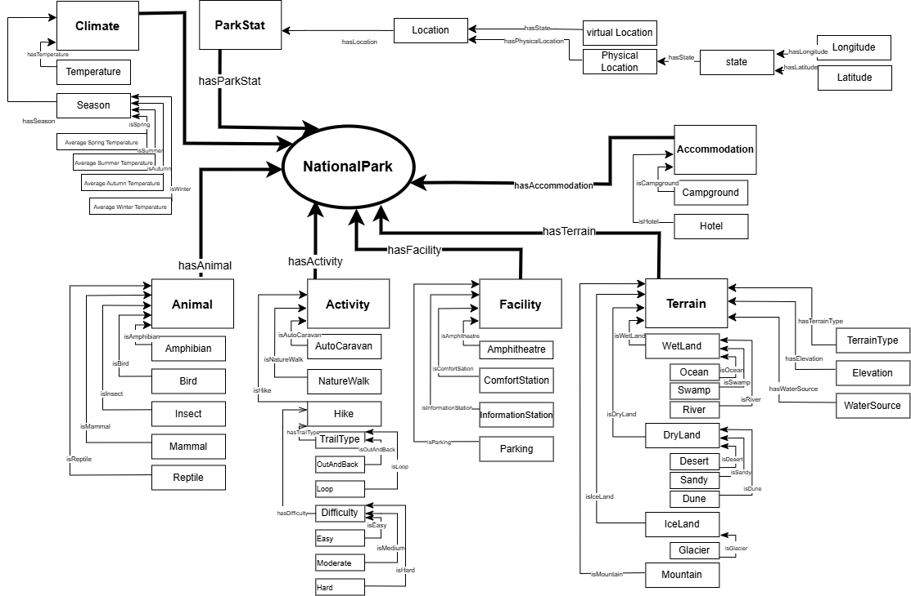

Denali National Park
## When To Go Where

When to go where is a project that aims to promote outdoor exploration across the 63 National Parks in the United States. We would like to give people a tool that will allow them to find national parks that will fit any preferences that they may have. We want to give people as few excuses as possible for not pursing outdoor activities such as camping and hiking.

To achieve this we are creating a semantically enabled application that will leverage an OWL ontology to answer user questions. Our interface will give users options to input preferences and using semantics we will identify the best parks that match a users particular criteria.

## Developers

- [Samyuth Sagi](https://github.com/Samyuth)
- [Tyler Layton](https://github.com/TylerLayton123)
- [Ben Rodgers](https://github.com/benrodgers14)
- [Annabelle Choi](https://github.com/snoopy0328)

## Call to Action

## Link to Our Class
[Ontology Engineering Fall 2024](https://tw.rpi.edu/classes/ontology-engineering-fall-2024)

## Workflow Diagram

The conceptual model above is a visual representation of the ontology that we developed in this project. In the above we can see that there are a set of concepts such as Animal, Activity, Accommodation, Facility, Park Statistics, Terrain, and Climate. All of these concepts are attached to a central concept National Park which is the focus of our ontology. They also have sets of other concepts that are connected to them such as Accommodation which is attached to Campground, Hotel, Capacity, Availability, and Amenities.
	
The conceptual model also shows how we have connected the different concepts in our ontology. Using the relations we have defined we are able to query our ontology to answer specific questions. For example, to find the longest trail in California, the system would look at parks in California, check which trails they have, and find the one with the greatest length. The conceptual model helps the system understand and process these connections efficiently.

## List of Resources

<table>
  <tr>
    <th>Resources</th>
  </tr>
  <tr>
    <td><a href="https://when-to-go-where--rpi-ontology-engineering.netlify.app/oe2024/when-to-go-where/ontology">When To Go Where Ontology</a></td>
  </tr>
  <tr>
    <td><a href="https://when-to-go-where--rpi-ontology-engineering.netlify.app/oe2024/when-to-go-where/termlist">Term Lists</a> </td>
  </tr>
  <tr>
    <td><a href="https://when-to-go-where--rpi-ontology-engineering.netlify.app/oe2024/when-to-go-where/demo">Compentency Questions & Demo</a> </td>
  </tr>
  <tr>
    <td><a href="https://when-to-go-where--rpi-ontology-engineering.netlify.app/oe2024/when-to-go-where/presentations">Presentations</a> </td>
  </tr>
</table>

## Acknowledgements

We would like to thank the following individuals for their guidance and support throughout this course:

- **Instructors**: Prof. Deborah L. McGuinness and Ms. Elisa Kendall, for their expertise and instruction.
- **Course Managers**: Jade Franklin, Vladia Pinheiro, Kelsey Rook, and Danielle Villa, for their dedicated coordination and assistance.