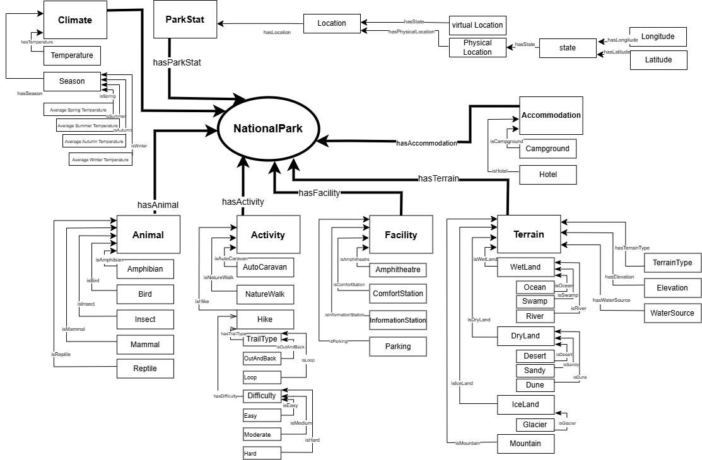

[Concept Map](#conceptual-model) | [Ontology File](#ontologies) | [Ontologies Reused](#ontologies-reused) | [Ontology Prefixes](#ontology-prefixes)

## Conceptual Model

An overview of the main classes.

### Previous versions

- [Version 6 (OE 12)](images/OE12_WhenToGoWhere_ConceptualModel.png)
- [Version 5 (OE 10)](images/WhenToGoWhere-Page-1.drawio.png)
- [Version 4 (OE 8)](images/WhenToGoWhere.drawio.png)
- [Version 3 (OE 6)](images/model_v3.PNG)
- [Version 2 (OE 5)](images/updated_model.png)
- [Version 1 (OE 5)](images/Model.png)

## Ontologies

Currently we have two ontologies. Our main ontology is the when to go where ontology which contains the main classes and some individuals and we also have the the when to go where individuals ontology which contains individuals we have obtained from different data sources.

### When to Go Where

[Latest Version](https://github.com/tetherless-world/ontology-engineering/blob/when-to-go-where/oe2024/when-to-go-where/WhenToGoWhere.rdf)

#### Previous Versions

* [OE 12](https://github.com/tetherless-world/ontology-engineering/blob/14692ea481cf5409860dddc9f9e4943b919db9bf/oe2024/when-to-go-where/WhenToGoWhere.rdf)
* [OE 11](https://github.com/tetherless-world/ontology-engineering/blob/114aa8ad617d0eeea3570d8d0f7a65eb21b862a9/oe2024/when-to-go-where/WhenToGoWhere.rdf)
* [OE 10](https://github.com/tetherless-world/ontology-engineering/blob/dac8dda75fb576d8551123076e10627d716549d9/oe2024/when-to-go-where/WhenToGoWhere.rdf)
* [OE 9](https://github.com/tetherless-world/ontology-engineering/blob/0dab7dba2bad974dbc2be7e40d342d4812061be4/oe2024/when-to-go-where/WhenToGoWhere.rdf)
* [OE 8](https://github.com/tetherless-world/ontology-engineering/blob/d8dbcde8a9a0cd9575f6ed39444b6270ad35dffb/oe2024/when-to-go-where/WhenToGoWhere.rdf)
* [OE 7](https://github.com/tetherless-world/ontology-engineering/tree/1f121a4bcc7b2b251eb518afe4a10b16a6e2790e/oe2024/when-to-go-where/WhenToGoWhere.rdf)
* [OE 6](https://github.com/tetherless-world/ontology-engineering/tree/774f8b39b28986da7ae4c43ba8fac63a93f1c300/oe2024/when-to-go-where/WhenToGoWhere.rdf)
* [OE 5](https://github.com/tetherless-world/ontology-engineering/tree/6299697c15940f038485890ded6b14a8ccfb33c3/oe2024/when-to-go-where/WhenToGoWhere.rdf)

### When to Go Where Individuals

[Latest Version](https://github.com/tetherless-world/ontology-engineering/blob/when-to-go-where/oe2024/when-to-go-where/WhenToGoWhere-individuals.rdf)

#### Previous Versions

* [OE 12](https://github.com/tetherless-world/ontology-engineering/blob/14692ea481cf5409860dddc9f9e4943b919db9bf/oe2024/when-to-go-where/WhenToGoWhere-individuals.rdf)
* [OE 11](https://github.com/tetherless-world/ontology-engineering/blob/114aa8ad617d0eeea3570d8d0f7a65eb21b862a9/oe2024/when-to-go-where/WhenToGoWhere-individuals.rdf)
* [OE 10](https://github.com/tetherless-world/ontology-engineering/blob/dac8dda75fb576d8551123076e10627d716549d9/oe2024/when-to-go-where/WhenToGoWhere-individuals.rdf)
* [OE 9](https://github.com/tetherless-world/ontology-engineering/blob/0dab7dba2bad974dbc2be7e40d342d4812061be4/oe2024/when-to-go-where/WhenToGoWhere-individuals.rdf)
* [OE 8](https://github.com/tetherless-world/ontology-engineering/blob/d8dbcde8a9a0cd9575f6ed39444b6270ad35dffb/oe2024/when-to-go-where/WhenToGoWhere-individuals.rdf)