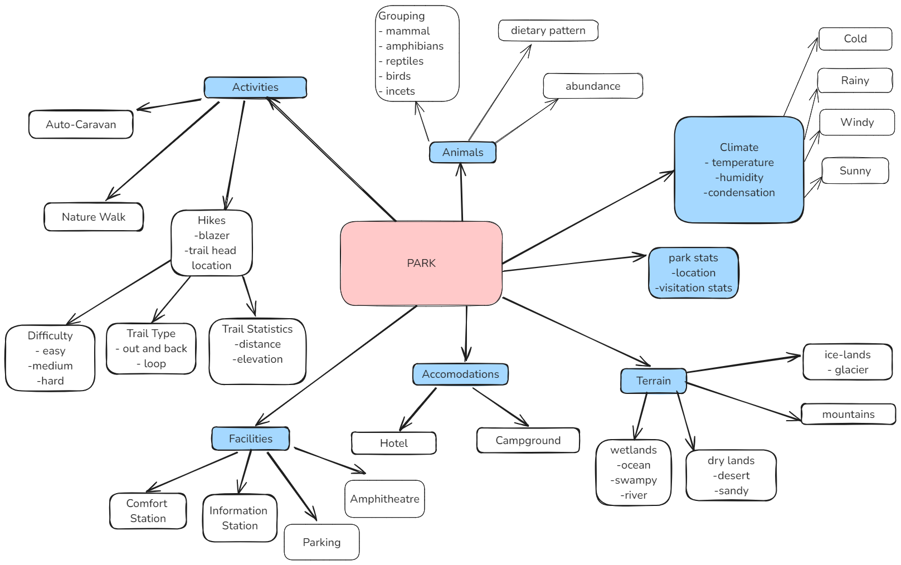

[Concept Map](#conceptual-model) | [Ontology File](#ontologies) | [Ontologies Reused](#ontologies-reused) | [Ontology Prefixes](#ontology-prefixes)

## Conceptual Model

An overview of the main classes.

## Ontologies

### Study Cohort Ontology (SCO)

**Link:**
[https://raw.githubusercontent.com/tetherless-world/study-cohort-ontology/master/Ontologies/studycohort.owl](https://raw.githubusercontent.com/tetherless-world/study-cohort-ontology/master/Ontologies/studycohort.owl)

**View the ontology documentation at:**
[https://tetherless-world.github.io/study-cohort-ontology/WidocoDocumentation/doc/index-en.html](https://tetherless-world.github.io/study-cohort-ontology/WidocoDocumentation/doc/index-en.html)

#### Primary Classes and Definitions

1. Research Study
    - Definition: A scientific investigation that involves testing a hypothesis
    - Immediate Superclass: None
    - Example: "10-Year Follow-up of Intensive Glucose Control in Type 2 Diabetes"
    - Reused From: Hasco
1. Clinical Trial
    - Definition: A prospective study designed to evaluate whether one or more interventions are associated with an outcome
    - Immediate Superclass: Research Study
    - Example: "10-Year Follow-up of Intensive Glucose Control in Type 2 Diabetes"
    - Reused From: National Cancer Institute Thesarus (NCIT)
1. Cohort
    - Definition: A cohort is the group of subjects enrolled in a study
    - Immediate Superclass: None
    - Example: Randomized Cohort in "10-Year Follow-up of Intensive Glucose Control in Type 2 Diabetes"
    - Reused From: The Statistical Methods Ontology (STATO)
1. Study Arm
    - Definition: A group or subgroup of participants in a clinical trial that receives a specific intervention/treatment,
    or no intervention, according to the trial's protocol
    - Immediate Superclass: Cohort
    - Example: Metformin Conventional Therapy Arm
    - Reused From: None
1. Study Subject
    - Definition: A person who receives medical attention, care, or treatment, or who is registered with medical
    professional or institution with the purpose to receive medical care when necessary
    - Immediate Superclass: None
    - Example: African American Male Subject in "10-Year Follow-up of Intensive Glucose Control in Type 2 Diabetes"
    - Reused From: SemanticScience Integrated Ontology (SIO)
1. Study Intervention
    - Definition: A process or action that is the focus of a clinical study. Interventions include drugs, medical devices,
    procedures, vaccines, and other products that are either investigational or already available
    - Immediate Superclass: None
    - Example: Metformin
    - Reused From: ProvCaRe
1. Subject Characteristic
    - Definition: Property that summarizes important attributes of the participants enrolled in a study
    - Immediate Superclass: None
    - Example: Age
    - Reused From: None
1. Statistical Measure
    - Definition: a standard unit used to express the size, amount, or degree of something
    - Immediate Superclass: None
    - Example: Mean
    - Reused From: ProvCaRe

### Accompanying Suite of Ontologies

- [Diseases](https://raw.githubusercontent.com/tetherless-world/study-cohort-ontology/master/Ontologies/diseases.owl)
- [Lab results](https://raw.githubusercontent.com/tetherless-world/study-cohort-ontology/master/Ontologies/labresults.owl)
- [Medications](https://raw.githubusercontent.com/tetherless-world/study-cohort-ontology/master/Ontologies/medications.owl)
- [Therapies](https://raw.githubusercontent.com/tetherless-world/study-cohort-ontology/master/Ontologies/therapies.owl)
- [Measures](https://raw.githubusercontent.com/tetherless-world/study-cohort-ontology/master/Ontologies/measures.owl)
- [Units](https://raw.githubusercontent.com/tetherless-world/study-cohort-ontology/master/Ontologies/units.owl)

## Ontologies Reused

We group the ontologies we reuse by the purpose and the use-cases they are intended to serve, as vocabularies for.

### Study Design Ontologies

- [Provenance for Healthcare + Clinical Research (ProvCaRe)](https://provcare.case.edu/)
- [Human-Aware Science Ontology](http://hadatac.org/ont/hasco/)

### Medical Ontologies

- [National Cancer Institute Thesarus (NCIT)](https://provcare.case.edu/)
- [Children's Health Exposure Analysis Resource Ontology (CHEAR)](https://bioportal.bioontology.org/ontologies/NCIT)
- [Human-Disease Ontology (DOID)](https://www.ebi.ac.uk/ols/ontologies/doid")

### Mid-Level Ontologies

- [SemanticScience Integrated Ontology
  (SIO)](https://raw.githubusercontent.com/micheldumontier/semanticscience/master/ontology/sio/release/sio-subset-labels.owl)

### Statistical Ontologies

- [Units Ontology
  (UO)](https://www.google.com/search?q=UO+ontology&rlz=1C5CHFA_enIN727IN729&oq=UO+ontology&aqs=chrome..69i57j69i60.3199j0j4&sourceid=chrome&ie=UTF-8)
- [Statistical Methods Ontology (STATO)](https://www.ebi.ac.uk/ols/ontologies/stato)

### Ontology Prefixes

<table style="width:100%">
  <tr>
    <th>Prefix</th>
    <th>Links</th>
  </tr>
  <tr>
    <td>rdf</td>
    <td><a href="http://www.w3.org/1999/02/22-rdf-syntax-ns">Resource Description Framework</a></td>
  </tr>
  <tr>
    <td>rdfs</td>
    <td><a href="http://www.w3.org/2000/01/rdf-schema"> RDF Schema</a> </td>
  </tr>
  <tr>
    <td>owl</td>
    <td><a href="http://www.w3.org/2002/07/owl#">Web Ontology Language </a> </td>
  </tr>
  <tr>
    <td> xsd</td>
    <td> <a href="http://www.w3.org/2001/XMLSchema#">XML Schema Definition</a></td>
  </tr>
  <tr>
    <td>dct</td>
    <td> <a href="http://purl.org/dc/terms/">Dublin Core Term</a> </td>
  </tr>
  <tr>
    <td>skos</td>
    <td> <a href="http://www.w3.org/2004/02/skos/core#">Simple Knowledge Organization System</a></td>
  </tr>
  <tr>
    <td>sco</td>
    <td> <a href="https://idea.tw.rpi.edu/projects/heals/studycohort/"> Study Cohort Ontology</a> </td>
  </tr>
  <tr>
    <td>chear</td>
    <td> <a href="http://hadatac.org/ont/chear#">Children’s Health Exposure Analysis Resource</a></td>
  </tr>
  <tr>
    <td>hasco</td>
    <td> <a href="http://hadatac.org/ont/hasco#"> Human-Aware Science Ontology</a> </td>
  </tr>
  <tr>
    <td>fibo-fnd-utl-av</td>
    <td> <a href="http://www.omg.org/spec/EDMC-FIBO/FND/Utilities/AnnotationVocabulary/">Financial Industry Business
        Ontology</a> </td>
  </tr>
  <tr>
    <td>sio</td>
    <td> <a href="http://semanticscience.org/resource/">SemanticScience Integrated Ontology</a> </td>
  </tr>
  <tr>
    <td>obo</td>
    <td> <a href="http://purl.obolibrary.org/obo/">OBO Foundry</a> </td>
  </tr>
  <tr>
    <td>stato</td>
    <td> <a href="http://purl.obolibrary.org/obo/STATO_">The Statistical Methods Ontolgy</a> </td>
  </tr>
  <tr>
    <td>uo</td>
    <td><a href="http://purl.obolibrary.org/obo/UO_"> Units of Measurement Ontology</a> </td>
  </tr>
  <tr>
    <td>pato</td>
    <td> <a href="http://purl.obolibrary.org/obo/PATO_"> Human Phenotypic Quality Ontology</a> </td>
  </tr>
  <tr>
    <td>ncit</td>
    <td> <a href="http://purl.obolibrary.org/obo/NCI_">National Cancer Institute Thesarus</a> </td>
  </tr>
  <tr>
    <td>provcare</td>
    <td> <a href="http://www.case.edu/ProvCaRe/provcare#">Provenance for Clinical + Healthcare Research</a> </td>
  </tr>
  <tr>
    <td>ocre</td>
    <td> <a href="http://purl.org/net/OCRe/OCRe.owl/#"> Ontology of Clinical Research</a> </td>
  </tr>
</table>
